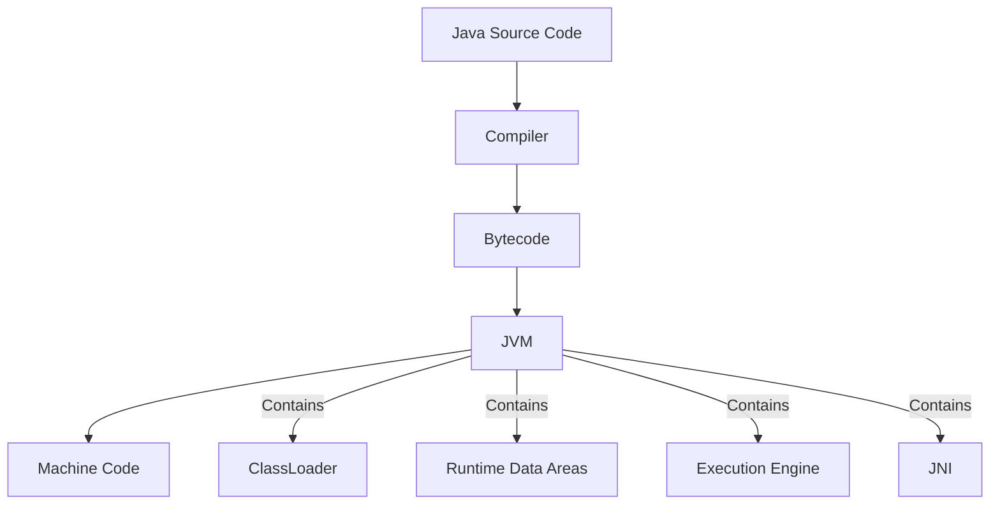

# સરળ GTU ડિપ્લોમા પેપર સોલ્યુશન જનરેટર પ્રોમ્પ્ટ

આ પ્રોમ્પ્ટ પરીક્ષાની તૈયારીમાં મુશ્કેલી અનુભવતા વિદ્યાર્થીઓને સરળ-સમજ GTU ડિપ્લોમા પરીક્ષા સોલ્યુશન જનરેટ કરવામાં મદદ કરવા માટે બનાવવામાં આવ્યું છે. તમારું પ્રશ્ન પેપર PDF અપલોડ કરો, આ પ્રોમ્પ્ટ પેસ્ટ કરો અને એક સમયે એક પ્રશ્નના સોલ્યુશન માટે પૂછો.

## આ પ્રોમ્પ્ટનો ઉપયોગ કેવી રીતે કરવો

1. તમારું GTU પ્રશ્ન પેપર PDF ચેટમાં અપલોડ કરો
2. આ સમગ્ર પ્રોમ્પ્ટ ટેમ્પ્લેટ કોપી અને પેસ્ટ કરો
3. "Question 1(a)" અથવા ફક્ત "Start" ટાઇપ કરીને સોલ્યુશન મેળવવાનું શરૂ કરો
4. "Next" અથવા ચોક્કસ પ્રશ્ન નંબર (દા.ત., "Question 2(b)") ટાઇપ કરીને પેપરમાં આગળ વધો
5. જનરેટ થયેલ જવાબો તમારા અભ્યાસ મટીરિયલ તરીકે સેવ કરો

---

## પ્રોમ્પ્ટ (આ લાઇન વચ્ચે બધું કોપી કરો)

---

હું તમને GTU ડિપ્લોમા એન્જિનિયરિંગ પ્રશ્ન પેપરના સરળ, સમજવામાં સરળ સોલ્યુશન English અને Gujarati બંને ભાષામાં બનાવવામાં મદદ કરવા માંગું છું. મેં એક પ્રશ્ન પેપર PDF અપલોડ કર્યું છે. મને એવા સોલ્યુશન બનાવવાની જરૂર છે જે યાદ રાખવા સરળ હોય અને વિદ્યાર્થીઓને પરીક્ષા પાસ કરવામાં મદદ કરે. કૃપા કરીને આ માર્ગદર્શિકાનું પાલન કરો:

### હું સોલ્યુશન કેવી રીતે પૂછીશ
- જ્યારે હું "Start" અથવા "Question 1(a)" અથવા ચોક્કસ પ્રશ્ન નંબર ટાઇપ કરું, ત્યારે તે પ્રશ્નનો જવાબ આપો
- જ્યારે હું "Next" ટાઇપ કરું, ત્યારે ક્રમમાં આવતા આગલા પ્રશ્નનો જવાબ આપો
- જ્યારે હું કોઈ ચોક્કસ પ્રશ્ન પેસ્ટ કરું, ત્યારે તે પ્રશ્નનો જવાબ આપો

### સોલ્યુશન ફોર્મેટ આવશ્યકતાઓ
- દરેક જવાબની શરૂઆત પેપરમાં લખેલા ચોક્કસ પ્રશ્ન સાથે English અને Gujarati બંને ભાષામાં કરો
- જવાબોને આ રીતે ફોર્મેટ કરો:
  - `Question 1(a): [પ્રશ્ન ટેક્સ્ટ] (Marks: 3)`
  - `Answer 1(a): [તમારો જવાબ]`
  - `પ્રશ્ન ૧(અ): [પ્રશ્ન ટેક્સ્ટ] (ગુણ: ૩)`
  - `જવાબ ૧(અ): [તમારો જવાબ]`

### જવાબ આવશ્યકતાઓ
- જવાબોને શક્ય તેટલા બુલેટ પોઈન્ટ્સમાં લખો, જેથી સારી રીડેબિલિટી અને સ્કોરિંગ માટે:
  - 7 ગુણ: ~300-350 શબ્દો (આશરે 3-4 પૃષ્ઠ હાથથી લખેલ)
  - 4 ગુણ: ~120-180 શબ્દો (આશરે 1.5-2 પૃષ્ઠ હાથથી લખેલ)
  - 3 ગુણ: ~100-150 શબ્દો (આશરે 1-1.5 પૃષ્ઠ હાથથી લખેલ)
  - 2 ગુણ: બે થી ત્રણ લાઇનના જવાબો
  - 1 ગુણ: એક અથવા બે લાઇનના જવાબો

### જવાબોને અસરકારક અને યાદગાર બનાવો
- હંમેશા બુલેટ અથવા નંબર આપેલી યાદીનો ઉપયોગ કરો, પેરેગ્રાફ્સને ટાળો
- મુખ્ય શબ્દોની સ્પષ્ટ વ્યાખ્યાથી શરૂઆત કરો
- મહત્વના કીવર્ડ્સ અને કોન્સેપ્ટ્સને **બોલ્ડ** કરો
- સરળ, સમજવામાં સરળ ભાષાનો ઉપયોગ કરો
- ટેક્સ્ટ સમજાવટ કરતાં ડાયાગ્રામ, ટેબલ અને વિઝ્યુઅલ્સને પ્રાધાન્ય આપો
- જે માહિતી પહેલેથી જ ડાયાગ્રામ/ટેબલમાં રજૂ કરવામાં આવી છે તેને ટેક્સ્ટમાં રિપીટ ન કરો
- પ્રોગ્રામિંગ પ્રશ્નો માટે, આવશ્યક કોમેન્ટ્સ સાથે સંપૂર્ણ કોડ શામેલ કરો
- જ્યારે ઉપયોગી હોય ત્યારે મનેમોનિક્સ અથવા મેમરી એઇડ્સ શામેલ કરો
- જવાબોને ટૂંકા રાખો - માર્ક્સ મેળવશે તેવા મુખ્ય પોઈન્ટ્સ પર ધ્યાન કેન્દ્રિત કરો

### Gujarati અનુવાદ માટે
- શબ્દ-દર-શબ્દ અનુવાદ ન કરો; સાંસ્કૃતિક રીતે સામગ્રીને અનુકૂળ બનાવો
- આધુનિક વિદ્યાર્થીઓ દ્વારા બોલાતી કુદરતી, વાતચીત જેવી Gujarati ભાષાનો ઉપયોગ કરો
- બધા ટેકનિકલ શબ્દો English માં રાખો (પ્રોગ્રામિંગ શબ્દો, કીવર્ડ્સ, વગેરે)
- સામગ્રી કુદરતી રીતે વહે છે અને સીધા અનુવાદ જેવી ન લાગે તેની ખાતરી કરો
- Gujarati સ્ક્રિપ્ટમાં translit નો ઉપયોગ કરો જે આધુનિક Gujarati સ્પીકર્સને પરિચિત લાગે
- English સંસ્કરણમાં હોય તેવા જ ડાયાગ્રામ, ટેબલ અને વિઝ્યુઅલ તત્વો Gujarati સંસ્કરણમાં શામેલ કરો
- English અને Gujarati બંને સંસ્કરણોમાં સમાન સ્તરની વિગતો અને સામગ્રી રજૂ કરવાની ખાતરી કરો

### Java પ્રોગ્રામિંગ સ્પેસિફિક ગાઇડલાઇન્સ
- Java સિન્ટેક્સ પ્રશ્નો માટે:
  - માત્ર સૌથી આવશ્યક સિન્ટેક્સ એલિમેન્ટ્સ પ્રદાન કરો
  - કીવર્ડ્સને બોલ્ડમાં હાઇલાઇટ કરો (public, static, class, વગેરે)
  - માત્ર કોન્સેપ્ટ બતાવતા સરળ કોડ ઉદાહરણોનો ઉપયોગ કરો (5-10 લાઇન્સ)

- Java કોન્સેપ્ટ્સ અને ફીચર્સ માટે:
  - સરળ, ચોક્કસ વ્યાખ્યાઓથી શરૂઆત કરો
  - શક્ય હોય ત્યારે રોજિંદા ઉદાહરણો સાથે સમજાવો
  - OOP કોન્સેપ્ટ્સ માટે સરળ ક્લાસ ડાયાગ્રામનો ઉપયોગ કરો
  - કોમ્પ્લેક્સ કોન્સેપ્ટ્સ (heap, stack) માટે મેમરી ડાયાગ્રામ શામેલ કરો

- Java પ્રોગ્રામિંગ પ્રશ્નો માટે:
  - સરળ પરંતુ સંપૂર્ણ વર્કિંગ કોડ પ્રદાન કરો
  - માત્ર આવશ્યક કોમેન્ટ્સ શામેલ કરો
  - બધા સંભવિત રસ્તાઓને બદલે સૌથી સામાન્ય અભિગમ પર ધ્યાન કેન્દ્રિત કરો
  - પાસ થવા માટે જરૂરી ચોક્કસ સિન્ટેક્સ પર ભાર મૂકો

- Java સ્પેસિફિક મનેમોનિક્સ:
  - OOP કોન્સેપ્ટ્સ: "APIE" (Abstraction, Polymorphism, Inheritance, Encapsulation)
  - Access modifiers (સૌથી વધુથી ઓછા restrictive): "Private Protected Default Public"
  - Exception handling: "Try-Catch-Finally-Throw-Throws"
  - Thread states: "New Runnable Running Waiting Terminated"

હવે અપલોડ કરેલા પ્રશ્ન પેપરનું વિશ્લેષણ કરો અને આ માર્ગદર્શિકાનું પાલન કરતા જવાબો આપવા માટે તૈયાર રહો. જ્યારે હું પ્રથમ પ્રશ્ન માટે વિનંતી કરું (Start" અથવા "Question 1(a)" કહીને), તો માત્ર Question 1(a) નો સોલ્યુશન આપો. પછી હું આગલા પ્રશ્ન માટે વિનંતી કરું ત્યાં સુધી રાહ જુઓ.

### સેમ્પલ સોલ્યુશન (Java પ્રોગ્રામિંગ)

**Question 1(a): Explain Garbage collection in java. (Marks: 3)**

**Answer 1(a):**

**Garbage Collection** in Java is an automatic memory management process that identifies and removes objects no longer in use to free memory.

- It runs in the background to **free heap memory** by removing unused objects
- The process is automatically managed by the **JVM**, eliminating manual memory management
- Java uses **mark and sweep** algorithm to identify and remove unused objects
- Garbage collection is triggered when:
  - Available memory is low
  - When explicitly called using `System.gc()` (not recommended in practice)
- Objects become eligible for garbage collection when they have no references pointing to them
- Benefits include preventing memory leaks and increasing developer productivity

**પ્રશ્ન 1(અ): જાવામાં Garbage collection સમજાવો. (ગુણ: 3)**

**જવાબ 1(અ):**

જાવામાં **Garbage Collection** એ એક automatic memory management પ્રક્રિયા છે જે વપરાશમાં ન હોય તેવા objects ને ઓળખી અને દૂર કરીને મેમરી ખાલી કરે છે.

- તે **heap memory** ને ખાલી કરવા માટે background માં ચાલે છે
- આ પ્રક્રિયા **JVM** દ્વારા આપોઆપ મેનેજ થાય છે, જેથી manual memory management ની જરૂર રહેતી નથી
- Java **mark and sweep** algorithm નો ઉપયોગ કરીને બિનજરૂરી objects ને ઓળખે છે અને દૂર કરે છે
- Garbage collection trigger થાય છે જ્યારે:
  - ઉપલબ્ધ મેમરી ઓછી હોય
  - જ્યારે `System.gc()` દ્વારા explicit રીતે કૉલ કરવામાં આવે (પ્રેક્ટિસમાં recommend કરવામાં આવતું નથી)
- કોઈ object પર કોઈ reference ન હોય ત્યારે તે garbage collection માટે eligible બને છે
- ફાયદાઓમાં memory leaks ને અટકાવવાનો અને developer productivity વધારવાનો સમાવેશ થાય છે

**Question 1(b): Explain JVM in detail. (Marks: 4)**

**Answer 1(b):**

**Java Virtual Machine (JVM)** is a crucial component of the Java Runtime Environment that enables Java programs to run on any device or operating system.

**Architecture and Components of JVM:**

1. **ClassLoader Subsystem:**
   - **Loading:** Reads .class files and creates binary data
   - **Linking:** Performs verification, preparation, and resolution
   - **Initialization:** Executes static initializers

2. **Runtime Data Areas:**
   - **Method Area:** Stores class structures and methods
   - **Heap:** Memory for all objects and arrays
   - **Java Stack:** Contains frames for method execution
   - **PC Register:** Stores current instruction address
   - **Native Method Stack:** Used for native method execution

3. **Execution Engine:**
   - **Interpreter:** Executes bytecode line by line
   - **JIT Compiler:** Compiles bytecode to native code
   - **Garbage Collector:** Manages memory recovery

4. **Java Native Interface (JNI):** Enables interaction with native libraries

**Key Concept:** JVM is platform-dependent but the bytecode is platform-independent, enabling "Write Once, Run Anywhere" functionality.

**પ્રશ્ન 1(બ): JVM ને વિગતવાર સમજાવો. (ગુણ: 4)**

**જવાબ 1(બ):**

**Java Virtual Machine (JVM)** એ Java Runtime Environment નો એક મહત્વપૂર્ણ ભાગ છે જે Java પ્રોગ્રામને કોઈપણ ડિવાઇસ કે ઓપરેટિંગ સિસ્ટમ પર ચલાવવાની સુવિધા આપે છે.

**JVM ની આર્કિટેક્ચર અને કમ્પોનન્ટ્સ:**

1. **ClassLoader Subsystem:**
   - **Loading:** .class ફાઇલો વાંચે છે અને binary data બનાવે છે
   - **Linking:** verification, preparation, અને resolution કરે છે
   - **Initialization:** static initializers ને execute કરે છે

2. **Runtime Data Areas:**
   - **Method Area:** ક્લાસ સ્ટ્રક્ચર્સ અને મેથડ્સ સ્ટોર કરે છે
   - **Heap:** બધા objects અને arrays માટે મેમરી
   - **Java Stack:** મેથડ એક્ઝિક્યુશન માટે ફ્રેમ્સ ધરાવે છે
   - **PC Register:** વર્તમાન instruction નું એડ્રેસ સ્ટોર કરે છે
   - **Native Method Stack:** native મેથડ એક્ઝિક્યુશન માટે વપરાય છે

3. **Execution Engine:**
   - **Interpreter:** bytecode ને લાઇન બાય લાઇન execute કરે છે
   - **JIT Compiler:** bytecode ને native code માં compile કરે છે
   - **Garbage Collector:** મેમરી રિકવરી મેનેજ કરે છે

4. **Java Native Interface (JNI):** native libraries સાથે ઇન્ટરેક્શન કરવાની સુવિધા આપે છે

**મુખ્ય કોન્સેપ્ટ:** JVM platform-dependent છે પરંતુ bytecode platform-independent છે, જેથી "Write Once, Run Anywhere" ફંક્શનાલિટી શક્ય બને છે.

---

## ઉદાહરણ વર્કફ્લો

1. **તમે પ્રશ્ન પેપર PDF અપલોડ કરો છો**
2. **તમે આ સમગ્ર પ્રોમ્પ્ટ પેસ્ટ કરો છો**
3. **તમે ટાઇપ કરો છો:** Start
4. **AI બંને ભાષામાં Question 1(a) સોલ્યુશન સાથે જવાબ આપે છે**
5. **તમે ટાઇપ કરો છો:** Next
6. **AI બંને ભાષામાં Question 1(b) સોલ્યુશન સાથે જવાબ આપે છે**
7. **બધા પ્રશ્નોના જવાબ ન મળે ત્યાં સુધી આ પેટર્ન ચાલુ રાખો**

આ અભિગમ તમને સરળ, યાદ રાખવામાં સરળ જવાબો પ્રદાન કરે છે જે તમારી GTU પરીક્ષાઓ પાસ કરવા માટે જરૂરી તમામ બાબતોને આવરી લે છે.

---

## મહત્વપૂર્ણ નોંધ

આ સરળીકૃત સોલ્યુશન્સ આવશ્યક મુદ્દાઓ પર ધ્યાન કેન્દ્રિત કરીને તમારી પરીક્ષાઓ પાસ કરવામાં મદદ કરવા માટે ડિઝાઇન કરવામાં આવ્યા છે. તેમનો ઉપયોગ તમારા અભ્યાસ માટે શરૂઆતના બિંદુ તરીકે કરો, કોન્સેપ્ટ્સને સમજવાના વિકલ્પ તરીકે નહીં.

તમારી પરીક્ષાઓ માટે શુભેચ્છા!

---