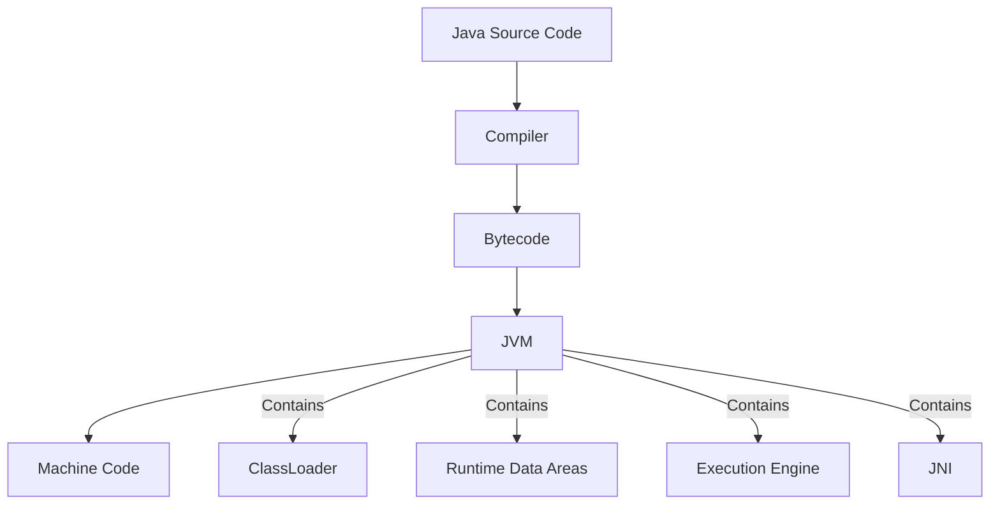

# Simple GTU Diploma Paper Solution Generator Prompt

This prompt is designed to help students who struggle with exam preparation generate easy-to-understand GTU diploma exam solutions. Simply upload your question paper PDF, paste this prompt, and ask for solutions one question at a time.

## How to Use This Prompt

1. Upload your GTU question paper PDF to the chat
2. Copy and paste this entire prompt template
3. Type "Question 1(a)" or simply "Start" to begin getting solutions
4. Type "Next" or the specific question number (e.g., "Question 2(b)") to proceed through the paper
5. Save the generated answers for your study materials

---

## The Prompt (Copy Everything Between These Lines)

---

I want you to help me create simple, easy-to-understand solutions for GTU diploma engineering question papers in both English and Gujarati. I've uploaded a question paper PDF. I need you to create solutions that are easy to memorize and will help students pass the exam. Please follow these guidelines:

### How I'll Ask For Solutions
- When I type "Start" or "Question 1(a)" or the specific question number, provide the answer to that question
- When I type "Next", provide the answer to the next question in sequence
- When I paste a specific question, provide the answer to that question

### Solution Format Requirements
- Begin each answer with the exact question in both English and Gujarati exactly as written in the paper
- Format answers using:
  - `Question 1(a): [Question text] (Marks: 3)`
  - `Answer 1(a): [Your answer]`
  - `પ્રશ્ન ૧(અ): [Question text] (ગુણ: ૩)`
  - `જવાબ ૧(અ): [Your answer]`

### Answer Requirements
- Format answers as bulleted points whenever possible for better readability and scoring:
  - 7 marks: ~300-350 words (approximately 3-4 pages handwritten)
  - 4 marks: ~120-180 words (approximately 1.5-2 pages handwritten)
  - 3 marks: ~100-150 words (approximately 1-1.5 pages handwritten)
  - 2 marks: Two to Three Line Answers
  - 1 mark: One or Two Liner Answers

### Make Answers Effective and Memorable
- Always use bulleted or numbered lists instead of paragraphs
- Start with a clear definition of key terms
- **Bold** the important keywords and concepts
- Use simple, easy-to-understand language
- Prioritize diagrams, tables, and visuals over text explanations
- Do not repeat information in text that is already presented in diagrams/tables
- For programming questions, include complete code with essential comments
- Include mnemonics or memory aids when helpful
- Keep answers concise - focus on key points that will score marks

### For Gujarati Translations
- Do NOT translate word-for-word; adapt the content culturally
- Use natural, conversational Gujarati as spoken by contemporary students
- Keep all technical terms in English (programming terms, keywords, etc.)
- Ensure the content flows naturally and doesn't sound like a direct translation
- Use transliteration in Gujarati script that feels familiar to modern-day Gujarati speakers
- Include all diagrams, tables, and visual elements in the Gujarati version identical to the English version
- Ensure both English and Gujarati versions present the same level of detail and content

### Java Programming Specific Guidelines
- For Java syntax questions:
  - Provide only the most essential syntax elements
  - Highlight keywords in bold (public, static, class, etc.)
  - Use simple code examples that show just the concept (5-10 lines)

- For Java concepts and features:
  - Use simple, precise definitions first
  - Explain with everyday analogies when possible
  - Use simple class diagrams for OOP concepts
  - Include memory diagrams for complex concepts (heap, stack)

- For Java programming questions:
  - Provide simplified but complete working code
  - Include only the essential comments
  - Focus on the most common approach, not all possible ways
  - Emphasize the exact syntax needed to pass

- For Java specific mnemonics:
  - OOP concepts: "APIE" (Abstraction, Polymorphism, Inheritance, Encapsulation)
  - Access modifiers (from most to least restrictive): "Private Protected Default Public"
  - Exception handling: "Try-Catch-Finally-Throw-Throws"
  - Thread states: "New Runnable Running Waiting Terminated"

Now analyze the uploaded question paper and be ready to provide answers that follow these guidelines. When I request the first question (by saying "Start" or "Question 1(a)"), provide the solution to Question 1(a) only. Then wait for me to request the next question.

### Sample Solutions (Java Programming)

**Question 1(a): Explain Garbage collection in java. (Marks: 3)**

**Answer 1(a):**

**Garbage Collection** in Java is an automatic memory management process that identifies and removes objects no longer in use to free memory.

- It runs in the background to **free heap memory** by removing unused objects
- The process is automatically managed by the **JVM**, eliminating manual memory management
- Java uses **mark and sweep** algorithm to identify and remove unused objects
- Garbage collection is triggered when:
  - Available memory is low
  - When explicitly called using `System.gc()` (not recommended in practice)
- Objects become eligible for garbage collection when they have no references pointing to them
- Benefits include preventing memory leaks and increasing developer productivity


**પ્રશ્ન 1(અ): જાવામાં Garbage collection સમજાવો. (ગુણ: 3)**

**જવાબ 1(અ):**

જાવામાં **Garbage Collection** એ એક automatic memory management પ્રક્રિયા છે જે વપરાશમાં ન હોય તેવા objects ને ઓળખી અને દૂર કરીને મેમરી ખાલી કરે છે.

- તે **heap memory** ને ખાલી કરવા માટે background માં ચાલે છે
- આ પ્રક્રિયા **JVM** દ્વારા આપોઆપ મેનેજ થાય છે, જેથી manual memory management ની જરૂર રહેતી નથી
- Java **mark and sweep** algorithm નો ઉપયોગ કરીને બિનજરૂરી objects ને ઓળખે છે અને દૂર કરે છે
- Garbage collection trigger થાય છે જ્યારે:
  - ઉપલબ્ધ મેમરી ઓછી હોય
  - જ્યારે `System.gc()` દ્વારા explicit રીતે કૉલ કરવામાં આવે (પ્રેક્ટિસમાં recommend કરવામાં આવતું નથી)
- કોઈ object પર કોઈ reference ન હોય ત્યારે તે garbage collection માટે eligible બને છે
- ફાયદાઓમાં memory leaks ને અટકાવવાનો અને developer productivity વધારવાનો સમાવેશ થાય છે


**Question 1(b): Explain JVM in detail. (Marks: 4)**

**Answer 1(b):**

**Java Virtual Machine (JVM)** is a crucial component of the Java Runtime Environment that enables Java programs to run on any device or operating system.

**Architecture and Components of JVM:**

1. **ClassLoader Subsystem:**
   - **Loading:** Reads .class files and creates binary data
   - **Linking:** Performs verification, preparation, and resolution
   - **Initialization:** Executes static initializers

2. **Runtime Data Areas:**
   - **Method Area:** Stores class structures and methods
   - **Heap:** Memory for all objects and arrays
   - **Java Stack:** Contains frames for method execution
   - **PC Register:** Stores current instruction address
   - **Native Method Stack:** Used for native method execution

3. **Execution Engine:**
   - **Interpreter:** Executes bytecode line by line
   - **JIT Compiler:** Compiles bytecode to native code
   - **Garbage Collector:** Manages memory recovery

4. **Java Native Interface (JNI):** Enables interaction with native libraries

**Key Concept:** JVM is platform-dependent but the bytecode is platform-independent, enabling "Write Once, Run Anywhere" functionality.



**પ્રશ્ન 1(બ): JVM ને વિગતવાર સમજાવો. (ગુણ: 4)**

**જવાબ 1(બ):**

**Java Virtual Machine (JVM)** એ Java Runtime Environment નો એક મહત્વપૂર્ણ ભાગ છે જે Java પ્રોગ્રામને કોઈપણ ડિવાઇસ કે ઓપરેટિંગ સિસ્ટમ પર ચલાવવાની સુવિધા આપે છે.

**JVM ની આર્કિટેક્ચર અને કમ્પોનન્ટ્સ:**

1. **ClassLoader Subsystem:**
   - **Loading:** .class ફાઇલો વાંચે છે અને binary data બનાવે છે
   - **Linking:** verification, preparation, અને resolution કરે છે
   - **Initialization:** static initializers ને execute કરે છે

2. **Runtime Data Areas:**
   - **Method Area:** ક્લાસ સ્ટ્રક્ચર્સ અને મેથડ્સ સ્ટોર કરે છે
   - **Heap:** બધા objects અને arrays માટે મેમરી
   - **Java Stack:** મેથડ એક્ઝિક્યુશન માટે ફ્રેમ્સ ધરાવે છે
   - **PC Register:** વર્તમાન instruction નું એડ્રેસ સ્ટોર કરે છે
   - **Native Method Stack:** native મેથડ એક્ઝિક્યુશન માટે વપરાય છે

3. **Execution Engine:**
   - **Interpreter:** bytecode ને લાઇન બાય લાઇન execute કરે છે
   - **JIT Compiler:** bytecode ને native code માં compile કરે છે
   - **Garbage Collector:** મેમરી રિકવરી મેનેજ કરે છે

4. **Java Native Interface (JNI):** native libraries સાથે ઇન્ટરેક્શન કરવાની સુવિધા આપે છે

**મુખ્ય કોન્સેપ્ટ:** JVM platform-dependent છે પરંતુ bytecode platform-independent છે, જેથી "Write Once, Run Anywhere" ફંક્શનાલિટી શક્ય બને છે.


**Question 1(c): Write a program in java to print Fibonacci series for N terms. (Marks: 7)**

**Answer 1(c):**

**Fibonacci Series Program in Java:**

**Algorithm:**
1. Take input N (number of terms)
2. Initialize first two numbers (0 and 1)
3. Print these numbers if required
4. Use loop to generate and print remaining numbers
5. Each new number = sum of previous two numbers

**Code Implementation:**

```java
import java.util.Scanner;

public class FibonacciSeries {
    public static void main(String[] args) {
        // Get input from user
        Scanner scanner = new Scanner(System.in);
        System.out.print("Enter number of terms (N): ");
        int n = scanner.nextInt();
        
        // Input validation
        if (n <= 0) {
            System.out.println("Please enter a positive integer.");
            scanner.close();
            return;
        }
        
        System.out.println("Fibonacci Series for " + n + " terms:");
        
        // Variables for series
        long first = 0, second = 1, next;
        
        // Print first number
        if (n >= 1) System.out.print(first + " ");
        
        // Print second number
        if (n >= 2) System.out.print(second + " ");
        
        // Generate remaining numbers
        for (int i = 3; i <= n; i++) {
            next = first + second;
            System.out.print(next + " ");
            
            // Update for next iteration
            first = second;
            second = next;
        }
        
        scanner.close();
    }
}
```

**Key Implementation Features:**
- Uses **Scanner** for user input
- **Input validation** ensures N is positive
- Handles special cases for N=1 and N=2
- Uses **long** data type to handle larger numbers
- Implements Fibonacci logic: F(n) = F(n-1) + F(n-2)
- Properly closes Scanner to prevent memory leaks

**Time Complexity:** O(n) - Linear time based on number of terms
**Space Complexity:** O(1) - Uses constant extra space

**પ્રશ્ન 1(ક): Fibonacci series પ્રિન્ટ કરવા માટેનો જાવા પ્રોગ્રામ લખો. (ગુણ: 7)**

**જવાબ 1(ક):**

**Java માં Fibonacci Series પ્રોગ્રામ:**

**અલ્ગોરિધમ:**
1. N (terms ની સંખ્યા) ઇનપુટ લો
2. પ્રથમ બે નંબર્સ (0 અને 1) initialize કરો
3. જો જરૂરી હોય તો આ નંબર્સ પ્રિન્ટ કરો
4. બાકીના નંબર્સ જનરેટ કરવા અને પ્રિન્ટ કરવા માટે loop નો ઉપયોગ કરો
5. દરેક નવો નંબર = અગાઉના બે નંબર્સનો સરવાળો

**કોડ ઇમ્પ્લિમેન્ટેશન:**

```java
import java.util.Scanner;

public class FibonacciSeries {
    public static void main(String[] args) {
        // યુઝર પાસેથી ઇનપુટ લો
        Scanner scanner = new Scanner(System.in);
        System.out.print("Enter number of terms (N): ");
        int n = scanner.nextInt();
        
        // ઇનપુટ વેલિડેશન
        if (n <= 0) {
            System.out.println("Please enter a positive integer.");
            scanner.close();
            return;
        }
        
        System.out.println("Fibonacci Series for " + n + " terms:");
        
        // સિરીઝ માટે વેરિએબલ્સ
        long first = 0, second = 1, next;
        
        // પ્રથમ નંબર પ્રિન્ટ કરો
        if (n >= 1) System.out.print(first + " ");
        
        // બીજો નંબર પ્રિન્ટ કરો
        if (n >= 2) System.out.print(second + " ");
        
        // બાકીના નંબર્સ જનરેટ કરો
        for (int i = 3; i <= n; i++) {
            next = first + second;
            System.out.print(next + " ");
            
            // આગલા iteration માટે અપડેટ કરો
            first = second;
            second = next;
        }
        
        scanner.close();
    }
}
```

**મુખ્ય ઇમ્પ્લિમેન્ટેશન ફીચર્સ:**
- યુઝર ઇનપુટ માટે **Scanner** નો ઉપયોગ કરે છે
- **ઇનપુટ વેલિડેશન** દ્વારા N પોઝિટિવ છે તેની ખાતરી કરે છે
- N=1 અને N=2 માટેના સ્પેશિયલ કેસ હેન્ડલ કરે છે
- મોટા નંબર્સ હેન્ડલ કરવા માટે **long** ડેટા ટાઇપનો ઉપયોગ કરે છે
- Fibonacci લોજિક implement કરે છે: F(n) = F(n-1) + F(n-2)
- મેમરી લીક અટકાવવા માટે Scanner ને યોગ્ય રીતે બંધ કરે છે

**ટાઇમ કોમ્પ્લેક્સિટી:** O(n) - terms ની સંખ્યાના આધારે લિનિયર ટાઇમ
**સ્પેસ કોમ્પ્લેક્સિટી:** O(1) - કોન્સ્ટન્ટ એક્સ્ટ્રા સ્પેસનો ઉપયોગ કરે છે

---

## Example Workflow

1. **You upload the question paper PDF**
2. **You paste this entire prompt**
3. **You type:** Start
4. **AI responds with Question 1(a) solution in both languages**
5. **You type:** Next
6. **AI responds with Question 1(b) solution in both languages**
7. **Continue this pattern until all questions are answered**

This approach provides you with simple, easy-to-memorize answers that cover exactly what you need to pass your GTU exams.

---

## Important Note

These simplified solutions are designed to help you pass your exams by focusing on the essential points. Use them as a starting point for your studies, not as a replacement for understanding the concepts.

Good luck with your exams!

---