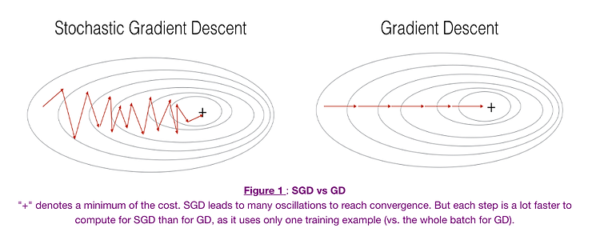
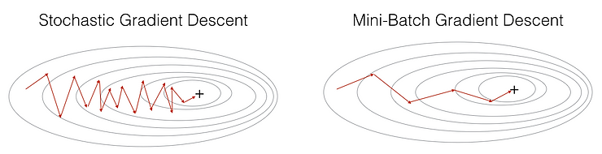
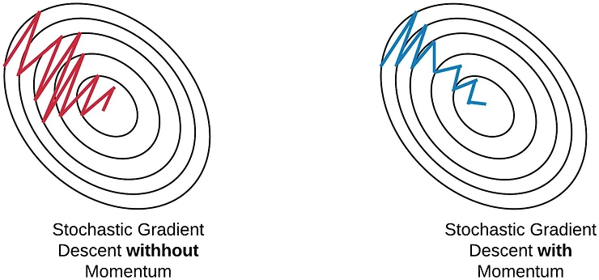
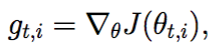
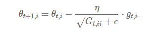
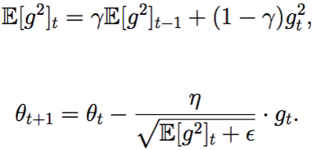
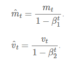
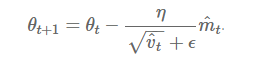

### Introduction

- In deep learning, we have the concept of loss, which tells us how poorly the model is performing at that current instant.
- Now we need to use this loss to **train** our network such that it performs better.
- Essentially what we need to do is to take the loss and try to **minimize** it, because a lower loss means our model is going to perform better.
- The process of minimizing (or maximizing) any mathematical expression is called **optimization.**
- Optimizers are algorithms or methods used to change the attributes of the neural network such as **weights** and **learning rate** to reduce the losses.
- Optimizers are used to solve optimization problems by minimizing the function.

We’ll compare below listed types of optimizers

1. Gradient Descent
2. Stochastic Gradient Descent (SGD)
3. Mini Batch Stochastic Gradient Descent (MB-SGD)
4. SGD with momentum
5. Nesterov Accelerated Gradient (NAG)
6. Adaptive Gradient (AdaGrad)
7. AdaDelta
8. RMSprop
9. Adaptive Moment Estimation (Adam)

### 1\. **Gradient Descent**

- Most Basic & Most Used
- Used in Back Prpogation
- Depends on first order derivative of a loss function
- algorithm: **θ=θ−α⋅∇J(θ)**

**Advantages**:

1. Easy computation.
2. Easy to implement.
3. Easy to understand.

**Disadvantages**:

1. May trap at local minima.
2. Weights are changed after calculating gradient on the whole dataset. So, if the dataset is too large than this may take years to converge to the minima.
3. Requires large memory to calculate gradient on the whole dataset.

### 2\. **Stochastic Gradient Descent** (SGD)

- An atempt to solve the Slow convergenece of Simple GD.
- Loss Calculation and parameter update after every training observation. (1000 updates for 1000 rows instead of 1 in gradient descent)
- **θ=θ−α⋅∇J(θ;x(i);y(i)) , where {x(i) ,y(i)} are the training examples**.

**Advantages**:

1. Frequent updates of model parameters hence, converges in less time.
2. Requires less memory as no need to store values of loss functions.
3. May get new minima’s.

**Disadvantages**:

1. High variance in model parameters.
2. May shoot even after achieving global minima.
3. To get the same convergence as gradient descent needs to slowly reduce the value of learning rate.

### 3\. Mini Batch Stochastic Gradient Descent (MB-SGD)

- An attempt to solve slow convergence of Simple GD and High variance of SGD.
- Dataset is divided into various batches and after every batch, the parameters are updated.
- **θ=θ−α⋅∇J(θ; B(i)), where {B(i)} are the batches of training examples**.

**Advantages**:

1. Considered as Best of the gradient descent based algorithms.
2. Frequently updates the model parameters and also has less variance.
3. Requires medium amount of memory.

**All types of Gradient Descent have some challenges:**

1. Choosing an optimum value of the learning rate. If the learning rate is too small than gradient descent may take ages to converge.
2. Have a constant learning rate for all the parameters. There may be some parameters which we may not want to change at the same rate.
3. May get trapped at local minima.

### 4\. S**GD with momentum**

- Another attempt to solve high variance of SGD
- One New Hyperparameter: Momentum (‘**γ**’) is introduced.
- It accelerates the convergence towards the relevant direction and reduces the fluctuation to the irrelevant direction.
- **V(t)=γV(t−1)+α.∇J(θ)** and the weights are updated by **θ=θ−V(t).**

**Advantages**:

1. Reduces the oscillations and high variance of the parameters.
2. Converges faster than gradient descent.

**Disadvantages**:

1. One more hyper-parameter is added which needs to be selected manually and accurately.
2. If the momentum is too high the algorithm may miss the local minima and may continue to rise up.

### 5\. Nesterov Accelerated Gradient

- Invented to Solve the issue of missing local minima (when momentum is too high) in case of Momentum based optimization.
- In NAG, we’ll calculate the cost based on this future parameter rather than the current one.
- We’ll be using **γV(t−1)** for modifying the weights so, **θ−γV(t−1)** approximately tells us the future location. It is a look ahead method.
- **V(t)=γV(t−1)+α. ∇J( θ−γV(t−1) )** and then update the parameters using **θ=θ−V(t).**

**Advantages**:

1. Does not miss the local minima.
2. Slows if minima’s are occurring.

**Disadvantages**:

1. Still, the hyperparameter needs to be selected manually.

### 6\. Adaptive Gradient (AdaGrad)

- An attempt to solve the problem of tuning learning rate manually.
- In Adagrad, we change the learning rate **‘η’** for each parameter and at every time step **‘t’.** 
- **η** is a learning rate which is modified for given parameter **θ(i)** at a given time based on previous gradients calculated for given parameter **θ(i).**
- We store the sum of the squares of the gradients w.r.t. **θ(i)** up to time step **t**, while **ϵ** is a smoothing term that avoids division by zero.
- It makes big updates for less frequent parameters and a small step for frequent parameters.

<figure>

<figcaption>

A derivative of loss function for given parameters at a given time t.

</figcaption>

</figure>

<figure>

<figcaption>

Update parameters for given input i and at time/iteration t

</figcaption>

</figure>

**Advantages**:

1. Learning rate changes for each training parameter.
2. Don’t need to manually tune the learning rate.
3. Able to train on sparse data.

**Disadvantages**:

1. Computationally expensive as a need to calculate the second order derivative.
2. The learning rate is always decreasing results in slow training.

### 7\. AdaDelta

- It is an extension of **AdaGrad** which tends to remove the _decaying learning Rate_ problem of it.
- Instead of accumulating all previously squared gradients, **_Adadelta_** limits the window of accumulated past gradients to some fixed size **w**.
- In this exponentially moving average is used rather than the sum of all the gradients.

<figure>

<figcaption>

Update the parameters

</figcaption>

</figure>

**Advantages**:

1. Now the learning rate does not decay and the training does not stop.

**Disadvantages**:

1. Computationally expensive.

### 8\. RMSprop

- RMSprop in fact is identical to the first update vector of Adadelta that we derived above.
- RMSprop as well divides the learning rate by an exponentially decaying average of squared gradients. Hinton suggests **γ** be set to 0.9, while a good default value for the learning rate **η** is 0.001.
- RMSprop and Adadelta have both been developed independently around the same time stemming from the need to resolve Adagrad's radically diminishing learning rates

### 9\. Adaptive Moment Estimation (Adam)

- Adam (Adaptive Moment Estimation) works with momentums of first and second order.
- In addition to storing an exponentially decaying average of past squared gradients like **AdaDelta**, 
- **_Adam_** also keeps track of:
    - first moment :- **Mean** of past gradients **M(t)**
    - second moment:- uncentered **Variance** of the gradients **V(t)**.

<figure>

<figcaption>

First and second order of momentum

</figcaption>

</figure>

To update the parameter:

<figure>

<figcaption>

Update the parameters

</figcaption>

</figure>

**Advantages**:

1. The method is too fast and converges rapidly.
2. Rectifies vanishing learning rate, high variance.

**Disadvantages**:

Computationally costly.

### **Conclusions**

Now observing the above animation and theory we can draw following points:

1. It is observed that the SGD algorithm (red) is stuck at a saddle point. So SGD algorithm can only be used for shallow networks.
2. All the other algorithms except SGD finally converges one after the other, AdaDelta being the fastest followed by momentum algorithms.
3. AdaGrad and AdaDelta algorithm can be used for sparse data.
4. Momentum and NAG work well for most cases but is slower.
5. Animation for Adam is not available but from the plot above it is observed that it is the fastest algorithm to converge to minima.
6. Adam is considered the best algorithm amongst all the algorithms discussed above.
