## 1333203 DSA Summer 2024

### Question 1(a): Define linear data structure and give its examples. (03 marks)

**Ans 1(a):**
A linear data structure is a type of data organization where elements are arranged in a sequential manner, with each element directly linked to its adjacent elements. Key characteristics of linear data structures include:

- Elements are organized in a linear or sequential order.
- Each element has a unique predecessor and successor, except for the first and last elements.
- Data can be traversed in a single run, i.e., in one pass.

Examples of linear data structures:

1. **Array**: A collection of elements stored in contiguous memory locations.
2. **Linked List**: A sequence of nodes where each node contains data and a reference to the next node.
3. **Stack**: Follows Last-In-First-Out (LIFO) principle for element access.
4. **Queue**: Follows First-In-First-Out (FIFO) principle for element access.

```mermaid
graph TD
    subgraph Array
    A[0] --> |10| B[1]
    B --> |20| C[2]
    C --> |30| D[3]
    D --> |40| E[4]
    end

    subgraph "Linked List"
    F["10 | ->"] --> G["20 | ->"]
    G --> H["30 | ->"]
    H --> I["40 | null"]
    end

    subgraph Stack
    J[Top] --> |40| K
    K --> |30| L
    L --> |20| M
    M --> |10| N[Bottom]
    end

    subgraph Queue
    O[Front] --> |10| P
    P --> |20| Q
    Q --> |30| R
    R --> |40| S[Rear]
    end
```

### પ્રશ્ન 1(અ): રેખીય ડેટા સ્ટ્રક્ચર વ્યાખ્યાયિત કરો અને તેના ઉદાહરણો આપો. (૦૩)

**જવાબ 1(અ):**
રેખીય ડેટા સ્ટ્રક્ચર એ ડેટા સંગઠનનો એક પ્રકાર છે જ્યાં elements ક્રમિક રીતે ગોઠવાયેલા હોય છે, જેમાં દરેક element તેના આજુબાજુના elements સાથે સીધી રીતે જોડાયેલો હોય છે. રેખીય ડેટા સ્ટ્રક્ચરની મુખ્ય લાક્ષણિકતાઓમાં સામેલ છે:

- Elements રેખીય અથવા ક્રમિક ક્રમમાં ગોઠવાયેલા હોય છે.
- દરેક element ને અનન્ય પૂર્વગામી અને અનુગામી હોય છે, સિવાય કે પ્રથમ અને છેલ્લા elements.
- ડેટાને એક જ run માં, એટલે કે એક પાસમાં traverse કરી શકાય છે.

રેખીય ડેટા સ્ટ્રક્ચરના ઉદાહરણો:

1. **Array**: સળંગ મેમરી સ્થાનોમાં સંગ્રહિત elements નો સમૂહ.
2. **Linked List**: nodes નો ક્રમ જ્યાં દરેક node માં ડેટા અને આગળના node નો સંદર્ભ હોય છે.
3. **Stack**: Element access માટે Last-In-First-Out (LIFO) સિદ્ધાંતને અનુસરે છે.
4. **Queue**: Element access માટે First-In-First-Out (FIFO) સિદ્ધાંતને અનુસરે છે.


### Question 1(b): Define time and space complexity. (04 marks)

**Ans 1(b):**
Time and space complexity are crucial concepts in algorithm analysis that help evaluate the efficiency and resource requirements of an algorithm.

**Time Complexity:**
Time complexity is a measure of the amount of time an algorithm takes to complete as a function of the input size. It represents the number of operations or steps an algorithm performs relative to the input size.

Key points about time complexity:
- Expressed using Big O notation, e.g., O(n), O(log n), O(n^2)
- Focuses on the worst-case scenario
- Helps compare the efficiency of different algorithms
- Independent of hardware or implementation details

Example: An algorithm with O(n) time complexity means its execution time grows linearly with the input size.

**Space Complexity:**
Space complexity refers to the amount of memory space an algorithm requires relative to the input size. It measures how much additional or auxiliary space is needed by the algorithm to solve a problem.

Key points about space complexity:
- Also expressed using Big O notation
- Includes both auxiliary space and space used by the input
- Helps evaluate memory efficiency of algorithms
- Important for applications with limited memory resources

Example: An algorithm with O(1) space complexity uses a constant amount of extra space regardless of input size.

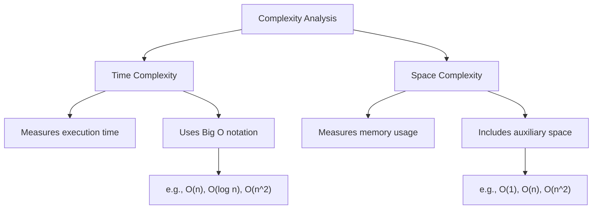

### પ્રશ્ન 1(બ): ટાઇમ અને સ્પેસ કોમ્પ્લેક્ષીટી વ્યાખ્યાયિત કરો. (૦૪)

**જવાબ 1(બ):**
ટાઇમ અને સ્પેસ કોમ્પ્લેક્ષીટી એ અલ્ગોરિધમ વિશ્લેષણમાં મહત્વપૂર્ણ ખ્યાલો છે જે અલ્ગોરિધમની કાર્યક્ષમતા અને સંસાધન જરૂરિયાતોનું મૂલ્યાંકન કરવામાં મદદ કરે છે.

**ટાઇમ કોમ્પ્લેક્ષીટી:**
ટાઇમ કોમ્પ્લેક્ષીટી એ ઇનપુટ સાઇઝના ફંક્શન તરીકે અલ્ગોરિધમ પૂર્ણ થવામાં લાગતા સમયનું માપ છે. તે ઇનપુટ સાઇઝના સંબંધમાં અલ્ગોરિધમ દ્વારા કરવામાં આવતા operations અથવા steps ની સંખ્યાને રજૂ કરે છે.

ટાઇમ કોમ્પ્લેક્ષીટી વિશેના મુખ્ય મુદ્દાઓ:
- Big O notation નો ઉપયોગ કરીને વ્યક્ત કરવામાં આવે છે, દા.ત., O(n), O(log n), O(n^2)
- સૌથી ખરાબ કેસ સ્થિતિ પર ધ્યાન કેન્દ્રિત કરે છે
- વિવિધ અલ્ગોરિધમ્સની કાર્યક્ષમતાની તુલના કરવામાં મદદ કરે છે
- હાર્ડવેર અથવા અમલીકરણની વિગતોથી સ્વતંત્ર

ઉદાહરણ: O(n) ટાઇમ કોમ્પ્લેક્ષીટી ધરાવતા અલ્ગોરિધમનો અર્થ એ છે કે તેનો execution સમય ઇનપુટ સાઇઝ સાથે રૈખિક રીતે વધે છે.

**સ્પેસ કોમ્પ્લેક્ષીટી:**
સ્પેસ કોમ્પ્લેક્ષીટી એ ઇનપુટ સાઇઝના સંબંધમાં અલ્ગોરિધમને જરૂરી મેમરી સ્પેસની રકમનો ઉલ્લેખ કરે છે. તે સમસ્યાનો ઉકેલ લાવવા માટે અલ્ગોરિધમને જરૂરી વધારાની અથવા સહાયક જગ્યાનું માપ કરે છે.

સ્પેસ કોમ્પ્લેક્ષીટી વિશેના મુખ્ય મુદ્દાઓ:
- પણ Big O notation નો ઉપયોગ કરીને વ્યક્ત કરવામાં આવે છે
- સહાયક સ્પેસ અને ઇનપુટ દ્વારા વપરાયેલ સ્પેસ બંને સામેલ છે
- અલ્ગોરિધમ્સની મેમરી કાર્યક્ષમતાનું મૂલ્યાંકન કરવામાં મદદ કરે છે
- મર્યાદિત મેમરી સંસાધનો ધરાવતા એપ્લિકેશનો માટે મહત્વપૂર્ણ

ઉદાહરણ: O(1) સ્પેસ કોમ્પ્લેક્ષીટી ધરાવતો અલ્ગોરિધમ ઇનપુટ સાઇઝને ધ્યાનમાં લીધા વિના સતત પ્રમાણમાં વધારાની જગ્યાનો ઉપયોગ કરે છે.

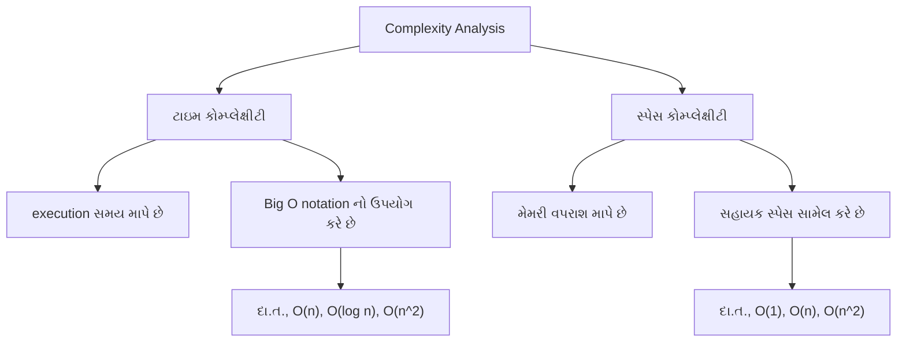

### Question 1(c): Explain the concept of class and object with example. (07 marks)

**Ans 1(c):**
Classes and objects are fundamental concepts in object-oriented programming (OOP). They provide a way to structure code, encapsulate data, and create reusable components.

**Class:**
A class is a blueprint or template for creating objects. It defines the attributes (data) and methods (functions) that the objects of that class will have.

Key points about classes:
- Act as a blueprint for objects
- Encapsulate data and behavior
- Support inheritance and polymorphism
- Promote code reusability and organization

**Object:**
An object is an instance of a class. It represents a specific entity with its own set of data and ability to perform actions defined by its class.

Key points about objects:
- Instances of a class
- Have their own unique set of attributes
- Can perform actions (methods) defined in their class
- Interact with other objects

**Example: Car Class and Objects**

Let's illustrate these concepts with a `Car` class and car objects:

```python
class Car:
    def __init__(self, make, model, year, color):
        self.make = make
        self.model = model
        self.year = year
        self.color = color
        self.speed = 0

    def accelerate(self, increase):
        self.speed += increase
        print(f"{self.make} {self.model} is now going {self.speed} km/h")

    def brake(self, decrease):
        if self.speed - decrease < 0:
            self.speed = 0
        else:
            self.speed -= decrease
        print(f"{self.make} {self.model} slowed down to {self.speed} km/h")

# Creating car objects
car1 = Car("Toyota", "Corolla", 2022, "Blue")
car2 = Car("Honda", "Civic", 2023, "Red")

# Using object methods
car1.accelerate(50)
car2.accelerate(60)
car1.brake(20)
car2.brake(30)
```

In this example:
1. The `Car` class defines the blueprint for car objects.
2. It has attributes like `make`, `model`, `year`, `color`, and `speed`.
3. It also has methods `accelerate()` and `brake()` to modify the car's speed.
4. We create two car objects, `car1` and `car2`, each with its own set of attributes.
5. We can call methods on these objects to change their state.

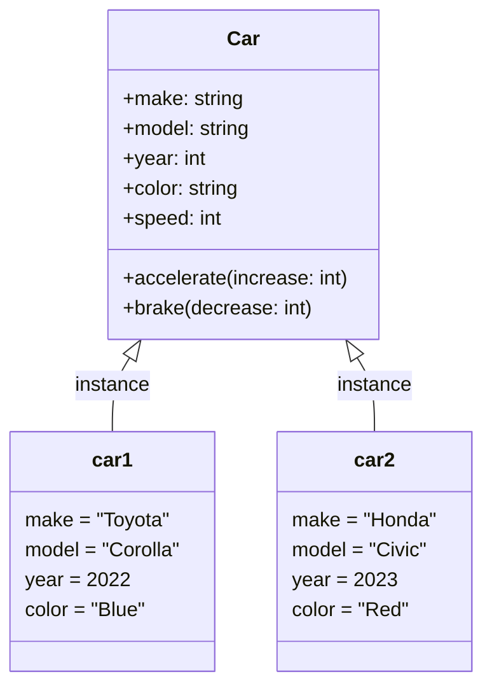

This diagram illustrates the relationship between the `Car` class and its objects, showing how each object is an instance of the class with its own unique set of attributes.

### પ્રશ્ન 1(ક): ક્લાસ અને ઓબ્જેક્ટ ઉદાહરણ સાથે સમજાવો. (૦૭)

**જવાબ 1(ક):**
Class અને object એ object-oriented programming (OOP)માં મૂળભૂત concepts છે. તેઓ કોડને structure કરવા, data ને encapsulate કરવા અને reusable components બનાવવાની રીત પ્રદાન કરે છે.

**Class:**
Class એ objects બનાવવા માટેનો blueprint અથવા template છે. તે attributes (data) અને methods (functions) ને વ્યાખ્યાયિત કરે છે જે તે class ના objects ધરાવશે.

Class વિશેના મુખ્ય મુદ્દાઓ:
- Objects માટે blueprint તરીકે કાર્ય કરે છે
- Data અને behavior ને encapsulate કરે છે
- Inheritance અને polymorphism ને support કરે છે
- Code reusability અને organization ને પ્રોત્સાહન આપે છે

**Object:**
Object એ class નું instance છે. તે ચોક્કસ entity નું પ્રતિનિધિત્વ કરે છે જે તેના પોતાના data set અને તેના class દ્વારા વ્યાખ્યાયિત ક્રિયાઓ કરવાની ક્ષમતા ધરાવે છે.

Objects વિશેના મુખ્ય મુદ્દાઓ:
- Class ના instances છે
- તેમના પોતાના અનન્ય attributes set ધરાવે છે
- તેમના class માં વ્યાખ્યાયિત ક્રિયાઓ (methods) કરી શકે છે
- અન્ય objects સાથે interact કરે છે

**ઉદાહરણ: Car Class અને Objects**

આ concepts ને `Car` class અને car objects સાથે સમજાવીએ:

```python
class Car:
    def __init__(self, make, model, year, color):
        self.make = make
        self.model = model
        self.year = year
        self.color = color
        self.speed = 0

    def accelerate(self, increase):
        self.speed += increase
        print(f"{self.make} {self.model} હવે {self.speed} km/h પર જઈ રહ્યું છે")

    def brake(self, decrease):
        if self.speed - decrease < 0:
            self.speed = 0
        else:
            self.speed -= decrease
        print(f"{self.make} {self.model} ધીમું પડીને {self.speed} km/h પર આવ્યું")

# Car objects બનાવવા
car1 = Car("Toyota", "Corolla", 2022, "Blue")
car2 = Car("Honda", "Civic", 2023, "Red")

# Object methods નો ઉપયોગ કરવો
car1.accelerate(50)
car2.accelerate(60)
car1.brake(20)
car2.brake(30)
```

આ ઉદાહરણમાં:
1. `Car` class car objects માટે blueprint વ્યાખ્યાયિત કરે છે.
2. તેમાં `make`, `model`, `year`, `color`, અને `speed` જેવા attributes છે.
3. તેમાં `accelerate()` અને `brake()` methods પણ છે જે car ની speed ને modify કરે છે.
4. આપણે બે car objects બનાવીએ છીએ, `car1` અને `car2`, દરેક તેના પોતાના attributes set સાથે.
5. આપણે આ objects પર methods ને call કરી શકીએ છીએ જેથી તેમની state બદલાય.


આ આકૃતિ `Car` class અને તેના objects વચ્ચેના સંબંધને દર્શાવે છે, જે બતાવે છે કે કેવી રીતે દરેક object એ class નું instance છે જે તેના પોતાના અનન્ય attributes set ધરાવે છે.

### Question 1(cOR): Explain instance method, class method and static method with example. (07 marks)

**Ans 1(cOR):**
In object-oriented programming, particularly in Python, there are three types of methods: instance methods, class methods, and static methods. Each serves a different purpose and has unique characteristics.

1. **Instance Methods:**
   - Operate on instance-specific data
   - First parameter is `self` (the instance)
   - Can access and modify instance state

2. **Class Methods:**
   - Operate on class-level data
   - First parameter is `cls` (the class)
   - Decorated with `@classmethod`
   - Can access and modify class state

3. **Static Methods:**
   - Don't operate on instance or class data
   - No special first parameter
   - Decorated with `@staticmethod`
   - Utility functions related to the class

Example demonstrating all three types:

```python
class MathOperations:
    pi = 3.14159  # Class variable

    def __init__(self, value):
        self.value = value  # Instance variable

    def square(self):  # Instance method
        return self.value ** 2

    @classmethod
    def circle_area(cls, radius):  # Class method
        return cls.pi * radius ** 2

    @staticmethod
    def add(a, b):  # Static method
        return a + b

# Usage
math_obj = MathOperations(5)
print(math_obj.square())  # Instance method call
print(MathOperations.circle_area(3))  # Class method call
print(MathOperations.add(10, 20))  # Static method call
```

Comparison in tabular form:

| Aspect                    | Instance Method              | Class Method           | Static Method     |
| ------------------------- | ---------------------------- | ---------------------- | ----------------- |
| Decorator                 | None                         | `@classmethod`         | `@staticmethod`   |
| First Parameter           | `self` (instance)            | `cls` (class)          | None              |
| Can Access Instance State | Yes                          | No                     | No                |
| Can Access Class State    | Yes                          | Yes                    | No                |
| Can Modify Class State    | No                           | Yes                    | No                |
| Called via                | Instance                     | Class or Instance      | Class or Instance |
| Use Case                  | Instance-specific operations | Class-level operations | Utility functions |

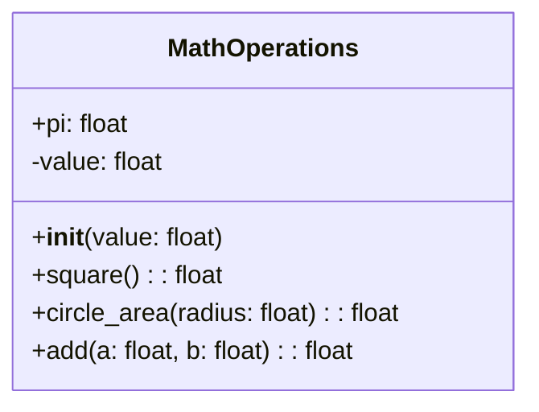

This diagram illustrates the structure of the `MathOperations` class, showing the different types of methods and their parameters.

### પ્રશ્ન 1(કOR): ઇંસ્ટંસ મેથડ, ક્લાસ મેથડ અને સ્ટેટીક મેથડ ઉદાહરણ સાથે સમજાવો. (૦૭)

**જવાબ 1(કOR):**
Object-oriented programming માં, ખાસ કરીને Python માં, ત્રણ પ્રકારની methods હોય છે: instance methods, class methods, અને static methods. દરેક અલગ હેતુ માટે સેવા આપે છે અને અનન્ય લક્ષણો ધરાવે છે.

1. **Instance Methods:**
   - Instance-specific data પર કાર્ય કરે છે
   - પ્રથમ parameter `self` (instance) છે
   - Instance state ને access અને modify કરી શકે છે

2. **Class Methods:**
   - Class-level data પર કાર્ય કરે છે
   - પ્રથમ parameter `cls` (class) છે
   - `@classmethod` decorator સાથે ડેકોરેટ કરેલ હોય છે
   - Class state ને access અને modify કરી શકે છે

3. **Static Methods:**
   - Instance કે class data પર કાર્ય કરતી નથી
   - કોઈ ખાસ પ્રથમ parameter નથી
   - `@staticmethod` decorator સાથે ડેકોરેટ કરેલ હોય છે
   - Class સાથે સંબંધિત utility functions છે

ત્રણેય પ્રકારને દર્શાવતું ઉદાહરણ:

```python
class MathOperations:
    pi = 3.14159  # Class variable

    def __init__(self, value):
        self.value = value  # Instance variable

    def square(self):  # Instance method
        return self.value ** 2

    @classmethod
    def circle_area(cls, radius):  # Class method
        return cls.pi * radius ** 2

    @staticmethod
    def add(a, b):  # Static method
        return a + b

# ઉપયોગ
math_obj = MathOperations(5)
print(math_obj.square())  # Instance method call
print(MathOperations.circle_area(3))  # Class method call
print(MathOperations.add(10, 20))  # Static method call
```

કોષ્ટક સ્વરૂપમાં તુલના:

| પાસું                          | Instance Method              | Class Method           | Static Method       |
| ---------------------------- | ---------------------------- | ---------------------- | ------------------- |
| Decorator                    | કોઈ નહીં                      | `@classmethod`         | `@staticmethod`     |
| પ્રથમ Parameter               | `self` (instance)            | `cls` (class)          | કોઈ નહીં             |
| Instance State Access કરી શકે | હા                           | ના                     | ના                  |
| Class State Access કરી શકે    | હા                           | હા                     | ના                  |
| Class State Modify કરી શકે    | ના                           | હા                     | ના                  |
| દ્વારા Call થાય               | Instance                     | Class અથવા Instance    | Class અથવા Instance |
| ઉપયોગ કેસ                     | Instance-specific operations | Class-level operations | Utility functions   |


આ આકૃતિ `MathOperations` class ની રચનાને દર્શાવે છે, જે વિવિધ પ્રકારની methods અને તેમના parameters બતાવે છે.

### Question 2(a): Explain concept of recursive function. (03 marks)

**Ans 2(a):**
A recursive function is a function that calls itself during its execution. This technique allows the function to repeat its behavior until it reaches a specific condition, known as the base case, which terminates the recursion.

Key points about recursive functions:

1. **Base Case:** 
   - A condition that stops the recursion
   - Prevents infinite recursion
   - Usually the simplest form of the problem

2. **Recursive Case:**
   - The part where the function calls itself
   - Breaks down the problem into smaller subproblems

3. **Call Stack:**
   - Each recursive call adds a new layer to the call stack
   - The stack unwinds as base cases are reached and functions return

4. **Advantages:**
   - Can solve complex problems with elegant and concise code
   - Naturally suited for problems with recursive structures (e.g., tree traversal)

5. **Disadvantages:**
   - Can be memory-intensive for deep recursions
   - May be less efficient than iterative solutions for simple problems

Example of a recursive function to calculate factorial:

```python
def factorial(n):
    # Base case
    if n == 0 or n == 1:
        return 1
    # Recursive case
    else:
        return n * factorial(n - 1)

# Usage
print(factorial(5))  # Output: 120
```

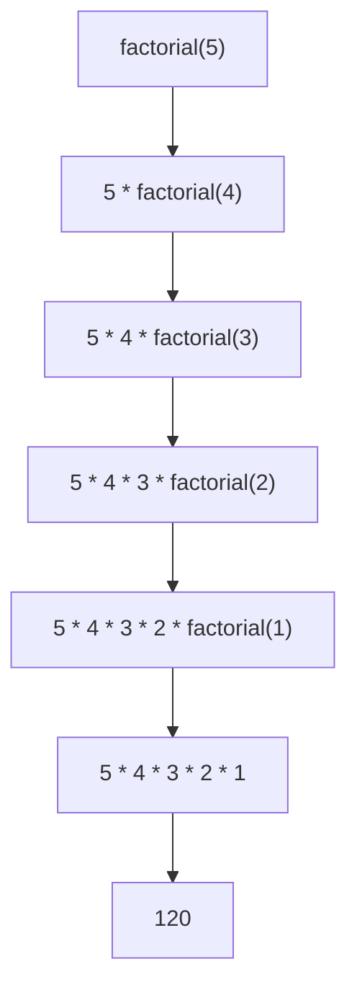

This diagram illustrates how the recursive function breaks down the factorial calculation into smaller subproblems until it reaches the base case.

### પ્રશ્ન 2(અ): રીકર્ઝીવ ફંકશન નો કોંસેપ્ટ સમજાવો. (૦૩)

**જવાબ 2(અ):**
રીકર્ઝીવ ફંક્શન એ એવું ફંક્શન છે જે તેના execution દરમિયાન પોતાને જ કૉલ કરે છે. આ તકનીક ફંક્શનને તેની વર્તણૂકને પુનરાવર્તિત કરવાની મંજૂરી આપે છે જ્યાં સુધી તે ચોક્કસ શરત, જેને base case કહેવામાં આવે છે, સુધી ન પહોંચે, જે રીકર્શનને સમાપ્ત કરે છે.

રીકર્ઝીવ ફંક્શન્સ વિશેના મુખ્ય મુદ્દાઓ:

1. **Base Case:**
   - એક શરત જે રીકર્શનને રોકે છે
   - અનંત રીકર્શનને અટકાવે છે
   - સામાન્ય રીતે સમસ્યાનું સૌથી સરળ સ્વરૂપ

2. **Recursive Case:**
   - તે ભાગ જ્યાં ફંક્શન પોતાને કૉલ કરે છે
   - સમસ્યાને નાના ઉપ-સમસ્યાઓમાં વિભાજિત કરે છે

3. **Call Stack:**
   - દરેક રીકર્ઝીવ કૉલ call stack માં નવું સ્તર ઉમેરે છે
   - જ્યારે base cases સુધી પહોંચે અને ફંક્શન્સ પરત થાય ત્યારે stack unwind થાય છે

4. **ફાયદાઓ:**
   - જટિલ સમસ્યાઓને elegant અને સંક્ષિપ્ત કોડ સાથે ઉકેલી શકે છે
   - રીકર્ઝીવ સ્ટ્રક્ચર્સ (દા.ત., tree traversal) વાળી સમસ્યાઓ માટે કુદરતી રીતે અનુકૂળ

5. **ગેરફાયદાઓ:**
   - ઊંડા રીકર્શન માટે મેમરી-ઇન્ટેન્સિવ હોઈ શકે છે
   - સરળ સમસ્યાઓ માટે iterative solutions કરતાં ઓછું કાર્યક્ષમ હોઈ શકે છે

Factorial ગણવા માટે રીકર્ઝીવ ફંક્શનનું ઉદાહરણ:

```python
def factorial(n):
    # Base case
    if n == 0 or n == 1:
        return 1
    # Recursive case
    else:
        return n * factorial(n - 1)

# ઉપયોગ
print(factorial(5))  # આઉટપુટ: 120
```


આ આકૃતિ દર્શાવે છે કે કેવી રીતે રીકર્ઝીવ ફંક્શન factorial ગણતરીને નાના ઉપ-સમસ્યાઓમાં વિભાજિત કરે છે જ્યાં સુધી તે base case સુધી ન પહોંચે.

### Question 2(b): Define stack and queue. (04 marks)

**Ans 2(b):**

**Stack:**
A stack is a linear data structure that follows the Last-In-First-Out (LIFO) principle. It can be visualized as a stack of plates where you can only add or remove plates from the top.

Key characteristics of a stack:
1. Elements are added to the top (push operation)
2. Elements are removed from the top (pop operation)
3. Only the top element is accessible at any time
4. Follows the LIFO (Last-In-First-Out) principle

Common operations:
- Push: Add an element to the top
- Pop: Remove the top element
- Peek or Top: View the top element without removing it
- IsEmpty: Check if the stack is empty

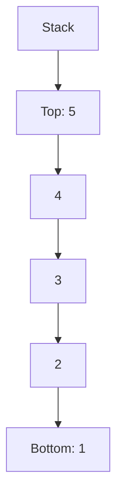

**Queue:**
A queue is a linear data structure that follows the First-In-First-Out (FIFO) principle. It can be visualized as a line of people waiting for a service, where the first person to join the line is the first to be served.

Key characteristics of a queue:
1. Elements are added at the rear (enqueue operation)
2. Elements are removed from the front (dequeue operation)
3. Follows the FIFO (First-In-First-Out) principle

Common operations:
- Enqueue: Add an element to the rear
- Dequeue: Remove the front element
- Front: View the front element without removing it
- IsEmpty: Check if the queue is empty

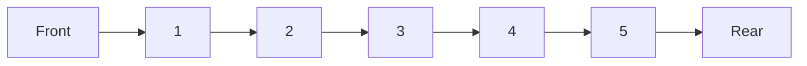

Both stacks and queues are fundamental data structures used in various algorithms and system designs, each suited for different types of problems based on their access patterns.

### પ્રશ્ન 2(બ): સ્ટેક અને ક્યુ વ્યાખ્યાયિત કરો. (૦૪)

**જવાબ 2(બ):**

**સ્ટેક:**
સ્ટેક એ એક linear data structure છે જે Last-In-First-Out (LIFO) સિદ્ધાંતને અનુસરે છે. તેને પ્લેટ્સના સ્ટેક તરીકે કલ્પના કરી શકાય છે જ્યાં તમે માત્ર ટોચથી જ પ્લેટ્સ ઉમેરી અથવા દૂર કરી શકો છો.

સ્ટેકની મુખ્ય લાક્ષણિકતાઓ:
1. Elements ને ટોચ પર ઉમેરવામાં આવે છે (push operation)
2. Elements ને ટોચથી દૂર કરવામાં આવે છે (pop operation)
3. કોઈપણ સમયે માત્ર ટોચનો element જ accessible હોય છે
4. LIFO (Last-In-First-Out) સિદ્ધાંતને અનુસરે છે

સામાન્ય operations:
- Push: ટોચ પર element ઉમેરવો
- Pop: ટોચનો element દૂર કરવો
- Peek અથવા Top: ટોચનો element દૂર કર્યા વગર જોવો
- IsEmpty: સ્ટેક ખાલી છે કે નહીં તે ચકાસવું

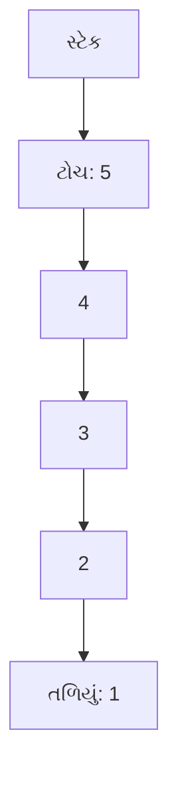

**ક્યુ:**
ક્યુ એ એક linear data structure છે જે First-In-First-Out (FIFO) સિદ્ધાંતને અનુસરે છે. તેને સેવા માટે રાહ જોતા લોકોની લાઇન તરીકે કલ્પના કરી શકાય છે, જ્યાં લાઇનમાં જોડાનાર પ્રથમ વ્યક્તિને પ્રથમ સેવા આપવામાં આવે છે.

ક્યુની મુખ્ય લાક્ષણિકતાઓ:
1. Elements ને પાછળના ભાગમાં ઉમેરવામાં આવે છે (enqueue operation)
2. Elements ને આગળના ભાગથી દૂર કરવામાં આવે છે (dequeue operation)
3. FIFO (First-In-First-Out) સિદ્ધાંતને અનુસરે છે

સામાન્ય operations:
- Enqueue: પાછળના ભાગમાં element ઉમેરવો
- Dequeue: આગળના ભાગનો element દૂર કરવો
- Front: આગળના ભાગનો element દૂર કર્યા વગર જોવો
- IsEmpty: ક્યુ ખાલી છે કે નહીં તે ચકાસવું

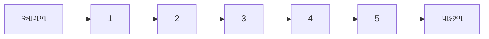

સ્ટેક અને ક્યુ બંને વિવિધ algorithms અને system designs માં ઉપયોગમાં લેવાતા મૂળભૂત data structures છે, જે તેમના access patterns ના આધારે અલગ-અલગ પ્રકારની સમસ્યાઓ માટે યોગ્ય છે.

### Question 2(c): Explain basic operations on stack. (07 marks)

**Ans 2(c):**
A stack is a fundamental data structure that follows the Last-In-First-Out (LIFO) principle. The basic operations on a stack include Push, Pop, Peek (or Top), IsEmpty, and IsFull. Let's explain each of these operations in detail:

1. **Push Operation:**
   - Adds an element to the top of the stack
   - Increases the stack size by 1
   - If the stack is full, it results in a stack overflow condition

   ```python
   def push(stack, item):
       if len(stack) < MAX_SIZE:
           stack.append(item)
       else:
           print("Stack Overflow")
   ```

2. **Pop Operation:**
   - Removes the top element from the stack
   - Decreases the stack size by 1
   - If the stack is empty, it results in a stack underflow condition

   ```python
   def pop(stack):
       if not is_empty(stack):
           return stack.pop()
       else:
           print("Stack Underflow")
           return None
   ```

3. **Peek (or Top) Operation:**
   - Returns the top element of the stack without removing it
   - Does not modify the stack

   ```python
   def peek(stack):
       if not is_empty(stack):
           return stack[-1]
       else:
           print("Stack is empty")
           return None
   ```

4. **IsEmpty Operation:**
   - Checks if the stack is empty
   - Returns True if the stack has no elements, False otherwise

   ```python
   def is_empty(stack):
       return len(stack) == 0
   ```

5. **IsFull Operation:**
   - Checks if the stack is full (applicable for fixed-size stacks)
   - Returns True if the stack has reached its maximum capacity, False otherwise

   ```python
   def is_full(stack):
       return len(stack) == MAX_SIZE
   ```

Example usage of these operations:

```python
MAX_SIZE = 5
stack = []

push(stack, 1)
push(stack, 2)
push(stack, 3)

print("Top element:", peek(stack))  # Output: 3
print("Popped element:", pop(stack))  # Output: 3
print("Is stack empty?", is_empty(stack))  # Output: False
print("Is stack full?", is_full(stack))  # Output: False
```

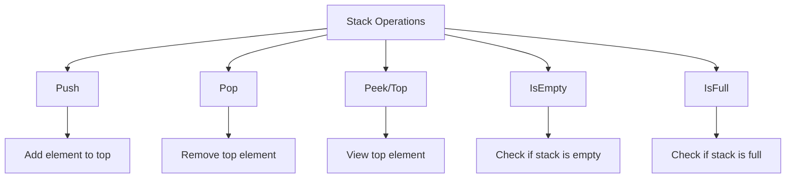

This diagram illustrates the basic operations on a stack and their primary functions.

### પ્રશ્ન 2(ક): સ્ટેક ના બેઝિક ઓપરેશન સમજાવો. (૦૭)

**જવાબ 2(ક):**
સ્ટેક એ મૂળભૂત ડેટા સ્ટ્રક્ચર છે જે Last-In-First-Out (LIFO) સિદ્ધાંતને અનુસરે છે. સ્ટેક પરના મૂળભૂત ઓપરેશન્સમાં Push, Pop, Peek (અથવા Top), IsEmpty, અને IsFull નો સમાવેશ થાય છે. આ દરેક ઓપરેશન્સને વિગતવાર સમજાવીએ:

1. **Push ઓપરેશન:**
   - સ્ટેકની ટોચ પર એક element ઉમેરે છે
   - સ્ટેકનું કદ 1 વધારે છે
   - જો સ્ટેક ભરેલો હોય, તો તે stack overflow સ્થિતિમાં પરિણમે છે

   ```python
   def push(stack, item):
       if len(stack) < MAX_SIZE:
           stack.append(item)
       else:
           print("સ્ટેક ઓવરફ્લો")
   ```

2. **Pop ઓપરેશન:**
   - સ્ટેકમાંથી ટોચનો element દૂર કરે છે
   - સ્ટેકનું કદ 1 ઘટાડે છે
   - જો સ્ટેક ખાલી હોય, તો તે stack underflow સ્થિતિમાં પરિણમે છે

   ```python
   def pop(stack):
       if not is_empty(stack):
           return stack.pop()
       else:
           print("સ્ટેક અંડરફ્લો")
           return None
   ```

3. **Peek (અથવા Top) ઓપરેશન:**
   - સ્ટેકના ટોચના element ને દૂર કર્યા વગર પરત કરે છે
   - સ્ટેકમાં કોઈ ફેરફાર કરતું નથી

   ```python
   def peek(stack):
       if not is_empty(stack):
           return stack[-1]
       else:
           print("સ્ટેક ખાલી છે")
           return None
   ```

4. **IsEmpty ઓપરેશન:**
   - સ્ટેક ખાલી છે કે નહીં તે ચકાસે છે
   - જો સ્ટેકમાં કોઈ elements ન હોય તો True, અન્યથા False પરત કરે છે

   ```python
   def is_empty(stack):
       return len(stack) == 0
   ```

5. **IsFull ઓપરેશન:**
   - સ્ટેક ભરેલો છે કે નહીં તે ચકાસે છે (નિશ્ચિત-કદના સ્ટેક્સ માટે લાગુ)
   - જો સ્ટેક તેની મહત્તમ ક્ષમતા સુધી પહોંચ્યો હોય તો True, અન્યથા False પરત કરે છે

   ```python
   def is_full(stack):
       return len(stack) == MAX_SIZE
   ```

આ ઓપરેશન્સનો ઉપયોગનું ઉદાહરણ:

```python
MAX_SIZE = 5
stack = []

push(stack, 1)
push(stack, 2)
push(stack, 3)

print("ટોચનો element:", peek(stack))  # આઉટપુટ: 3
print("દૂર કરેલ element:", pop(stack))  # આઉટપુટ: 3
print("શું સ્ટેક ખાલી છે?", is_empty(stack))  # આઉટપુટ: False
print("શું સ્ટેક ભરેલો છે?", is_full(stack))  # આઉટપુટ: False
```

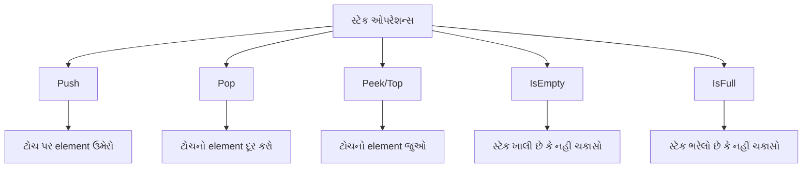

આ આકૃતિ સ્ટેક પરના મૂળભૂત ઓપરેશન્સ અને તેમના મુખ્ય કાર્યોને દર્શાવે છે.

### Question 2(aOR): Define singly linked list. (03 marks)

**Ans 2(aOR):**
A singly linked list is a linear data structure in which elements are stored in nodes. Each node contains two components:

1. Data: The actual value or information stored in the node.
2. Next pointer: A reference to the next node in the sequence.

Key characteristics of a singly linked list:

- Each node points only to the next node in the sequence.
- The last node points to NULL, indicating the end of the list.
- The first node is called the head of the list.
- Elements are not stored in contiguous memory locations.
- Dynamic size, allowing for efficient insertion and deletion operations.

Basic structure of a node in a singly linked list:

```python
class Node:
    def __init__(self, data):
        self.data = data
        self.next = None
```

Diagrammatic representation:

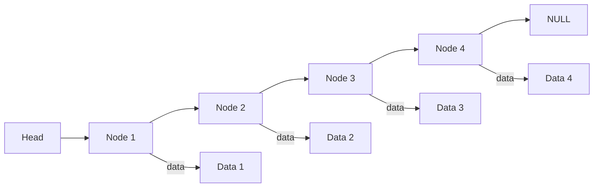

This diagram shows a singly linked list with four nodes, where each node points to the next one, and the last node points to NULL.

### પ્રશ્ન 2(અOR): સિંગ્લી લિંક્ડ લિસ્ટ વ્યાખ્યાયિત કરો. (૦૩)

**જવાબ 2(અOR):**
સિંગ્લી લિંક્ડ લિસ્ટ એ એક linear data structure છે જેમાં elements ને nodes માં સંગ્રહિત કરવામાં આવે છે. દરેક node બે ઘટકો ધરાવે છે:

1. Data: Node માં સંગ્રહિત વાસ્તવિક મૂલ્ય અથવા માહિતી.
2. Next pointer: શ્રેણીમાં આગળના node નો સંદર્ભ.

સિંગ્લી લિંક્ડ લિસ્ટની મુખ્ય લાક્ષણિકતાઓ:

- દરેક node માત્ર શ્રેણીમાં આગળના node તરફ પોઇન્ટ કરે છે.
- છેલ્લો node NULL તરફ પોઇન્ટ કરે છે, જે લિસ્ટના અંતને દર્શાવે છે.
- પ્રથમ node ને લિસ્ટનું head કહેવામાં આવે છે.
- Elements સળંગ મેમરી સ્થાનોમાં સંગ્રહિત થતા નથી.
- Dynamic કદ, જે કાર્યક્ષમ insertion અને deletion operations ની મંજૂરી આપે છે.

સિંગ્લી લિંક્ડ લિસ્ટમાં node ની મૂળભૂત રચના:

```python
class Node:
    def __init__(self, data):
        self.data = data
        self.next = None
```

આકૃતિ દ્વારા રજૂઆત:


આ આકૃતિ ચાર nodes વાળી સિંગ્લી લિંક્ડ લિસ્ટ દર્શાવે છે, જ્યાં દરેક node આગળના node તરફ પોઇન્ટ કરે છે, અને છેલ્લો node NULL તરફ પોઇન્ટ કરે છે.

### Question 2(bOR): Explain Enqueue and Dequeue operations on Queue. (04 marks)

**Ans 2(bOR):**

A queue is a linear data structure that follows the First-In-First-Out (FIFO) principle. The two primary operations on a queue are Enqueue and Dequeue.

1. **Enqueue Operation:**
   - Adds an element to the rear of the queue
   - Increases the size of the queue by 1
   - If the queue is full, it results in a queue overflow condition

   ```python
   def enqueue(queue, item):
       if len(queue) < MAX_SIZE:
           queue.append(item)
       else:
           print("Queue Overflow")
   ```

2. **Dequeue Operation:**
   - Removes the element from the front of the queue
   - Decreases the size of the queue by 1
   - If the queue is empty, it results in a queue underflow condition

   ```python
   def dequeue(queue):
       if not is_empty(queue):
           return queue.pop(0)
       else:
           print("Queue Underflow")
           return None
   ```

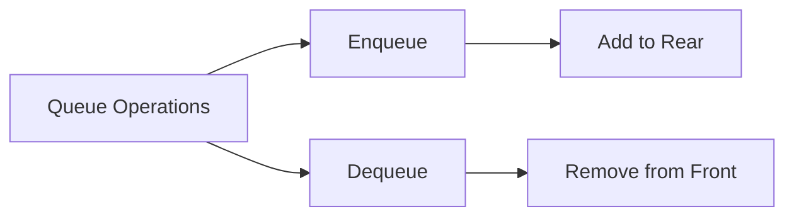

This diagram illustrates the Enqueue and Dequeue operations on a queue.

### પ્રશ્ન 2(બOR): ક્યુ ઉપર એનક્યુ ડીક્યુ ઓપરેશન સમજાવો. (૦૪)

**જવાબ 2(બOR):**

ક્યુ એ એક linear data structure છે જે First-In-First-Out (FIFO) સિદ્ધાંતને અનુસરે છે. ક્યુ પરના બે મુખ્ય ઓપરેશન્સ એનક્યુ અને ડીક્યુ છે.

1. **એનક્યુ (Enqueue) ઓપરેશન:**
   - ક્યુના પાછળના ભાગમાં એક element ઉમેરે છે
   - ક્યુનું કદ 1 વધારે છે
   - જો ક્યુ ભરેલી હોય, તો તે queue overflow સ્થિતિમાં પરિણમે છે

   ```python
   def enqueue(queue, item):
       if len(queue) < MAX_SIZE:
           queue.append(item)
       else:
           print("ક્યુ ઓવરફ્લો")
   ```

2. **ડીક્યુ (Dequeue) ઓપરેશન:**
   - ક્યુના આગળના ભાગમાંથી element દૂર કરે છે
   - ક્યુનું કદ 1 ઘટાડે છે
   - જો ક્યુ ખાલી હોય, તો તે queue underflow સ્થિતિમાં પરિણમે છે

   ```python
   def dequeue(queue):
       if not is_empty(queue):
           return queue.pop(0)
       else:
           print("ક્યુ અંડરફ્લો")
           return None
   ```

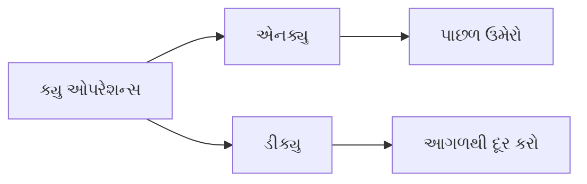

આ આકૃતિ ક્યુ પરના એનક્યુ અને ડીક્યુ ઓપરેશન્સને દર્શાવે છે.

### Question 2(cOR): Convert expression A+B/C+D to postfix and evaluate postfix expression using stack assuming some values for A, B, C and D. (07 marks)

**Ans 2(cOR):**

Let's break this down into two parts: converting the infix expression to postfix, and then evaluating the postfix expression.

1. Converting A+B/C+D to postfix:

Step 1: Use the following precedence rules:
- '+' and '-' have lower precedence
- '*' and '/' have higher precedence
- Left to right associativity for operators with equal precedence

Step 2: Scan the infix expression from left to right:
A → output: A
+ → push to stack: +
B → output: AB
/ → push to stack: /+
C → output: ABC
+ → pop and output /, pop and output +, push +
D → output: ABC/+D

Step 3: Pop remaining operators from the stack:
Final postfix expression: ABC/+D+

2. Evaluating the postfix expression:

Let's assume the following values:
A = 5, B = 10, C = 2, D = 3

We'll use a stack to evaluate the postfix expression:

```python
def evaluate_postfix(expression, values):
    stack = []
    for char in expression:
        if char in values:
            stack.append(values[char])
        else:
            b = stack.pop()
            a = stack.pop()
            if char == '+':
                stack.append(a + b)
            elif char == '/':
                stack.append(a / b)
    return stack.pop()

values = {'A': 5, 'B': 10, 'C': 2, 'D': 3}
postfix = "ABC/+D+"
result = evaluate_postfix(postfix, values)
print(f"Result: {result}")
```

Evaluation steps:
1. Push 5 (A)
2. Push 10 (B)
3. Push 2 (C)
4. Pop 2, Pop 10, Divide: 10/2 = 5, Push 5
5. Pop 5, Pop 5, Add: 5+5 = 10, Push 10
6. Push 3 (D)
7. Pop 3, Pop 10, Add: 10+3 = 13

Final result: 13

```mermaid
graph TD
    A[Start] --> B[Convert to Postfix]
    B --> C[ABC/+D+]
    C --> D[Evaluate Postfix]
    D --> E[Push 5 A]
    E --> F[Push 10 B]
    F --> G[Push 2 C]
    G --> H[Divide B/C]
    H --> I[Add A + B/C]
    I --> J[Push 3 D]
    J --> K[Add Result + D]
    K --> L[Final Result: 13]
```

### પ્રશ્ન 2(કOR): A+B/C+D પદ ને પોસ્ટફીક્ષ મા ફેરવો અને સ્ટેક નો ઉપયોગ કરીને A,B,C અને D ની કોઇ કિમત ધારીને એનુ મુલ્ય શોધો. (૦૭)

**જવાબ 2(કOR):**

આ પ્રશ્નને બે ભાગમાં વિભાજિત કરીએ: ઇનફિક્સ અભિવ્યક્તિને પોસ્ટફિક્સમાં રૂપાંતરિત કરવી અને પછી પોસ્ટફિક્સ અભિવ્યક્તિનું મૂલ્યાંકન કરવું.

1. A+B/C+D ને પોસ્ટફિક્સમાં રૂપાંતરિત કરવું:

પગલું 1: નીચેના પ્રાધાન્યતા નિયમોનો ઉપયોગ કરો:
- '+' અને '-' ને ઓછી પ્રાધાન્યતા
- '*' અને '/' ને ઉચ્ચ પ્રાધાન્યતા
- સમાન પ્રાધાન્યતા વાળા ઓપરેટર્સ માટે ડાબેથી જમણે સંકલન

પગલું 2: ઇનફિક્સ અભિવ્યક્તિને ડાબેથી જમણે સ્કેન કરો:
A → આઉટપુટ: A
+ → સ્ટેકમાં પુશ કરો: +
B → આઉટપુટ: AB
/ → સ્ટેકમાં પુશ કરો: /+
C → આઉટપુટ: ABC
+ → પોપ કરો અને / આઉટપુટ કરો, પોપ કરો અને + આઉટપુટ કરો, + પુશ કરો
D → આઉટપુટ: ABC/+D

પગલું 3: સ્ટેકમાંથી બાકીના ઓપરેટર્સને પોપ કરો:
અંતિમ પોસ્ટફિક્સ અભિવ્યક્તિ: ABC/+D+

2. પોસ્ટફિક્સ અભિવ્યક્તિનું મૂલ્યાંકન:

ચાલો નીચેની કિંમતો ધારીએ:
A = 5, B = 10, C = 2, D = 3

આપણે પોસ્ટફિક્સ અભિવ્યક્તિનું મૂલ્યાંકન કરવા માટે સ્ટેકનો ઉપયોગ કરીશું:

```python
def evaluate_postfix(expression, values):
    stack = []
    for char in expression:
        if char in values:
            stack.append(values[char])
        else:
            b = stack.pop()
            a = stack.pop()
            if char == '+':
                stack.append(a + b)
            elif char == '/':
                stack.append(a / b)
    return stack.pop()

values = {'A': 5, 'B': 10, 'C': 2, 'D': 3}
postfix = "ABC/+D+"
result = evaluate_postfix(postfix, values)
print(f"પરિણામ: {result}")
```

મૂલ્યાંકન પગલાં:
1. 5 પુશ કરો (A)
2. 10 પુશ કરો (B)
3. 2 પુશ કરો (C)
4. 2 પોપ કરો, 10 પોપ કરો, ભાગાકાર: 10/2 = 5, 5 પુશ કરો
5. 5 પોપ કરો, 5 પોપ કરો, સરવાળો: 5+5 = 10, 10 પુશ કરો
6. 3 પુશ કરો (D)
7. 3 પોપ કરો, 10 પોપ કરો, સરવાળો: 10+3 = 13

અંતિમ પરિણામ: 13

```mermaid
graph TD
    A[શરૂઆત] --> B[પોસ્ટફિક્સમાં રૂપાંતર]
    B --> C[ABC/+D+]
    C --> D[પોસ્ટફિક્સનું મૂલ્યાંકન]
    D --> E[5 પુશ કરો A]
    E --> F[10 પુશ કરો B]
    F --> G[2 પુશ કરો C]
    G --> H[B/C ભાગાકાર]
    H --> I[A + B/C સરવાળો]
    I --> J[3 પુશ કરો D]
    J --> K[પરિણામ + D સરવાળો]
    K --> L[અંતિમ પરિણામ: 13]
```

### Question 3(a): Enlist applications of Linked List. (03 marks)

**Ans 3(a):**
Linked Lists are versatile data structures with numerous applications in computer science and software development. Here are some key applications of Linked Lists:

1. **Dynamic Memory Allocation:**
   - Used in memory management systems for efficient allocation and deallocation of memory blocks.

2. **Implementation of Other Data Structures:**
   - Serves as a building block for more complex data structures like:
     - Stacks
     - Queues
     - Hash tables (for handling collisions)

3. **Undo Functionality in Applications:**
   - Maintains a history of operations in software applications, enabling undo/redo features.

4. **Symbol Table Management in Compiler Design:**
   - Stores and manages symbol information during the compilation process.

5. **Polynomial Arithmetic:**
   - Represents and manipulates polynomials in mathematical software.

6. **Image Viewer Applications:**
   - Implements image galleries with efficient navigation between images.

7. **Music Player Playlists:**
   - Manages and navigates through song lists in media players.

8. **Browser History:**
   - Implements forward and backward navigation in web browsers.

```mermaid
graph TD
    A[Linked List Applications] --> B[Dynamic Memory Allocation]
    A --> C[Implementation of Other Data Structures]
    A --> D[Undo Functionality]
    A --> E[Symbol Table Management]
    A --> F[Polynomial Arithmetic]
    A --> G[Image Viewer Applications]
    A --> H[Music Player Playlists]
    A --> I[Browser History]
```

This diagram illustrates the various applications of Linked Lists across different domains in computer science and software development.

### પ્રશ્ન 3(અ): લિંક્ડ લિસ્ટ ના ઉપયોગો લખો. (૦૩)

**જવાબ 3(અ):**
લિંક્ડ લિસ્ટ્સ એ કમ્પ્યુટર સાયન્સ અને સોફ્ટવેર ડેવલપમેન્ટમાં અનેક ઉપયોગો ધરાવતા બહુમુખી ડેટા સ્ટ્રક્ચર્સ છે. અહીં લિંક્ડ લિસ્ટ્સના કેટલાક મુખ્ય ઉપયોગો આપેલા છે:

1. **ડાયનેમિક મેમરી એલોકેશન:**
   - મેમરી બ્લોક્સના કાર્યક્ષમ એલોકેશન અને ડિએલોકેશન માટે મેમરી મેનેજમેન્ટ સિસ્ટમ્સમાં ઉપયોગમાં લેવાય છે.

2. **અન્ય ડેટા સ્ટ્રક્ચર્સનું અમલીકરણ:**
   - વધુ જટિલ ડેટા સ્ટ્રક્ચર્સ માટે બિલ્ડિંગ બ્લોક તરીકે સેવા આપે છે, જેમ કે:
     - સ્ટેક્સ
     - ક્યૂઝ
     - હેશ ટેબલ્સ (કોલિઝન્સ હેન્ડલ કરવા માટે)

3. **એપ્લિકેશન્સમાં અનડુ ફંક્શનાલિટી:**
   - સોફ્ટવેર એપ્લિકેશન્સમાં ઓપરેશન્સનો ઇતિહાસ જાળવે છે, જે અનડુ/રીડુ સુવિધાઓને સક્ષમ કરે છે.

4. **કમ્પાઇલર ડિઝાઇનમાં સિમ્બોલ ટેબલ મેનેજમેન્ટ:**
   - કમ્પાઇલેશન પ્રક્રિયા દરમિયાન સિમ્બોલ માહિતીને સંગ્રહિત અને સંચાલિત કરે છે.

5. **પોલિનોમિયલ અંકગણિત:**
   - ગણિતશાસ્ત્ર સોફ્ટવેરમાં પોલિનોમિયલ્સનું પ્રતિનિધિત્વ અને અમલીકરણ કરે છે.

6. **ઇમેજ વ્યૂઅર એપ્લિકેશન્સ:**
   - ઇમેજ ગેલેરીઓને કાર્યક્ષમ નેવિગેશન સાથે અમલમાં મૂકે છે.

7. **મ્યુઝિક પ્લેયર પ્લેલિસ્ટ્સ:**
   - મીડિયા પ્લેયર્સમાં ગીતોની યાદીઓનું સંચાલન અને નેવિગેશન કરે છે.

8. **બ્રાઉઝર હિસ્ટ્રી:**
   - વેબ બ્રાઉઝર્સમાં આગળ અને પાછળ નેવિગેશનનો અમલ કરે છે.

```mermaid
graph TD
    A[લિંક્ડ લિસ્ટ ઉપયોગો] --> B[ડાયનેમિક મેમરી એલોકેશન]
    A --> C[અન્ય ડેટા સ્ટ્રક્ચર્સનું અમલીકરણ]
    A --> D[અનડુ ફંક્શનાલિટી]
    A --> E[સિમ્બોલ ટેબલ મેનેજમેન્ટ]
    A --> F[પોલિનોમિયલ અંકગણિત]
    A --> G[ઇમેજ વ્યૂઅર એપ્લિકેશન્સ]
    A --> H[મ્યુઝિક પ્લેયર પ્લેલિસ્ટ્સ]
    A --> I[બ્રાઉઝર હિસ્ટ્રી]
```

આ આકૃતિ કમ્પ્યુટર સાયન્સ અને સોફ્ટવેર ડેવલપમેન્ટના વિવિધ ક્ષેત્રોમાં લિંક્ડ લિસ્ટ્સના વિવિધ ઉપયોગોને દર્શાવે છે.

### Question 3(b): Explain creation of singly linked list in Python. (04 marks)

**Ans 3(b):**
Creating a singly linked list in Python involves defining two main components: a Node class and a LinkedList class. Here's a step-by-step explanation:

1. Define the Node class:
   ```python
   class Node:
       def __init__(self, data):
           self.data = data
           self.next = None
   ```
   This class represents individual nodes in the list, containing data and a reference to the next node.

2. Define the LinkedList class:
   ```python
   class LinkedList:
       def __init__(self):
           self.head = None
   ```
   This class represents the linked list itself, with a head pointer to the first node.

3. Implement methods to add nodes:
   ```python
   def append(self, data):
       new_node = Node(data)
       if not self.head:
           self.head = new_node
           return
       current = self.head
       while current.next:
           current = current.next
       current.next = new_node
   ```
   This method adds a new node to the end of the list.

4. Implement a method to display the list:
   ```python
   def display(self):
       current = self.head
       while current:
           print(current.data, end=" -> ")
           current = current.next
       print("None")
   ```
   This method prints the contents of the list.

Example usage:
```python
# Create a linked list
my_list = LinkedList()

# Add elements
my_list.append(1)
my_list.append(2)
my_list.append(3)

# Display the list
my_list.display()  # Output: 1 -> 2 -> 3 -> None
```

```mermaid
graph LR
    A[Head] --> B[Node 1]
    B --> C[Node 2]
    C --> D[Node 3]
    D --> E[None]
    B --data--> F[1]
    C --data--> G[2]
    D --data--> H[3]
```

This diagram illustrates the structure of the created singly linked list.

### પ્રશ્ન 3(બ): પાયથનમા સિંગ્લી લિંક્ડ લિસ્ટ કેવી રીતે બનાવી શકાય એ સમજાવો. (૦૪)

**જવાબ 3(બ):**
પાયથનમાં સિંગ્લી લિંક્ડ લિસ્ટ બનાવવા માટે બે મુખ્ય ઘટકો વ્યાખ્યાયિત કરવાની જરૂર પડે છે: Node ક્લાસ અને LinkedList ક્લાસ. અહીં પગલાવાર સમજૂતી આપી છે:

1. Node ક્લાસ વ્યાખ્યાયિત કરો:
   ```python
   class Node:
       def __init__(self, data):
           self.data = data
           self.next = None
   ```
   આ ક્લાસ લિસ્ટમાં વ્યક્તિગત નોડ્સનું પ્રતિનિધિત્વ કરે છે, જેમાં ડેટા અને આગળના નોડનો સંદર્ભ હોય છે.

2. LinkedList ક્લાસ વ્યાખ્યાયિત કરો:
   ```python
   class LinkedList:
       def __init__(self):
           self.head = None
   ```
   આ ક્લાસ લિંક્ડ લિસ્ટ પોતેનું પ્રતિનિધિત્વ કરે છે, જેમાં પ્રથમ નોડ તરફ પોઇન્ટ કરતું head પોઇન્ટર હોય છે.

3. નોડ્સ ઉમેરવા માટેની પદ્ધતિઓ અમલમાં મૂકો:
   ```python
   def append(self, data):
       new_node = Node(data)
       if not self.head:
           self.head = new_node
           return
       current = self.head
       while current.next:
           current = current.next
       current.next = new_node
   ```
   આ પદ્ધતિ લિસ્ટના અંતે નવો નોડ ઉમેરે છે.

4. લિસ્ટ પ્રદર્શિત કરવા માટેની પદ્ધતિ અમલમાં મૂકો:
   ```python
   def display(self):
       current = self.head
       while current:
           print(current.data, end=" -> ")
           current = current.next
       print("None")
   ```
   આ પદ્ધતિ લિસ્ટની સામગ્રી પ્રિન્ટ કરે છે.

ઉપયોગનું ઉદાહરણ:
```python
# લિંક્ડ લિસ્ટ બનાવો
my_list = LinkedList()

# તત્વો ઉમેરો
my_list.append(1)
my_list.append(2)
my_list.append(3)

# લિસ્ટ પ્રદર્શિત કરો
my_list.display()  # આઉટપુટ: 1 -> 2 -> 3 -> None
```

```mermaid
graph LR
    A[Head] --> B[Node 1]
    B --> C[Node 2]
    C --> D[Node 3]
    D --> E[None]
    B --data--> F[1]
    C --data--> G[2]
    D --data--> H[3]
```

આ આકૃતિ બનાવેલ સિંગ્લી લિંક્ડ લિસ્ટની રચનાને દર્શાવે છે.

### Question 3(c): Write a code to insert a new node at the beginning and end of singly linked list. (07 marks)

**Ans 3(c):**
Let's create a Python implementation of a singly linked list with methods to insert nodes at the beginning and end of the list.

```python
class Node:
    def __init__(self, data):
        self.data = data
        self.next = None

class LinkedList:
    def __init__(self):
        self.head = None

    def insert_at_beginning(self, data):
        new_node = Node(data)
        new_node.next = self.head
        self.head = new_node

    def insert_at_end(self, data):
        new_node = Node(data)
        if not self.head:
            self.head = new_node
            return
        current = self.head
        while current.next:
            current = current.next
        current.next = new_node

    def display(self):
        current = self.head
        while current:
            print(current.data, end=" -> ")
            current = current.next
        print("None")

# Example usage
linked_list = LinkedList()

# Insert at the beginning
linked_list.insert_at_beginning(3)
linked_list.insert_at_beginning(2)
linked_list.insert_at_beginning(1)

print("After inserting at the beginning:")
linked_list.display()

# Insert at the end
linked_list.insert_at_end(4)
linked_list.insert_at_end(5)

print("After inserting at the end:")
linked_list.display()
```

Explanation:

1. `Node` class: Represents a single node in the linked list.

2. `LinkedList` class: Represents the entire linked list.

3. `insert_at_beginning` method:
   - Creates a new node
   - Sets the new node's next pointer to the current head
   - Updates the head to point to the new node

4. `insert_at_end` method:
   - Creates a new node
   - If the list is empty, sets the head to the new node
   - Otherwise, traverses to the end of the list and adds the new node

5. `display` method: Prints the entire list.

Output:
```
After inserting at the beginning:
1 -> 2 -> 3 -> None
After inserting at the end:
1 -> 2 -> 3 -> 4 -> 5 -> None
```

```mermaid
graph LR
    A[Head] --> B[1]
    B --> C[2]
    C --> D[3]
    D --> E[4]
    E --> F[5]
    F --> G[None]
```

This diagram illustrates the final state of the linked list after insertions at both the beginning and end.

### પ્રશ્ન 3(ક): સિંગ્લી લિંક્ડ લિસ્ટ ની શરૂઆતમાં અને અંતમાં નવા નોડ ઉમેરવાનો કોડ લખો. (૦૭)

**જવાબ 3(ક):**
ચાલો સિંગ્લી લિંક્ડ લિસ્ટનું પાયથન અમલીકરણ બનાવીએ જેમાં લિસ્ટની શરૂઆત અને અંતમાં નોડ્સ ઉમેરવાની પદ્ધતિઓ હોય.

```python
class Node:
    def __init__(self, data):
        self.data = data
        self.next = None

class LinkedList:
    def __init__(self):
        self.head = None

    def insert_at_beginning(self, data):
        new_node = Node(data)
        new_node.next = self.head
        self.head = new_node

    def insert_at_end(self, data):
        new_node = Node(data)
        if not self.head:
            self.head = new_node
            return
        current = self.head
        while current.next:
            current = current.next
        current.next = new_node

    def display(self):
        current = self.head
        while current:
            print(current.data, end=" -> ")
            current = current.next
        print("None")

# ઉપયોગનું ઉદાહરણ
linked_list = LinkedList()

# શરૂઆતમાં ઉમેરો
linked_list.insert_at_beginning(3)
linked_list.insert_at_beginning(2)
linked_list.insert_at_beginning(1)

print("શરૂઆતમાં ઉમેર્યા પછી:")
linked_list.display()

# અંતમાં ઉમેરો
linked_list.insert_at_end(4)
linked_list.insert_at_end(5)

print("અંતમાં ઉમેર્યા પછી:")
linked_list.display()
```

સમજૂતી:

1. `Node` ક્લાસ: લિંક્ડ લિસ્ટમાં એક નોડનું પ્રતિનિધિત્વ કરે છે.

2. `LinkedList` ક્લાસ: સમગ્ર લિંક્ડ લિસ્ટનું પ્રતિનિધિત્વ કરે છે.

3. `insert_at_beginning` પદ્ધતિ:
   - નવો નોડ બનાવે છે
   - નવા નોડના next પોઇન્ટરને વર્તમાન head પર સેટ કરે છે
   - head ને અપડેટ કરીને નવા નોડ તરફ પોઇન્ટ કરાવે છે

4. `insert_at_end` પદ્ધતિ:
   - નવો નોડ બનાવે છે
   - જો લિસ્ટ ખાલી હોય, તો head ને નવા નોડ પર સેટ કરે છે
   - અન્યથા, લિસ્ટના અંત સુધી જાય છે અને નવો નોડ ઉમેરે છે

5. `display` પદ્ધતિ: સમગ્ર લિસ્ટને પ્રિન્ટ કરે છે.

આઉટપુટ:
```
શરૂઆતમાં ઉમેર્યા પછી:
1 -> 2 -> 3 -> None
અંતમાં ઉમેર્યા પછી:
1 -> 2 -> 3 -> 4 -> 5 -> None
```

```mermaid
graph LR
    A[Head] --> B[1]
    B --> C[2]
    C --> D[3]
    D --> E[4]
    E --> F[5]
    F --> G[None]
```

આ આકૃતિ શરૂઆત અને અંત બંને પર ઉમેરણી પછી લિંક્ડ લિસ્ટની અંતિમ સ્થિતિને દર્શાવે છે.

### Question 3(aOR): Write a code to count the number of nodes in singly linked list. (03 marks)

**Ans 3(aOR):**
Here's a Python implementation to count the number of nodes in a singly linked list:

```python
class Node:
    def __init__(self, data):
        self.data = data
        self.next = None

class LinkedList:
    def __init__(self):
        self.head = None

    def count_nodes(self):
        count = 0
        current = self.head
        while current:
            count += 1
            current = current.next
        return count

# Example usage
linked_list = LinkedList()
linked_list.head = Node(1)
linked_list.head.next = Node(2)
linked_list.head.next.next = Node(3)

print("Number of nodes:", linked_list.count_nodes())
```

Explanation:
1. We define a `Node` class to represent individual nodes.
2. The `LinkedList` class has a `count_nodes` method that:
   - Initializes a counter to 0.
   - Traverses the list from the head.
   - Increments the counter for each node.
   - Returns the final count.

Output:
```
Number of nodes: 3
```

### પ્રશ્ન 3(અOR): સિંગ્લી લિંક્ડ મા રહેલ નોડ ની સંખ્યા ગણવા માટેનો કોડ લખો. (૦૩)

**જવાબ 3(અOR):**
અહીં સિંગ્લી લિંક્ડ લિસ્ટમાં નોડની સંખ્યા ગણવા માટેનું પાયથન અમલીકરણ આપેલું છે:

```python
class Node:
    def __init__(self, data):
        self.data = data
        self.next = None

class LinkedList:
    def __init__(self):
        self.head = None

    def count_nodes(self):
        count = 0
        current = self.head
        while current:
            count += 1
            current = current.next
        return count

# ઉપયોગનું ઉદાહરણ
linked_list = LinkedList()
linked_list.head = Node(1)
linked_list.head.next = Node(2)
linked_list.head.next.next = Node(3)

print("નોડની સંખ્યા:", linked_list.count_nodes())
```

સમજૂતી:
1. આપણે વ્યક્તિગત નોડ્સનું પ્રતિનિધિત્વ કરવા માટે `Node` ક્લાસ વ્યાખ્યાયિત કરીએ છીએ.
2. `LinkedList` ક્લાસમાં `count_nodes` પદ્ધતિ છે જે:
   - કાઉન્ટરને 0થી શરૂ કરે છે.
   - હેડથી શરૂ કરીને લિસ્ટને ટ્રાવર્સ કરે છે.
   - દરેક નોડ માટે કાઉન્ટરને વધારે છે.
   - અંતિમ ગણતરી પરત કરે છે.

આઉટપુટ:
```
નોડની સંખ્યા: 3
```

Here are the correct matches for both the English and Gujarati versions of the question:

### Question 3(bOR): Match appropriate options from column A and B (04 marks)

| Column A                 | Column B                                                     |
| ------------------------ | ------------------------------------------------------------ |
| 1. Singly Linked List    | a. Basic unit containing data and references                 |
| 2. Doubly Linked List    | b. Nodes form a loop where the last node points to the first node |
| 3. Circular Linked List  | c. Nodes contain data and a reference to the next node       |
| 4. Node in a Linked List | d. Nodes contain data and references to both the next and previous nodes |

**Ans 3(bOR):**

1. Singly Linked List    - c. Nodes contain data and a reference to the next node
2. Doubly Linked List    - d. Nodes contain data and references to both the next and previous nodes
3. Circular Linked List  - b. Nodes form a loop where the last node points to the first node
4. Node in a Linked List - a. Basic unit containing data and references

### પ્રશ્ન 3(બOR): કોલમ એ અને કોલમ બી ના યોગ્ય વિકલ્પ જોડો. (૦૪)

| કોલમ એ                 | કોલમ બી                                                |
| ---------------------- | ------------------------------------------------------ |
| 1. સિંગ્લી લિંક્ડ લિસ્ટ     | a. મુળભુત એકમ કે જેમા ડેટા અને સંદર્ભ હોય.                     |
| 2. ડબ્લી લિંક્ડ લિસ્ટ      | b. નોડ્સ એક લૂપ બનાવે જેમા છેલ્લો નોડ પ્રથમ નોડ તરફ નિર્દેશ કરે. |
| 3. સર્ક્યુલર લિંક્ડ લિસ્ટ    | c. નોડ્સમાં ડેટા અને આગામી નોડનો સંદર્ભ હોય છે                |
| 4. લિંક્ડ લિસ્ટ નો એક નોડ | d. નોડ્સમાં આગામી અને પાછલા બંને નોડ્સનો ડેટા અને સંદર્ભો હોય છે  |

**જવાબ 3(bOR):**

1. સિંગ્લી લિંક્ડ લિસ્ટ     - c. નોડ્સમાં ડેટા અને આગામી નોડનો સંદર્ભ હોય છે
2. ડબ્લી લિંક્ડ લિસ્ટ      - d. નોડ્સમાં આગામી અને પાછલા બંને નોડ્સનો ડેટા અને સંદર્ભો હોય છે
3. સર્ક્યુલર લિંક્ડ લિસ્ટ    - b. નોડ્સ એક લૂપ બનાવે જેમા છેલ્લો નોડ પ્રથમ નોડ તરફ નિર્દેશ કરે.
4. લિંક્ડ લિસ્ટ નો એક નોડ - a. મુળભુત એકમ કે જેમા ડેટા અને સંદર્ભ હોય.

These matches correctly associate each type of linked list or component with its defining characteristic.

### Q3cOR: Explain the deletion of the first and last node in the singly linked list. (**07 marks**)
**Answer Q3cOR:**

In a singly linked list, deleting the first and last nodes requires different approaches due to the list's structure. Let's examine both cases:

1. Deleting the First Node:
   - Set a temporary pointer to the current head.
   - Move the head to point to the second node (head.next).
   - Delete the temporary pointer to free memory.

   ```python
   def delete_first_node(self):
       if self.head:
           temp = self.head
           self.head = self.head.next
           del temp
   ```

2. Deleting the Last Node:
   - If the list is empty or has only one node, set head to None.
   - Otherwise, traverse the list until the second-to-last node.
   - Set the next of the second-to-last node to None.
   - Delete the last node to free memory.

   ```python
   def delete_last_node(self):
       if not self.head:
           return
       if not self.head.next:
           del self.head
           self.head = None
           return
       current = self.head
       while current.next.next:
           current = current.next
       del current.next
       current.next = None
   ```

Key points:
- Deleting the first node is O(1) time complexity.
- Deleting the last node is O(n) time complexity, where n is the number of nodes.
- Always handle edge cases like empty lists or lists with only one node.
- Proper memory management is crucial to avoid memory leaks.

```mermaid
graph TD
    A[Delete Node] --> B{First or Last?}
    B -->|First| C[Set temp to head]
    C --> D[Move head to next node]
    D --> E[Delete temp]
    B -->|Last| F{Empty list?}
    F -->|Yes| G[Return]
    F -->|No| H{Only one node?}
    H -->|Yes| I[Delete head, set to None]
    H -->|No| J[Traverse to second-to-last]
    J --> K[Set next to None]
    K --> L[Delete last node]
```

This diagram illustrates the decision process and steps involved in deleting the first and last nodes of a singly linked list.

________________
### Q3cOR: સિંગ્લી લિંક્ડ લિસ્ટ મા પ્રથમ અને છેલ્લો નોડ ને કાઢી નાખવાનુ સમજાવો. (**૦૭**)

**જવાબ Q3cOR:**

સિંગ્લી લિંક્ડ લિસ્ટમાં પ્રથમ અને છેલ્લા નોડને કાઢી નાખવા માટે અલગ-અલગ પદ્ધતિઓની જરૂર પડે છે. ચાલો બંને કેસ જોઈએ:

1. પ્રથમ નોડ કાઢી નાખવો:
   - વર્તમાન head માટે એક અસ્થાયી પોઈન્ટર સેટ કરો.
   - head ને બીજા નોડ (head.next) પર પોઈન્ટ કરાવો.
   - મેમરી મુક્ત કરવા માટે અસ્થાયી પોઈન્ટરને કાઢી નાખો.

   ```python
   def delete_first_node(self):
       if self.head:
           temp = self.head
           self.head = self.head.next
           del temp
   ```

2. છેલ્લો નોડ કાઢી નાખવો:
   - જો લિસ્ટ ખાલી હોય અથવા માત્ર એક નોડ હોય, તો head ને None સેટ કરો.
   - અન્યથા, છેલ્લાથી બીજા નોડ સુધી લિસ્ટને ટ્રેવર્સ કરો.
   - છેલ્લાથી બીજા નોડના next ને None સેટ કરો.
   - મેમરી મુક્ત કરવા માટે છેલ્લા નોડને કાઢી નાખો.

   ```python
   def delete_last_node(self):
       if not self.head:
           return
       if not self.head.next:
           del self.head
           self.head = None
           return
       current = self.head
       while current.next.next:
           current = current.next
       del current.next
       current.next = None
   ```

મુખ્ય મુદ્દાઓ:
- પ્રથમ નોડ કાઢી નાખવાની સમય જટિલતા O(1) છે.
- છેલ્લો નોડ કાઢી નાખવાની સમય જટિલતા O(n) છે, જ્યાં n નોડ્સની સંખ્યા છે.
- ખાલી લિસ્ટ અથવા માત્ર એક નોડવાળી લિસ્ટ જેવા કિસ્સાઓને હંમેશા સંભાળવા જોઈએ.
- મેમરી લીક ટાળવા માટે યોગ્ય મેમરી મેનેજમેન્ટ મહત્વપૂર્ણ છે.

```mermaid
graph TD
    A[નોડ કાઢી નાખો] --> B{પ્રથમ કે છેલ્લો?}
    B -->|પ્રથમ| C[temp ને head પર સેટ કરો]
    C --> D[head ને આગળના નોડ પર ખસેડો]
    D --> E[temp ને કાઢી નાખો]
    B -->|છેલ્લો| F{લિસ્ટ ખાલી છે?}
    F -->|હા| G[પાછા ફરો]
    F -->|ના| H{માત્ર એક નોડ છે?}
    H -->|હા| I[head કાઢી નાખો, None સેટ કરો]
    H -->|ના| J[છેલ્લાથી બીજા સુધી જાઓ]
    J --> K[next ને None સેટ કરો]
    K --> L[છેલ્લો નોડ કાઢી નાખો]
```

આ આકૃતિ સિંગ્લી લિંક્ડ લિસ્ટમાં પ્રથમ અને છેલ્લા નોડને કાઢી નાખવાની પ્રક્રિયા અને પગલાંઓને દર્શાવે છે.

### Q4a: Explain concept of doubly linked list. (03 marks)

A doubly linked list is a type of linear data structure where each node contains three components:
1. Data: Stores the actual value.
2. Next pointer: Points to the next node in the sequence.
3. Previous pointer: Points to the previous node in the sequence.

Key features:
- Bidirectional traversal: Can be traversed both forward and backward.
- Dynamic size: Can grow or shrink at runtime.
- Efficient insertion/deletion: O(1) time complexity at both ends.

Structure of a node in Python:
```python
class Node:
    def __init__(self, data):
        self.data = data
        self.next = None
        self.prev = None
```

Advantages:
- Easy reversal of list
- Efficient deletion of nodes
- Can be used to implement stacks and queues

Disadvantages:
- More memory usage due to extra pointer
- Slightly more complex implementation

```mermaid
graph LR
    A[Node 1] <--> B[Node 2]
    B <--> C[Node 3]
    C <--> D[...]
```

This diagram illustrates the bidirectional nature of a doubly linked list, showing how nodes are connected in both directions.

### Q4a: ડબ્લી લિંક્ડ લિસ્ટ નો કોંસેપ્ટ સમજાવો. (૦૩)

ડબલી લિંક્ડ લિસ્ટ એ એક પ્રકારનું લીનીયર ડેટા સ્ટ્રક્ચર છે જેમાં દરેક નોડમાં ત્રણ ઘટકો હોય છે:
1. ડેટા: વાસ્તવિક મૂલ્ય સંગ્રહિત કરે છે.
2. આગળનો પોઇન્ટર: ક્રમમાં આગળના નોડને નિર્દેશ કરે છે.
3. પાછળનો પોઇન્ટર: ક્રમમાં પાછલા નોડને નિર્દેશ કરે છે.

મુખ્ય લક્ષણો:
- દ્વિદિશ ટ્રાવર્સલ: આગળ અને પાછળ બંને દિશામાં ટ્રાવર્સ કરી શકાય છે.
- ડાયનેમિક સાઇઝ: રનટાઇમ પર વધી અથવા ઘટી શકે છે.
- કાર્યક્ષમ ઇન્સર્શન/ડિલીશન: બંને છેડે O(1) સમય જટિલતા.

પાયથોનમાં નોડની રચના:
```python
class Node:
    def __init__(self, data):
        self.data = data
        self.next = None
        self.prev = None
```

ફાયદાઓ:
- લિસ્ટને સરળતાથી ઉલટાવી શકાય છે
- નોડ્સનું કાર્યક્ષમ ડિલીશન
- સ્ટેક્સ અને ક્યૂઝ implement કરવા માટે વાપરી શકાય છે

ગેરફાયદાઓ:
- વધારાના પોઇન્ટરને કારણે વધુ મેમરી વપરાશ
- થોડું વધુ જટિલ અમલીકરણ

```mermaid
graph LR
    A[નોડ 1] <--> B[નોડ 2]
    B <--> C[નોડ 3]
    C <--> D[...]
```

આ આકૃતિ ડબલી લિંક્ડ લિસ્ટની દ્વિદિશ પ્રકૃતિને દર્શાવે છે, જે બતાવે છે કે નોડ્સ બંને દિશાઓમાં કેવી રીતે જોડાયેલા છે.

### Q4b: Explain concept of linear search. (04 marks)

Linear search, also known as sequential search, is a simple searching algorithm used to find a specific element in a list or array. Here's an explanation of the concept:

1. Working Principle:
   - The algorithm checks each element in the list sequentially.
   - It compares each element with the target value until a match is found or the end of the list is reached.

2. Algorithm Steps:
   - Start from the first element of the list.
   - Compare the current element with the target value.
   - If they match, return the index of the current element.
   - If not, move to the next element and repeat steps 2-3.
   - If the end of the list is reached without finding a match, return -1 or indicate the element is not found.

3. Time Complexity:
   - Best Case: O(1) - when the target is the first element.
   - Worst Case: O(n) - when the target is the last element or not in the list.
   - Average Case: O(n) - on average, half the elements are checked.

4. Implementation in Python:
   ```python
   def linear_search(arr, target):
       for i in range(len(arr)):
           if arr[i] == target:
               return i
       return -1
   ```

5. Advantages and Disadvantages:
   - Advantages: Simple to implement, works on unsorted lists.
   - Disadvantages: Inefficient for large datasets.

```mermaid
graph LR
    A[Start] --> B[Check Element]
    B --> C{Match?}
    C -->|Yes| D[Return Index]
    C -->|No| E{End of List?}
    E -->|No| F[Move to Next]
    F --> B
    E -->|Yes| G[Not Found]
```

This diagram illustrates the linear search process, showing the step-by-step flow of checking elements until a match is found or the end of the list is reached.

### Q4b: લિનિયર સર્ચ નો કોંસેપ્ટ સમજાવો. (૦૪)

લિનિયર સર્ચ, જેને સિક્વેન્શિયલ સર્ચ પણ કહેવાય છે, એ એક સરળ શોધ એલ્ગોરિધમ છે જે લિસ્ટ અથવા એરેમાં કોઈ ચોક્કસ તત્વને શોધવા માટે વપરાય છે. અહીં કોન્સેપ્ટની સમજૂતી આપી છે:

1. કાર્ય સિદ્ધાંત:
   - એલ્ગોરિધમ લિસ્ટમાં દરેક તત્વને ક્રમશઃ ચકાસે છે.
   - તે દરેક તત્વને લક્ષ્ય મૂલ્ય સાથે સરખાવે છે જ્યાં સુધી મેળ ન મળે અથવા લિસ્ટનો અંત ન આવે.

2. એલ્ગોરિધમના પગલાં:
   - લિસ્ટના પ્રથમ તત્વથી શરૂ કરો.
   - વર્તમાન તત્વને લક્ષ્ય મૂલ્ય સાથે સરખાવો.
   - જો તેઓ મેળ ખાય, તો વર્તમાન તત્વનો ઇન્ડેક્સ પરત કરો.
   - જો નહીં, તો આગળના તત્વ પર જાઓ અને પગલાં 2-3 પુનરાવર્તિત કરો.
   - જો મેળ મળ્યા વિના લિસ્ટનો અંત આવે, તો -1 પરત કરો અથવા તત્વ મળ્યું નથી એમ સૂચવો.

3. સમય જટિલતા:
   - શ્રેષ્ઠ કેસ: O(1) - જ્યારે લક્ષ્ય પ્રથમ તત્વ હોય.
   - સૌથી ખરાબ કેસ: O(n) - જ્યારે લક્ષ્ય છેલ્લું તત્વ હોય અથવા લિસ્ટમાં ન હોય.
   - સરેરાશ કેસ: O(n) - સરેરાશ રીતે, અડધા તત્વો ચકાસવામાં આવે છે.

4. પાયથોનમાં અમલીકરણ:
   ```python
   def linear_search(arr, target):
       for i in range(len(arr)):
           if arr[i] == target:
               return i
       return -1
   ```

5. ફાયદા અને ગેરફાયદા:
   - ફાયદા: અમલ કરવામાં સરળ, અવ્યવસ્થિત લિસ્ટ પર કામ કરે છે.
   - ગેરફાયદા: મોટા ડેટાસેટ માટે અકાર્યક્ષમ.

```mermaid
graph LR
    A[શરૂઆત] --> B[તત્વ ચકાસો]
    B --> C{મેળ?}
    C -->|હા| D[ઇન્ડેક્સ પરત કરો]
    C -->|ના| E{લિસ્ટનો અંત?}
    E -->|ના| F[આગળના પર જાઓ]
    F --> B
    E -->|હા| G[મળ્યું નથી]
```

આ આકૃતિ લિનિયર સર્ચની પ્રક્રિયાને દર્શાવે છે, જે મેળ મળે અથવા લિસ્ટનો અંત આવે ત્યાં સુધી તત્વોની તપાસનો પગલે પગલે પ્રવાહ બતાવે છે.

### Q4c: Write a code to implement binary search algorithm. (07 marks)

Binary search is an efficient algorithm for searching a sorted array by repeatedly dividing the search interval in half. Here's an implementation of the binary search algorithm in Python:

```python
def binary_search(arr, target):
    left = 0
    right = len(arr) - 1

    while left <= right:
        mid = (left + right) // 2
        
        if arr[mid] == target:
            return mid  # Target found, return its index
        elif arr[mid] < target:
            left = mid + 1  # Target is in the right half
        else:
            right = mid - 1  # Target is in the left half

    return -1  # Target not found in the array

# Example usage
sorted_array = [1, 3, 5, 7, 9, 11, 13, 15, 17]
target = 7
result = binary_search(sorted_array, target)

if result != -1:
    print(f"Element {target} found at index {result}")
else:
    print(f"Element {target} not found in the array")
```

Key points of the implementation:

1. The function takes a sorted array and a target value as input.
2. It initializes two pointers, `left` and `right`, to the start and end of the array.
3. In each iteration, it calculates the middle index `mid`.
4. It compares the middle element with the target:
   - If equal, the target is found.
   - If the target is greater, search the right half.
   - If the target is smaller, search the left half.
5. The process continues until the target is found or the search space is exhausted.
6. If the target is not found, it returns -1.

Time Complexity: O(log n), where n is the number of elements in the array.
Space Complexity: O(1) as it uses only a constant amount of extra space.

```mermaid
graph TD
    A[Start] --> B[Initialize pointers]
    B --> C{Search condition met?}
    C -->|Yes| D[Calculate mid]
    D --> E{Compare mid element}
    E -->|Equal| F[Return mid]
    E -->|Less than| G[Update left pointer]
    E -->|Greater than| H[Update right pointer]
    G --> C
    H --> C
    C -->|No| I[Return not found]
    F --> J[End]
    I --> J
```

This diagram illustrates the flow of the binary search algorithm, showing the decision process and how the search space is narrowed down in each iteration.

### Q4c: બાયનરી સર્ચ અલ્ગોરિધમ ઇમ્પ્લીમેંટ કરવા માટેનો કોડ લખો. (૦૭)

બાયનરી સર્ચ એ એક કાર્યક્ષમ અલ્ગોરિધમ છે જે સોર્ટેડ એરેમાં શોધ અંતરાલને વારંવાર અડધામાં વિભાજિત કરીને શોધે છે. અહીં પાયથોનમાં બાયનરી સર્ચ અલ્ગોરિધમનું અમલીકરણ આપ્યું છે:

```python
def binary_search(arr, target):
    left = 0
    right = len(arr) - 1

    while left <= right:
        mid = (left + right) // 2
        
        if arr[mid] == target:
            return mid  # લક્ષ્ય મળ્યું, તેનો ઇન્ડેક્સ પરત કરો
        elif arr[mid] < target:
            left = mid + 1  # લક્ષ્ય જમણી બાજુના અર્ધભાગમાં છે
        else:
            right = mid - 1  # લક્ષ્ય ડાબી બાજુના અર્ધભાગમાં છે

    return -1  # લક્ષ્ય એરેમાં મળ્યું નથી

# ઉપયોગનું ઉદાહરણ
sorted_array = [1, 3, 5, 7, 9, 11, 13, 15, 17]
target = 7
result = binary_search(sorted_array, target)

if result != -1:
    print(f"તત્વ {target} ઇન્ડેક્સ {result} પર મળ્યું")
else:
    print(f"તત્વ {target} એરેમાં મળ્યું નથી")
```

અમલીકરણના મુખ્ય મુદ્દાઓ:

1. ફંક્શન સોર્ટેડ એરે અને લક્ષ્ય મૂલ્યને ઇનપુટ તરીકે લે છે.
2. તે `left` અને `right` નામના બે પોઇન્ટર્સને એરેની શરૂઆત અને અંત પર આરંભ કરે છે.
3. દરેક પુનરાવર્તનમાં, તે મધ્ય ઇન્ડેક્સ `mid` ની ગણતરી કરે છે.
4. તે મધ્ય તત્વને લક્ષ્ય સાથે સરખાવે છે:
   - જો સમાન હોય, તો લક્ષ્ય મળી ગયું છે.
   - જો લક્ષ્ય મોટું હોય, તો જમણી બાજુના અર્ધભાગમાં શોધો.
   - જો લક્ષ્ય નાનું હોય, તો ડાબી બાજુના અર્ધભાગમાં શોધો.
5. લક્ષ્ય મળે અથવા શોધ અવકાશ સમાપ્ત થાય ત્યાં સુધી પ્રક્રિયા ચાલુ રહે છે.
6. જો લક્ષ્ય ન મળે, તો તે -1 પરત કરે છે.

સમય જટિલતા: O(log n), જ્યાં n એરેમાં તત્વોની સંખ્યા છે.
સ્પેસ જટિલતા: O(1) કારણ કે તે માત્ર સ્થિર જગ્યાનો ઉપયોગ કરે છે.

```mermaid
graph TD
    A[શરૂઆત] --> B[પોઇન્ટર્સ આરંભ કરો]
    B --> C{શોધ ચાલુ?}
    C -->|હા| D[mid ગણો]
    D --> E{mid ચકાસો}
    E -->|સમાન| F[mid આપો]
    E -->|નાનું| G[left અપડેટ કરો]
    E -->|મોટું| H[right અપડેટ કરો]
    G --> C
    H --> C
    C -->|ના| I[ના મળ્યું]
    F --> K[સમાપ્ત]
    I --> K
```

આ આકૃતિ બાયનરી સર્ચ અલ્ગોરિધમના પ્રવાહને દર્શાવે છે, જે નિર્ણય પ્રક્રિયા અને દરેક પુનરાવર્તનમાં શોધ અવકાશ કેવી રીતે સાંકડો થાય છે તે બતાવે છે.

### Q4aOR: Explain concept of selection sort algorithm. (03 marks)

Selection sort is a simple comparison-based sorting algorithm. The main concept behind selection sort is as follows:

1. Basic Idea:
   - The algorithm divides the input list into two parts: a sorted portion and an unsorted portion.
   - It repeatedly selects the smallest (or largest) element from the unsorted portion and moves it to the end of the sorted portion.

2. Algorithm Steps:
   - Find the minimum element in the unsorted array
   - Swap it with the first element of the unsorted part
   - Move the boundary of the sorted array one element to the right

3. Time Complexity:
   - Best Case: O(n^2)
   - Average Case: O(n^2)
   - Worst Case: O(n^2)

4. Space Complexity:
   - O(1) as it sorts in-place

5. Key Characteristics:
   - Simple implementation
   - Performs well on small lists
   - Inefficient on large lists
   - Unstable sort (may change the relative order of equal elements)

```mermaid
graph TD
    A[Start] --> B[Set minimum to first element]
    B --> C[Compare with next element]
    C --> D{Smaller?}
    D -->|Yes| E[Update minimum]
    D -->|No| F[Move to next element]
    E --> F
    F --> G{End of array?}
    G -->|No| C
    G -->|Yes| H[Swap minimum with first unsorted element]
    H --> I{Whole array sorted?}
    I -->|No| B
    I -->|Yes| J[End]
```

This diagram illustrates the process of selection sort, showing how the algorithm repeatedly finds the minimum element and places it in the sorted portion of the array.

### Q4aOR: સિલેક્શન સોર્ટ અલ્ગોરીધમ નો કોંસેપ્ટ સમજાવો. (૦૩)

સિલેક્શન સોર્ટ એક સરળ તુલના-આધારિત સોર્ટિંગ અલ્ગોરિધમ છે. સિલેક્શન સોર્ટની પાછળનો મુખ્ય વિચાર આ મુજબ છે:

1. મૂળભૂત વિચાર:
   - અલ્ગોરિધમ ઇનપુટ લિસ્ટને બે ભાગમાં વિભાજિત કરે છે: સોર્ટેડ ભાગ અને અનસોર્ટેડ ભાગ.
   - તે વારંવાર અનસોર્ટેડ ભાગમાંથી સૌથી નાના (અથવા મોટા) તત્વને પસંદ કરે છે અને તેને સોર્ટેડ ભાગના અંતે ખસેડે છે.

2. અલ્ગોરિધમના પગલાં:
   - અનસોર્ટેડ એરેમાં લઘુત્તમ તત્વ શોધો
   - તેને અનસોર્ટેડ ભાગના પ્રથમ તત્વ સાથે સ્વેપ કરો
   - સોર્ટેડ એરેની સીમાને એક તત્વ જમણી તરફ ખસેડો

3. સમય જટિલતા:
   - શ્રેષ્ઠ કેસ: O(n^2)
   - સરેરાશ કેસ: O(n^2)
   - સૌથી ખરાબ કેસ: O(n^2)

4. સ્પેસ જટિલતા:
   - O(1) કારણ કે તે ઇન-પ્લેસ સોર્ટ કરે છે

5. મુખ્ય લક્ષણો:
   - સરળ અમલીકરણ
   - નાની યાદીઓ પર સારું પ્રદર્શન કરે છે
   - મોટી યાદીઓ પર અકાર્યક્ષમ
   - અસ્થિર સોર્ટ (સમાન તત્વોનો સાપેક્ષ ક્રમ બદલી શકે છે)

```mermaid
graph TD
    A[શરૂઆત] --> B[પ્રથમ તત્વને ન્યૂનતમ તરીકે સેટ કરો]
    B --> C[આગળના તત્વ સાથે સરખાવો]
    C --> D{નાનું?}
    D -->|હા| E[ન્યૂનતમ અપડેટ કરો]
    D -->|ના| F[આગળના તત્વ પર જાઓ]
    E --> F
    F --> G{એરેનો અંત?}
    G -->|ના| C
    G -->|હા| H[ન્યૂનતમને પ્રથમ અનસોર્ટેડ તત્વ સાથે સ્વેપ કરો]
    H --> I{આખો એરે સોર્ટેડ?}
    I -->|ના| B
    I -->|હા| J[સમાપ્ત]
```

આ આકૃતિ સિલેક્શન સોર્ટની પ્રક્રિયાને દર્શાવે છે, જે બતાવે છે કે અલ્ગોરિધમ કેવી રીતે વારંવાર ન્યૂનતમ તત્વ શોધે છે અને તેને એરેના સોર્ટેડ ભાગમાં મૂકે છે.

### Q4bOR: Explain bubble sort method. (04 marks)

Bubble sort is a simple sorting algorithm that repeatedly steps through the list, compares adjacent elements and swaps them if they are in the wrong order. The pass through the list is repeated until the list is sorted. Here's a detailed explanation:

1. Working Principle:
   - The algorithm compares adjacent elements in the array.
   - If the first element is greater than the second, it swaps them.
   - This process continues for the entire array, causing larger elements to "bubble up" to the end of the list.

2. Algorithm Steps:
   - Start with the first element of the array.
   - Compare it with the next element.
   - If it's larger, swap them.
   - Move to the next pair of adjacent elements and repeat steps 2-3.
   - After each pass, the largest unsorted element moves to its correct position at the end.
   - Repeat the process for n-1 passes, where n is the number of elements.

3. Time Complexity:
   - Best Case: O(n) when the array is already sorted
   - Average and Worst Case: O(n^2)

4. Space Complexity: O(1) as it sorts in-place

5. Advantages and Disadvantages:
   - Advantages: Simple to understand and implement
   - Disadvantages: Inefficient for large datasets

6. Optimization:
   - Can be optimized by stopping the algorithm if no swaps occur in a pass

```mermaid
graph TD
    A[Start] --> B[Outer loop]
    B --> C[Inner loop]
    C --> D{Compare adjacent elements}
    D -->|Greater| E[Swap elements]
    D -->|Not Greater| F[Move to next pair]
    E --> F
    F --> G{Inner loop complete?}
    G -->|No| C
    G -->|Yes| H{Outer loop complete?}
    H -->|No| B
    H -->|Yes| I[End]
```

This diagram illustrates the nested loop structure of the bubble sort algorithm, showing how elements are compared and swapped in each pass.

### Q4bOR: બબલ સોર્ટ મેથડ સમજાવો. (૦૪)

બબલ સોર્ટ એક સરળ સોર્ટિંગ અલ્ગોરિધમ છે જે વારંવાર યાદીમાંથી પસાર થાય છે, બાજુના તત્વોની તુલના કરે છે અને જો તેઓ ખોટા ક્રમમાં હોય તો તેમને સ્વેપ કરે છે. યાદી સોર્ટ થાય ત્યાં સુધી યાદીમાંથી પસાર થવાનું પુનરાવર્તન થાય છે. અહીં વિગતવાર સમજૂતી આપી છે:

1. કાર્ય સિદ્ધાંત:
   - અલ્ગોરિધમ એરેમાં બાજુના તત્વોની તુલના કરે છે.
   - જો પ્રથમ તત્વ બીજા કરતાં મોટું હોય, તો તે તેમને સ્વેપ કરે છે.
   - આ પ્રક્રિયા આખા એરે માટે ચાલુ રહે છે, જેના કારણે મોટા તત્વો યાદીના અંત તરફ "બબલ અપ" થાય છે.

2. અલ્ગોરિધમના પગલાં:
   - એરેના પ્રથમ તત્વથી શરૂ કરો.
   - તેને આગળના તત્વ સાથે સરખાવો.
   - જો તે મોટું હોય, તો તેમને સ્વેપ કરો.
   - બાજુના તત્વોની આગળની જોડી પર જાઓ અને પગલાં 2-3 પુનરાવર્તિત કરો.
   - દરેક પાસ પછી, સૌથી મોટું અનસોર્ટેડ તત્વ અંતે તેના સાચા સ્થાને ખસે છે.
   - n-1 પાસ માટે પ્રક્રિયાનું પુનરાવર્તન કરો, જ્યાં n તત્વોની સંખ્યા છે.

3. સમય જટિલતા:
   - શ્રેષ્ઠ કેસ: O(n) જ્યારે એરે પહેલેથી જ સોર્ટેડ હોય
   - સરેરાશ અને સૌથી ખરાબ કેસ: O(n^2)

4. સ્પેસ જટિલતા: O(1) કારણ કે તે ઇન-પ્લેસ સોર્ટ કરે છે

5. ફાયદા અને ગેરફાયદા:
   - ફાયદા: સમજવામાં અને અમલ કરવામાં સરળ
   - ગેરફાયદા: મોટા ડેટાસેટ્સ માટે અકાર્યક્ષમ

6. ઓપ્ટિમાઇઝેશન:
   - જો કોઈ પાસમાં કોઈ સ્વેપ ન થાય તો અલ્ગોરિધમને રોકીને ઓપ્ટિમાઇઝ કરી શકાય છે

```mermaid
graph TD
    A[શરૂઆત] --> B[બાહ્ય લૂપ]
    B --> C[આંતરિક લૂપ]
    C --> D{બાજુના તત્વોની તુલના}
    D -->|મોટું| E[તત્વો સ્વેપ કરો]
    D -->|નાનું/સમાન| F[આગળની જોડી]
    E --> F
    F --> G{આંતરિક લૂપ પૂર્ણ?}
    G -->|ના| C
    G -->|હા| H{બાહ્ય લૂપ પૂર્ણ?}
    H -->|ના| B
    H -->|હા| I[સમાપ્ત]
```

આ આકૃતિ બબલ સોર્ટ અલ્ગોરિધમની નેસ્ટેડ લૂપ સ્ટ્રક્ચરને દર્શાવે છે, જે બતાવે છે કે દરેક પાસમાં તત્વોની કેવી રીતે તુલના કરવામાં આવે છે અને સ્વેપ કરવામાં આવે છે.

### Q4cOR: Explain the working of quick sort method with example. (07 marks)

Quick sort is an efficient, divide-and-conquer sorting algorithm. Here's an explanation of its working with an example:

1. Basic Principle:
   - Choose a 'pivot' element from the array.
   - Partition the other elements into two sub-arrays, according to whether they are less than or greater than the pivot.
   - Recursively sort the sub-arrays.

2. Algorithm Steps:
   a. Select a pivot (usually the last element).
   b. Partition the array:
      - Move elements smaller than the pivot to the left.
      - Move elements larger than the pivot to the right.
   c. Recursively apply the above steps to the sub-arrays.

3. Example:
   Let's sort the array: [8, 3, 2, 5, 1, 7, 6, 4]

   Step 1: Choose last element (4) as pivot
   [8, 3, 2, 5, 1, 7, 6, 4]
                          ^
   Step 2: Partition
   [3, 2, 1, 4, 8, 7, 6, 5]
            ^
   Step 3: Recursively sort left and right sub-arrays
   Left: [3, 2, 1]   Right: [8, 7, 6, 5]

   Continuing this process:
   [1, 2, 3, 4, 5, 6, 7, 8]

4. Time Complexity:
   - Average case: O(n log n)
   - Worst case: O(n^2) (rare, occurs when the pivot is always the smallest or largest element)

5. Space Complexity: O(log n) due to the recursive call stack

6. Advantages:
   - Generally faster in practice compared to other O(n log n) algorithms
   - In-place sorting (doesn't require much additional memory)

```mermaid
graph TD
    A[Start] --> B[Choose Pivot]
    B --> C[Partition Array]
    C --> D{Left sub-array exists?}
    D -->|Yes| E[Recursively sort left]
    D -->|No| F{Right sub-array exists?}
    E --> F
    F -->|Yes| G[Recursively sort right]
    F -->|No| H[Combine sorted sub-arrays]
    G --> H
    H --> I[End]
```

This diagram illustrates the recursive nature of the quick sort algorithm, showing how the array is partitioned and sub-arrays are sorted.

### Q4cOR: ઉદાહરણ સાથે ક્વીક સોર્ટ મેથડનુ વર્કિંગ સમજાવો. (૦૭)

ક્વીક સોર્ટ એક કાર્યક્ષમ, વિભાજન-અને-શાસન સોર્ટિંગ અલ્ગોરિધમ છે. અહીં ઉદાહરણ સાથે તેના કાર્યની સમજૂતી આપી છે:

1. મૂળભૂત સિદ્ધાંત:
   - એરેમાંથી એક 'પિવોટ' તત્વ પસંદ કરો.
   - અન્ય તત્વોને બે પેટા-એરેમાં વિભાજિત કરો, તેઓ પિવોટ કરતાં નાના છે કે મોટા તે મુજબ.
   - પેટા-એરેને પુનરાવર્તિત રીતે સોર્ટ કરો.

2. અલ્ગોરિધમના પગલાં:
   a. પિવોટ પસંદ કરો (સામાન્ય રીતે છેલ્લું તત્વ).
   b. એરેને વિભાજિત કરો:
      - પિવોટ કરતાં નાના તત્વોને ડાબી બાજુ ખસેડો.
      - પિવોટ કરતાં મોટા તત્વોને જમણી બાજુ ખસેડો.
   c. ઉપરોક્ત પગલાંને પેટા-એરે પર પુનરાવર્તિત રીતે લાગુ કરો.

3. ઉદાહરણ:
   ચાલો આ એરેને સોર્ટ કરીએ: [8, 3, 2, 5, 1, 7, 6, 4]

   પગલું 1: છેલ્લા તત્વને (4) પિવોટ તરીકે પસંદ કરો
   [8, 3, 2, 5, 1, 7, 6, 4]
                          ^
   પગલું 2: વિભાજન કરો
   [3, 2, 1, 4, 8, 7, 6, 5]
            ^
   પગલું 3: ડાબા અને જમણા પેટા-એરેને પુનરાવર્તિત રીતે સોર્ટ કરો
   ડાબે: [3, 2, 1]   જમણે: [8, 7, 6, 5]

   આ પ્રક્રિયા ચાલુ રાખતાં:
   [1, 2, 3, 4, 5, 6, 7, 8]

4. સમય જટિલતા:
   - સરેરાશ કેસ: O(n log n)
   - સૌથી ખરાબ કેસ: O(n^2) (દુર્લભ, જ્યારે પિવોટ હંમેશા સૌથી નાનું અથવા સૌથી મોટું તત્વ હોય ત્યારે થાય છે)

5. સ્પેસ જટિલતા: O(log n) પુનરાવર્તિત કૉલ સ્ટેકને કારણે

6. ફાયદાઓ:
   - સામાન્ય રીતે અન્ય O(n log n) અલ્ગોરિધમ્સની તુલનામાં વ્યવહારમાં ઝડપી
   - ઇન-પ્લેસ સોર્ટિંગ (ઘણી વધારાની મેમરીની જરૂર પડતી નથી)

```mermaid
graph TD
    A[શરૂઆત] --> B[પિવોટ પસંદ કરો]
    B --> C[એરેને વિભાજિત કરો]
    C --> D{ડાબો પેટા-એરે છે?}
    D -->|હા| E[ડાબાને પુનરાવર્તિત સોર્ટ કરો]
    D -->|ના| F{જમણો પેટા-એરે છે?}
    E --> F
    F -->|હા| G[જમણાને પુનરાવર્તિત સોર્ટ કરો]
    F -->|ના| H[સોર્ટેડ પેટા-એરેને જોડો]
    G --> H
    H --> I[સમાપ્ત]
```

આ આકૃતિ ક્વીક સોર્ટ અલ્ગોરિધમની પુનરાવર્તિત પ્રકૃતિને દર્શાવે છે, જે બતાવે છે કે કેવી રીતે એરેને વિભાજિત કરવામાં આવે છે અને પેટા-એરેને સોર્ટ કરવામાં આવે છે.

### Q5a: Explain binary tree. (03 marks)

A binary tree is a hierarchical data structure in which each node has at most two children, referred to as the left child and the right child. Here are the key points about binary trees:

1. Structure:
   - Root: The topmost node of the tree.
   - Nodes: Each element in the tree, containing data and references to children.
   - Leaves: Nodes with no children.

2. Properties:
   - Each node has 0, 1, or 2 children.
   - Left child: The node on the left side.
   - Right child: The node on the right side.

3. Types:
   - Full Binary Tree: Every node has 0 or 2 children.
   - Complete Binary Tree: All levels are fully filled except possibly the last level, which is filled from left to right.
   - Perfect Binary Tree: All internal nodes have two children and all leaves are at the same level.

4. Applications:
   - Expression trees in compilers.
   - Huffman coding trees in data compression.
   - Binary Search Trees for efficient searching and sorting.

5. Traversal Methods:
   - Inorder: Left, Root, Right
   - Preorder: Root, Left, Right
   - Postorder: Left, Right, Root

```mermaid
graph TD
    A[Root] --> B[Left Child]
    A --> C[Right Child]
    B --> D[Left Grandchild]
    B --> E[Right Grandchild]
    C --> F[Left Grandchild]
    C --> G[Right Grandchild]
```

This diagram illustrates a simple binary tree structure, showing the root, left and right children, and grandchildren nodes.

### Q5a: બાયનરી ટ્રી સમજાવો. (૦૩)

બાયનરી ટ્રી એ એક હાયરાર્કિકલ ડેટા સ્ટ્રક્ચર છે જેમાં દરેક નોડને વધુમાં વધુ બે બાળકો હોય છે, જેને ડાબું બાળક અને જમણું બાળક કહેવાય છે. અહીં બાયનરી ટ્રી વિશેના મુખ્ય મુદ્દાઓ છે:

1. રચના:
   - રૂટ: ટ્રીનો સૌથી ઉપરનો નોડ.
   - નોડ્સ: ટ્રીમાં દરેક તત્વ, જેમાં ડેટા અને બાળકોના સંદર્ભો હોય છે.
   - પાંદડાં: બાળકો વગરના નોડ્સ.

2. ગુણધર્મો:
   - દરેક નોડને 0, 1, અથવા 2 બાળકો હોય છે.
   - ડાબું બાળક: ડાબી બાજુનો નોડ.
   - જમણું બાળક: જમણી બાજુનો નોડ.

3. પ્રકારો:
   - પૂર્ણ બાયનરી ટ્રી: દરેક નોડને 0 અથવા 2 બાળકો હોય છે.
   - સંપૂર્ણ બાયનરી ટ્રી: છેલ્લા સ્તર સિવાય બધા સ્તરો સંપૂર્ણ ભરેલા હોય છે, છેલ્લું સ્તર ડાબેથી જમણે ભરાય છે.
   - આદર્શ બાયનરી ટ્રી: બધા આંતરિક નોડ્સને બે બાળકો હોય છે અને બધા પાંદડાં એક જ સ્તરે હોય છે.

4. ઉપયોગો:
   - કમ્પાइલરોમાં એક્સપ્રેશન ટ્રીઓ.
   - ડેટા કમ્પ્રેશનમાં હફમેન કોડિંગ ટ્રીઓ.
   - કાર્યક્ષમ શોધ અને સોર્ટિંગ માટે બાયનરી સર્ચ ટ્રીઓ.

5. ટ્રાવર્સલ પદ્ધતિઓ:
   - ઇનઓર્ડર: ડાબું, રૂટ, જમણું
   - પ્રીઓર્ડર: રૂટ, ડાબું, જમણું
   - પોસ્ટઓર્ડર: ડાબું, જમણું, રૂટ

```mermaid
graph TD
    A[રૂટ] --> B[ડાબું બાળક]
    A --> C[જમણું બાળક]
    B --> D[ડાબું પૌત્ર]
    B --> E[જમણું પૌત્ર]
    C --> F[ડાબું પૌત્ર]
    C --> G[જમણું પૌત્ર]
```

આ આકૃતિ એક સરળ બાયનરી ટ્રી સ્ટ્રક્ચરને દર્શાવે છે, જેમાં રૂટ, ડાબા અને જમણા બાળકો, અને પૌત્ર નોડ્સ બતાવવામાં આવ્યા છે.

Certainly. I'll regenerate both the English and Gujarati answers with the improvements we discussed.

### Q5b: Define the terms root, path, parent and children with reference to tree. (04 marks)

In the context of tree data structures, these terms have specific meanings:

1. Root:
   - Definition: The topmost node in a tree structure.
   - Characteristics:
     * It has no parent.
     * All other nodes can be reached from the root.
   - Example: In a family tree, the oldest known ancestor would be the root.

2. Path:
   - Definition: A sequence of nodes and edges connecting a node with a descendant.
   - Characteristics:
     * Starts from one node and ends at another.
     * Each node in the path is connected by an edge to the next node.
   - Example: The sequence of nodes you traverse to get from the root to a specific leaf.

3. Parent:
   - Definition: A node that has one or more child nodes.
   - Characteristics:
     * Directly connected to its children.
     * A node can be a parent to multiple children but can have only one parent (except the root).
   - Example: In a directory structure, a folder containing files is a parent to those files.

4. Children:
   - Definition: Nodes that are direct descendants of a parent node.
   - Characteristics:
     * Directly connected to their parent.
     * A node can have multiple children or no children (leaf).
   - Example: In an organizational chart, employees directly under a manager are the children nodes of that manager node.

```mermaid
graph TD
    A[Root] --> B[Child 1]
    A --> C[Child 2]
    B --> D[Grandchild 1]
    B --> E[Grandchild 2]
    C --> F[Grandchild 3]
```

This diagram illustrates the concepts of root (A), parent (A, B, C), children (B, C, D, E, F), and path (e.g., A -> B -> E). Here, A is the root, B and C are children of A, and D, E, F are grandchildren. The path from A to E is A -> B -> E.

### Q5b: ટ્રી ના સંદર્ભ મા રૂટ, પાથ, parent અને children પદો વ્યાખ્યાયિત કરો. (૦૪)

ટ્રી ડેટા સ્ટ્રક્ચરના સંદર્ભમાં, આ પદોના ચોક્કસ અર્થ છે:

1. રૂટ (Root):
   - વ્યાખ્યા: ટ્રી સ્ટ્રક્ચરમાં સૌથી ઉપરનો નોડ.
   - લક્ષણો:
     * તેને કોઈ parent નથી.
     * બધા અન્ય નોડ્સ રૂટથી પહોંચી શકાય છે.
   - ઉદાહરણ: કુટુંબ વૃક્ષમાં, સૌથી જૂનો જાણીતો પૂર્વજ રૂટ હશે.

2. પાથ (Path):
   - વ્યાખ્યા: એક નોડને તેના વંશજ સાથે જોડતા નોડ્સ અને એજની શ્રેણી.
   - લક્ષણો:
     * એક નોડથી શરૂ થાય છે અને બીજા પર સમાપ્ત થાય છે.
     * પાથમાં દરેક નોડ આગળના નોડ સાથે એજ દ્વારા જોડાયેલો હોય છે.
   - ઉદાહરણ: રૂટથી ચોક્કસ leaf સુધી પહોંચવા માટે તમે જે નોડ્સની શ્રેણીમાંથી પસાર થાઓ છો તે.

3. Parent:
   - વ્યાખ્યા: એક અથવા વધુ child નોડ્સ ધરાવતો નોડ.
   - લક્ષણો:
     * તેના children સાથે સીધો જોડાયેલો.
     * એક નોડ અનેક childrenનો parent હોઈ શકે છે પરંતુ તેને માત્ર એક જ parent હોઈ શકે છે (રૂટ સિવાય).
   - ઉદાહરણ: ડિરેક્ટરી સ્ટ્રક્ચરમાં, ફાઇલો ધરાવતું ફોલ્ડર તે ફાઇલોનો parent છે.

4. Children:
   - વ્યાખ્યા: parent નોડના સીધા વંશજો.
   - લક્ષણો:
     * તેમના parent સાથે સીધા જોડાયેલા.
     * એક નોડને અનેક children હોઈ શકે છે અથવા કોઈ child ન પણ હોય (leaf).
   - ઉદાહરણ: સંગઠનાત્મક ચાર્ટમાં, મેનેજર હેઠળ સીધા કર્મચારીઓ તે મેનેજર નોડના children નોડ્સ છે.

```mermaid
graph TD
    A[Root] --> B[Child 1]
    A --> C[Child 2]
    B --> D[Grandchild 1]
    B --> E[Grandchild 2]
    C --> F[Grandchild 3]
```

આ આકૃતિ રૂટ (A), parent (A, B, C), children (B, C, D, E, F), અને પાથ (દા.ત., A -> B -> E) ના ખ્યાલોને દર્શાવે છે. અહીં, A એ રૂટ છે, B અને C એ A ના children છે, અને D, E, F એ grandchildren છે. A થી E સુધીનો પાથ A -> B -> E છે.

### Q5c: Apply preorder and postorder traversal for given below tree. (07 marks)

```mermaid
graph TD
    Root["Root"] --> 40
    40((40)) --> 30((30))
    40 --> 50((50))
    30 --> 25((25))
    30 --> 35((35))
    50 --> 45((45))
    50 --> 60((60))
    25 --> 15((15))
    25 --> 28((28))
    60 --> 55((55))
    60 --> 70((70))
    
    classDef default fill:#D3D3D3,stroke:#000,stroke-width:1px;
    class Root font-weight:bold,fill:none,stroke:none;
    linkStyle default stroke:#000,stroke-width:1px;
```

Let's apply both preorder and postorder traversals to the given binary tree:

1. Preorder Traversal:
   - Algorithm: Visit Root, Traverse Left Subtree, Traverse Right Subtree
   - Steps:
     1. Visit the root (40)
     2. Traverse left subtree of 40
     3. Traverse right subtree of 40
   - Preorder sequence: 40, 30, 25, 15, 28, 35, 50, 45, 60, 55, 70

   Explanation:
   - Start at 40 (root)
   - Go left: 30, then 25, then 15
   - Backtrack to 25, go right: 28
   - Backtrack to 30, go right: 35
   - Backtrack to 40, go right: 50, then 45
   - Backtrack to 50, go right: 60, then 55
   - Backtrack to 60, go right: 70

2. Postorder Traversal:
   - Algorithm: Traverse Left Subtree, Traverse Right Subtree, Visit Root
   - Steps:
     1. Traverse left subtree of 40
     2. Traverse right subtree of 40
     3. Visit the root (40)
   - Postorder sequence: 15, 28, 25, 35, 30, 45, 55, 70, 60, 50, 40

   Explanation:
   - Start at leftmost leaf: 15
   - Go to its sibling: 28
   - Visit their parent: 25
   - Go to 25's sibling: 35
   - Visit their parent: 30
   - Move to right subtree, start at leftmost leaf: 45
   - Move to 60's left child: 55
   - Then to 60's right child: 70
   - Visit 60, then 50
   - Finally, visit the root: 40

```mermaid
graph TD
    Root["Root"] --> 40
    40((40)) --> 30((30))
    40 --> 50((50))
    30 --> 25((25))
    30 --> 35((35))
    50 --> 45((45))
    50 --> 60((60))
    25 --> 15((15))
    25 --> 28((28))
    60 --> 55((55))
    60 --> 70((70))
    
    classDef default fill:#D3D3D3,stroke:#000,stroke-width:1px;
    class Root font-weight:bold,fill:none,stroke:none;
    linkStyle default stroke:#000,stroke-width:1px;
```

This diagram shows the tree structure. The traversal orders given above demonstrate how preorder and postorder traversals navigate through this tree.

### Q5c: નીચે આપેલા ટ્રી માટે પ્રી ઓર્ડર અને પોસ્ટઓર્ડર ટ્રાવર્સલ લાગુ કરો. (૦૭)

```mermaid
graph TD
    Root["Root"] --> 40
    40((40)) --> 30((30))
    40 --> 50((50))
    30 --> 25((25))
    30 --> 35((35))
    50 --> 45((45))
    50 --> 60((60))
    25 --> 15((15))
    25 --> 28((28))
    60 --> 55((55))
    60 --> 70((70))
    
    classDef default fill:#D3D3D3,stroke:#000,stroke-width:1px;
    class Root font-weight:bold,fill:none,stroke:none;
    linkStyle default stroke:#000,stroke-width:1px;
```

આપેલા બાયનરી ટ્રી માટે પ્રી ઓર્ડર અને પોસ્ટઓર્ડર ટ્રાવર્સલ લાગુ કરીએ:

1. પ્રી ઓર્ડર ટ્રાવર્સલ:
   - અલ્ગોરિધમ: રૂટની મુલાકાત લો, ડાબા સબટ્રીને ટ્રાવર્સ કરો, જમણા સબટ્રીને ટ્રાવર્સ કરો
   - પગલાં:
     1. રૂટની મુલાકાત લો (40)
     2. 40ના ડાબા સબટ્રીને ટ્રાવર્સ કરો
     3. 40ના જમણા સબટ્રીને ટ્રાવર્સ કરો
   - પ્રી ઓર્ડર ક્રમ: 40, 30, 25, 15, 28, 35, 50, 45, 60, 55, 70

   સમજૂતી:
   - 40 (રૂટ)થી શરૂ કરો
   - ડાબે જાઓ: 30, પછી 25, પછી 15
   - 25 પર પાછા ફરો, જમણે જાઓ: 28
   - 30 પર પાછા ફરો, જમણે જાઓ: 35
   - 40 પર પાછા ફરો, જમણે જાઓ: 50, પછી 45
   - 50 પર પાછા ફરો, જમણે જાઓ: 60, પછી 55
   - 60 પર પાછા ફરો, જમણે જાઓ: 70

2. પોસ્ટઓર્ડર ટ્રાવર્સલ:
   - અલ્ગોરિધમ: ડાબા સબટ્રીને ટ્રાવર્સ કરો, જમણા સબટ્રીને ટ્રાવર્સ કરો, રૂટની મુલાકાત લો
   - પગલાં:
     1. 40ના ડાબા સબટ્રીને ટ્રાવર્સ કરો
     2. 40ના જમણા સબટ્રીને ટ્રાવર્સ કરો
     3. રૂટની મુલાકાત લો (40)
   - પોસ્ટઓર્ડર ક્રમ: 15, 28, 25, 35, 30, 45, 55, 70, 60, 50, 40

   સમજૂતી:
   - સૌથી ડાબા છેડાના leafથી શરૂ કરો: 15
   - તેના siblingમાં જાઓ: 28
   - તેમના parentની મુલાકાત લો: 25
   - 25ના siblingમાં જાઓ: 35
   - તેમના parentની મુલાકાત લો: 30
   - જમણા સબટ્રીમાં જાઓ, સૌથી ડાબા છેડાના leafથી શરૂ કરો: 45
   - 60ના ડાબા childમાં જાઓ: 55
   - પછી 60ના જમણા childમાં: 70
   - 60ની મુલાકાત લો, પછી 50
   - અંતે, રૂટની મુલાકાત લો: 40

```mermaid
graph TD
    Root["Root"] --> 40
    40((40)) --> 30((30))
    40 --> 50((50))
    30 --> 25((25))
    30 --> 35((35))
    50 --> 45((45))
    50 --> 60((60))
    25 --> 15((15))
    25 --> 28((28))
    60 --> 55((55))
    60 --> 70((70))
    
    classDef default fill:#D3D3D3,stroke:#000,stroke-width:1px;
    class Root font-weight:bold,fill:none,stroke:none;
    linkStyle default stroke:#000,stroke-width:1px;
```

આ આકૃતિ ટ્રી સ્ટ્રક્ચરને દર્શાવે છે. ઉપર આપેલા ટ્રાવર્સલ ક્રમો દર્શાવે છે કે પ્રી ઓર્ડર અને પોસ્ટઓર્ડર ટ્રાવર્સલ આ ટ્રીમાં કેવી રીતે નેવિગેટ કરે છે.

### Q5aOR: Enlist applications of binary tree. (03 marks)

Binary trees have numerous applications in computer science and real-world scenarios. Here are some key applications:

1. Expression Trees:
   - Used in compilers to represent and evaluate arithmetic expressions
   - Enables efficient parsing and calculation of mathematical formulas

2. Huffman Coding Trees:
   - Applied in data compression algorithms
   - Assigns variable-length codes to characters based on their frequency

3. Binary Search Trees (BST):
   - Efficient for searching, inserting, and deleting elements
   - Used in implementing database indexes and file systems

4. Decision Trees:
   - Applied in machine learning for classification and regression tasks
   - Used in artificial intelligence for game strategies

5. Syntax Trees:
   - Used in programming language compilers for parsing and code generation
   - Represents the structure of program code

6. Heap Data Structure:
   - Implements priority queues
   - Used in heap sort algorithm and graph algorithms like Dijkstra's shortest path

7. Trie (Prefix Tree):
   - Efficient for storing and searching strings
   - Used in autocomplete features and IP routing tables

These applications demonstrate the versatility and importance of binary trees in various areas of computer science and software development.

### Q5aOR: બાયનરી ટ્રી ની એપ્લિકેશંસ લખો. (૦૩)

બાયનરી ટ્રીના કમ્પ્યુટર સાયન્સ અને વાસ્તવિક દુનિયાના સ્થિતિઓમાં ઘણા ઉપયોગો છે. અહીં કેટલીક મુખ્ય એપ્લિકેશન્સ આપી છે:

1. Expression Trees:
   - કમ્પાઇલર્સમાં ગાણિતિક અભિવ્યક્તિઓને રજૂ કરવા અને મૂલ્યાંકન કરવા માટે વપરાય છે
   - ગાણિતિક સૂત્રોનું કાર્યક્ષમ parsing અને ગણતરી સક્ષમ કરે છે

2. Huffman Coding Trees:
   - ડેટા કમ્પ્રેશન અલ્ગોરિધમ્સમાં લાગુ કરવામાં આવે છે
   - અક્ષરોની આવૃત્તિના આધારે તેમને variable-length કોડ્સ આપે છે

3. Binary Search Trees (BST):
   - એલિમેન્ટ્સ શોધવા, દાખલ કરવા અને કાઢી નાખવા માટે કાર્યક્ષમ
   - ડેટાબેસ ઇન્ડેક્સ અને ફાઇલ સિસ્ટમ્સને અમલમાં મૂકવા માટે વપરાય છે

4. Decision Trees:
   - મશીન લર્નિંગમાં વર્ગીકરણ અને નિયમન કાર્યો માટે લાગુ કરવામાં આવે છે
   - ગેમ વ્યૂહરચનાઓ માટે આર્ટિફિશિયલ ઇન્ટેલિજન્સમાં વપરાય છે

5. Syntax Trees:
   - પ્રોગ્રામિંગ લેંગ્વેજ કમ્પાઇલર્સમાં parsing અને કોડ જનરેશન માટે વપરાય છે
   - પ્રોગ્રામ કોડની રચનાનું પ્રતિનિધિત્વ કરે છે

6. Heap Data Structure:
   - પ્રાયોરિટી ક્યૂઝને અમલમાં મૂકે છે
   - heap sort અલ્ગોરિધમ અને Dijkstra's shortest path જેવા ગ્રાફ અલ્ગોરિધમ્સમાં વપરાય છે

7. Trie (Prefix Tree):
   - સ્ટ્રિંગ્સ સ્ટોર કરવા અને શોધવા માટે કાર્યક્ષમ
   - ઓટોકમ્પ્લીટ સુવિધાઓ અને IP રાઉટિંગ ટેબલ્સમાં વપરાય છે

આ એપ્લિકેશન્સ કમ્પ્યુટર સાયન્સ અને સોફ્ટવેર ડેવલપમેન્ટના વિવિધ ક્ષેત્રોમાં બાયનરી ટ્રીની બહુમુખી પ્રતિભા અને મહત્વ દર્શાવે છે.

### Q5bOR: Explain insertion of a node in binary search tree. (04 marks)

Insertion of a node in a Binary Search Tree (BST) follows a specific algorithm to maintain the BST property. Here's a detailed explanation:

1. BST Property:
   - For any node, all elements in its left subtree are smaller than the node.
   - All elements in its right subtree are larger than the node.

2. Insertion Algorithm:
   a. Start at the root of the tree.
   b. Compare the new value with the current node:
      - If smaller, move to the left child.
      - If larger, move to the right child.
   c. Repeat step b until reaching a null pointer.
   d. Create a new node with the value and insert it at the null position.

3. Steps in Detail:
   - If the tree is empty, the new node becomes the root.
   - Otherwise, traverse the tree:
     * If the new value is less than the current node, go left.
     * If it's greater, go right.
     * If you reach a null pointer, insert the new node there.

4. Time Complexity:
   - Average case: O(log n), where n is the number of nodes.
   - Worst case (skewed tree): O(n)

```mermaid
graph TD
    A[Start at root] --> B{New value < current node?}
    B -->|Yes| C[Move to left child]
    B -->|No| D[Move to right child]
    C --> E{Left child exists?}
    D --> F{Right child exists?}
    E -->|Yes| B
    E -->|No| G[Insert new node as left child]
    F -->|Yes| B
    F -->|No| H[Insert new node as right child]
```

This flowchart illustrates the decision process for inserting a new node in a BST.

### Q5bOR: બાયનરી સર્ચ ટ્રી મા નોડ કેવી રીતે ઉમેરી શકાય તે સમજાવો. (૦૪)

બાયનરી સર્ચ ટ્રી (BST)માં નોડ ઉમેરવાની પ્રક્રિયા BST ગુણધર્મને જાળવવા માટે ચોક્કસ અલ્ગોરિધમનું પાલન કરે છે. અહીં વિગતવાર સમજૂતી આપી છે:

1. BST ગુણધર્મ:
   - કોઈપણ નોડ માટે, તેના ડાબા સબટ્રીમાં બધા તત્વો નોડ કરતાં નાના હોય છે.
   - તેના જમણા સબટ્રીમાં બધા તત્વો નોડ કરતાં મોટા હોય છે.

2. ઉમેરવાનો અલ્ગોરિધમ:
   a. ટ્રીના રૂટથી શરૂ કરો.
   b. નવા મૂલ્યને વર્તમાન નોડ સાથે સરખાવો:
      - જો નાનું હોય, તો ડાબા child પર જાઓ.
      - જો મોટું હોય, તો જમણા child પર જાઓ.
   c. null pointer સુધી પહોંચે ત્યાં સુધી પગલું b પુનરાવર્તિત કરો.
   d. મૂલ્ય સાથે નવો નોડ બનાવો અને તેને null સ્થાને દાખલ કરો.

3. વિગતવાર પગલાં:
   - જો ટ્રી ખાલી હોય, તો નવો નોડ રૂટ બને છે.
   - અન્યથા, ટ્રીને ટ્રાવર્સ કરો:
     * જો નવું મૂલ્ય વર્તમાન નોડ કરતાં ઓછું હોય, તો ડાબે જાઓ.
     * જો તે વધારે હોય, તો જમણે જાઓ.
     * જો તમે null pointer પર પહોંચો, તો ત્યાં નવો નોડ દાખલ કરો.

4. સમય જટિલતા:
   - સરેરાશ કેસ: O(log n), જ્યાં n નોડ્સની સંખ્યા છે.
   - સૌથી ખરાબ કેસ (skewed tree): O(n)

```mermaid
graph TD
    A[રૂટથી શરૂ કરો] --> B{નવું મૂલ્ય < વર્તમાન નોડ?}
    B -->|હા| C[ડાબા child પર જાઓ]
    B -->|ના| D[જમણા child પર જાઓ]
    C --> E{ડાબું child છે?}
    D --> F{જમણું child છે?}
    E -->|હા| B
    E -->|ના| G[નવા નોડને ડાબા child તરીકે દાખલ કરો]
    F -->|હા| B
    F -->|ના| H[નવા નોડને જમણા child તરીકે દાખલ કરો]
```

આ ફ્લોચાર્ટ BST માં નવો નોડ દાખલ કરવા માટેની નિર્ણય પ્રક્રિયાને દર્શાવે છે.

### Q5cOR: Draw Binary search tree for 8, 4, 12, 2, 6, 10, 14, 1, 3, 5 and write In-order traversal for the tree. (07 marks)

Let's construct the Binary Search Tree (BST) step by step and then perform an in-order traversal.

1. BST Construction:
   - Start with 8 as the root
   - Insert each number one by one according to BST rules

Here's the resulting BST:

```mermaid
graph TD
    8((8)) --> 4((4))
    8 --> 12((12))
    4 --> 2((2))
    4 --> 6((6))
    2 --> 1((1))
    2 --> 3((3))
    6 --> 5((5))
    12 --> 10((10))
    12 --> 14((14))

    classDef default fill:#f9f,stroke:#333,stroke-width:1px;
```

2. In-order Traversal:
   - Algorithm: Visit left subtree, visit root, visit right subtree
   - Process: 
     * Start at the root (8)
     * Traverse left subtree completely
     * Visit the root
     * Traverse right subtree completely

3. In-order Traversal Sequence:
   1, 2, 3, 4, 5, 6, 8, 10, 12, 14

Explanation of the traversal:
- Start at 8, go left to 4, then to 2, then to 1
- Visit 1, go back to 2, visit 2, go right to 3
- Visit 3, go back to 4, visit 4, go right to 6
- Go left to 5, visit 5, go back to 6, visit 6
- Go back to 8, visit 8
- Go right to 12, go left to 10, visit 10
- Go back to 12, visit 12, go right to 14, visit 14

This in-order traversal results in the numbers being visited in ascending order, which is a property of in-order traversal in a BST.

### Q5cOR: 8, 4, 12, 2, 6, 10, 14, 1, 3, 5 નમ્બર માટે બાયનરી સર્ચ ટ્રી દોરો અને ટ્રી માટે ઇન ઓર્ડર ટ્રાવર્સલ લખો. (૦૭)

ચાલો, પગલે પગલે બાયનરી સર્ચ ટ્રી (BST) બનાવીએ અને પછી ઇન-ઓર્ડર ટ્રાવર્સલ કરીએ.

1. BST નિર્માણ:
   - 8 ને રૂટ તરીકે શરૂ કરો
   - BST નિયમો અનુસાર દરેક નંબરને એક પછી એક દાખલ કરો

અહીં પરિણામી BST છે:

```mermaid
graph TD
    8((8)) --> 4((4))
    8 --> 12((12))
    4 --> 2((2))
    4 --> 6((6))
    2 --> 1((1))
    2 --> 3((3))
    6 --> 5((5))
    12 --> 10((10))
    12 --> 14((14))

    classDef default fill:#f9f,stroke:#333,stroke-width:1px;
```

2. ઇન-ઓર્ડર ટ્રાવર્સલ:
   - અલ્ગોરિધમ: ડાબા સબટ્રીની મુલાકાત લો, રૂટની મુલાકાત લો, જમણા સબટ્રીની મુલાકાત લો
   - પ્રક્રિયા:
     * રૂટ (8) થી શરૂ કરો
     * ડાબા સબટ્રીને સંપૂર્ણપણે ટ્રાવર્સ કરો
     * રૂટની મુલાકાત લો
     * જમણા સબટ્રીને સંપૂર્ણપણે ટ્રાવર્સ કરો

3. ઇન-ઓર્ડર ટ્રાવર્સલ ક્રમ:
   1, 2, 3, 4, 5, 6, 8, 10, 12, 14

ટ્રાવર્સલની સમજૂતી:
- 8 થી શરૂ કરો, ડાબે 4 પર જાઓ, પછી 2 પર, પછી 1 પર
- 1 ની મુલાકાત લો, 2 પર પાછા જાઓ, 2 ની મુલાકાત લો, જમણે 3 પર જાઓ
- 3 ની મુલાકાત લો, 4 પર પાછા જાઓ, 4 ની મુલાકાત લો, જમણે 6 પર જાઓ
- ડાબે 5 પર જાઓ, 5 ની મુલાકાત લો, 6 પર પાછા જાઓ, 6 ની મુલાકાત લો
- 8 પર પાછા જાઓ, 8 ની મુલાકાત લો
- જમણે 12 પર જાઓ, ડાબે 10 પર જાઓ, 10 ની મુલાકાત લો
- 12 પર પાછા જાઓ, 12 ની મુલાકાત લો, જમણે 14 પર જાઓ, 14 ની મુલાકાત લો

આ ઇન-ઓર્ડર ટ્રાવર્સલ પરિણામે નંબરોની મુલાકાત ચડતા ક્રમમાં લેવાય છે, જે BST માં ઇન-ઓર્ડર ટ્રાવર્સલની એક વિશેષતા છે.

## 1333203 DSA Winter 2023

### Q1a: Define linked list. List different types of linked list. (03 marks)

**Ans 1a:**
A linked list is a dynamic data structure consisting of a sequence of elements, where each element (called a node) contains data and a reference (or link) to the next element in the sequence. Unlike arrays, linked lists do not store elements in contiguous memory locations, allowing for efficient insertion and deletion operations.

Key characteristics of linked lists:
- Dynamic size: Can grow or shrink during program execution
- Non-contiguous memory allocation: Elements can be stored anywhere in memory
- Efficient insertion and deletion: O(1) time complexity for operations at the beginning or end

Different types of linked lists:

1. **Singly Linked List**:
   - Each node contains data and a single reference to the next node
   - Last node points to NULL, indicating the end of the list

2. **Doubly Linked List**:
   - Each node contains data and two references: one to the next node and one to the previous node
   - Allows traversal in both directions

3. **Circular Linked List**:
   - Similar to singly linked list, but the last node points back to the first node
   - Forms a closed loop

4. **Circular Doubly Linked List**:
   - Combines features of doubly linked and circular linked lists
   - Last node's next pointer points to the first node, and first node's previous pointer points to the last node

5. **Header Linked List**:
   - Contains a special header node at the beginning
   - Header node may store metadata about the list (e.g., size, pointers to first and last elements)

```mermaid
graph LR
    A[Node 1] --> B[Node 2]
    B --> C[Node 3]
    C --> D[Node 4]
    D --> E[NULL]
    style A fill:#f9f,stroke:#333,stroke-width:2px
    style B fill:#f9f,stroke:#333,stroke-width:2px
    style C fill:#f9f,stroke:#333,stroke-width:2px
    style D fill:#f9f,stroke:#333,stroke-width:2px
    style E fill:#f9f,stroke:#333,stroke-width:2px
```

### પ્રશ્ન 1અ: લીન્કડ લીસ્ટની વ્યાખ્યા આપો. વિવિધ પ્રકારના લિન્ક્ડ લીસ્ટ ની યાદી આપો. (૦૩ ગુણ)

**જવાબ 1અ:**
linked list એ એક ડાયનેમિક ડેટા સ્ટ્રક્ચર છે જેમાં એલિમેન્ટ્સનો ક્રમ હોય છે, જ્યાં દરેક એલિમેન્ટ (જેને node કહેવાય છે) ડેટા અને ક્રમમાં આગળના એલિમેન્ટનો સંદર્ભ (અથવા link) ધરાવે છે. એરેઝથી વિપરીત, linked lists એલિમેન્ટ્સને સતત મેમરી સ્થાનોમાં સંગ્રહિત કરતા નથી, જે insertion અને deletion ઓપરેશન્સને કાર્યક્ષમ બનાવે છે.

linked lists ની મુખ્ય લાક્ષણિકતાઓ:
- ડાયનેમિક કદ: પ્રોગ્રામ એક્ઝીક્યુશન દરમિયાન વધી અથવા ઘટી શકે છે
- નોન-કન્ટીગ્યુઅસ મેમરી એલોકેશન: એલિમેન્ટ્સ મેમરીમાં ગમે ત્યાં સ્ટોર કરી શકાય છે
- કાર્યક્ષમ insertion અને deletion: શરૂઆત અથવા અંતમાં ઓપરેશન્સ માટે O(1) સમય જટિલતા

વિવિધ પ્રકારના linked lists:

1. **Singly Linked List**:
   - દરેક node ડેટા અને આગળના node નો એક સિંગલ સંદર્ભ ધરાવે છે
   - છેલ્લું node NULL તરફ પોઈન્ટ કરે છે, જે લિસ્ટના અંતને સૂચવે છે

2. **Doubly Linked List**:
   - દરેક node ડેટા અને બે સંદર્ભો ધરાવે છે: એક આગળના node માટે અને એક પાછલા node માટે
   - બંને દિશાઓમાં ટ્રાવર્સલની મંજૂરી આપે છે

3. **Circular Linked List**:
   - Singly Linked List જેવું જ, પરંતુ છેલ્લું node પ્રથમ node તરફ પાછું પોઈન્ટ કરે છે
   - બંધ લૂપ બનાવે છે

4. **Circular Doubly Linked List**:
   - Doubly Linked અને Circular Linked Lists ની વિશેષતાઓને જોડે છે
   - છેલ્લા node નો next pointer પ્રથમ node તરફ પોઈન્ટ કરે છે, અને પ્રથમ node નો previous pointer છેલ્લા node તરફ પોઈન્ટ કરે છે

5. **Header Linked List**:
   - શરૂઆતમાં એક વિશેષ header node ધરાવે છે
   - Header node લિસ્ટ વિશેના મેટાડેટા સ્ટોર કરી શકે છે (દા.ત., કદ, પ્રથમ અને છેલ્લા એલિમેન્ટ્સના pointers)

```mermaid
graph LR
    A[Node 1] --> B[Node 2]
    B --> C[Node 3]
    C --> D[Node 4]
    D --> E[NULL]
    style A fill:#f9f,stroke:#333,stroke-width:2px
    style B fill:#f9f,stroke:#333,stroke-width:2px
    style C fill:#f9f,stroke:#333,stroke-width:2px
    style D fill:#f9f,stroke:#333,stroke-width:2px
    style E fill:#f9f,stroke:#333,stroke-width:2px
```

### Q1b: Explain Linear and Non Linear Data structure in Python with examples. (04 marks)

**Ans 1b:**
Data structures in Python can be categorized into two main types: Linear and Non-Linear. These categories differ in how they organize and allow access to data elements.

**1. Linear Data Structures:**
Linear data structures are those in which data elements are arranged sequentially or linearly. Each element is directly connected to its previous and next elements (if they exist).

Characteristics:
- Elements are arranged in a sequential order
- Each element has at most one predecessor and one successor
- Data can be traversed in a single run

Examples in Python:

a) Lists:
```python
fruits = ['apple', 'banana', 'cherry']
print(fruits[1])  # Output: banana
```

b) Tuples:
```python
coordinates = (10, 20)
print(coordinates[0])  # Output: 10
```

c) Strings:
```python
message = "Hello"
print(message[2])  # Output: l
```

d) Stack (implemented using a list):
```python
stack = []
stack.append('a')
stack.append('b')
print(stack.pop())  # Output: b
```

e) Queue (using collections.deque):
```python
from collections import deque
queue = deque(['x', 'y', 'z'])
queue.append('w')
print(queue.popleft())  # Output: x
```

**2. Non-Linear Data Structures:**
Non-linear data structures are those in which data elements are not arranged sequentially. Each element can be connected to multiple other elements.

Characteristics:
- Elements are not arranged in a sequential order
- An element can be connected to multiple other elements
- Data cannot be traversed in a single run

Examples in Python:

a) Dictionaries:
```python
person = {'name': 'John', 'age': 30}
print(person['name'])  # Output: John
```

b) Sets:
```python
unique_numbers = {1, 2, 3, 4, 5}
unique_numbers.add(6)
print(unique_numbers)  # Output: {1, 2, 3, 4, 5, 6}
```

c) Trees (implemented using a class):
```python
class TreeNode:
    def __init__(self, value):
        self.value = value
        self.left = None
        self.right = None

root = TreeNode(1)
root.left = TreeNode(2)
root.right = TreeNode(3)
```

d) Graphs (using a dictionary):
```python
graph = {
    'A': ['B', 'C'],
    'B': ['A', 'D', 'E'],
    'C': ['A', 'F'],
    'D': ['B'],
    'E': ['B', 'F'],
    'F': ['C', 'E']
}
```

```mermaid
graph TD
    A[Linear Data Structures] --> B[Lists]
    A --> C[Tuples]
    A --> D[Strings]
    A --> E[Stacks]
    A --> F[Queues]
    G[Non-Linear Data Structures] --> H[Dictionaries]
    G --> I[Sets]
    G --> J[Trees]
    G --> K[Graphs]
    style A fill:#f9f,stroke:#333,stroke-width:2px
    style G fill:#bbf,stroke:#333,stroke-width:2px
```

### પ્રશ્ન 1બ: પાયથનમાં લીનીયર અને નોન-લીનીયર ડેટા સ્ટ્રક્ચર ઉદાહરણ સાથે સમજાવો. (૦૪ ગુણ)

**જવાબ 1બ:**
પાયથનમાં ડેટા સ્ટ્રક્ચર્સને બે મુખ્ય પ્રકારોમાં વર્ગીકૃત કરી શકાય છે: લીનીયર અને નોન-લીનીયર. આ વર્ગીકરણો ડેટા એલિમેન્ટ્સને કેવી રીતે વ્યવસ્થિત કરે છે અને તેમના ઍક્સેસની મંજૂરી આપે છે તેના આધારે અલગ પડે છે.

**1. લીનીયર ડેટા સ્ટ્રક્ચર્સ:**
લીનીયર ડેટા સ્ટ્રક્ચર્સ એ છે જેમાં ડેટા એલિમેન્ટ્સ અનુક્રમિક અથવા રેખીય રીતે ગોઠવાયેલા હોય છે. દરેક એલિમેન્ટ તેના અગાઉના અને પછીના એલિમેન્ટ્સ સાથે સીધું જોડાયેલું હોય છે (જો તે અસ્તિત્વમાં હોય તો).

લાક્ષણિકતાઓ:
- એલિમેન્ટ્સ અનુક્રમિક ક્રમમાં ગોઠવાયેલા હોય છે
- દરેક એલિમેન્ટને વધુમાં વધુ એક પૂર્વગામી અને એક અનુગામી હોય છે
- ડેટાને એક જ રનમાં ટ્રાવર્સ કરી શકાય છે

પાયથનમાં ઉદાહરણો:

a) Lists:
```python
fruits = ['apple', 'banana', 'cherry']
print(fruits[1])  # આઉટપુટ: banana
```

b) Tuples:
```python
coordinates = (10, 20)
print(coordinates[0])  # આઉટપુટ: 10
```

c) Strings:
```python
message = "Hello"
print(message[2])  # આઉટપુટ: l
```

d) Stack (લિસ્ટનો ઉપયોગ કરીને અમલીકરણ):
```python
stack = []
stack.append('a')
stack.append('b')
print(stack.pop())  # આઉટપુટ: b
```

e) Queue (collections.deque નો ઉપયોગ કરીને):
```python
from collections import deque
queue = deque(['x', 'y', 'z'])
queue.append('w')
print(queue.popleft())  # આઉટપુટ: x
```

**2. નોન-લીનીયર ડેટા સ્ટ્રક્ચર્સ:**
નોન-લીનીયર ડેટા સ્ટ્રક્ચર્સ એ છે જેમાં ડેટા એલિમેન્ટ્સ અનુક્રમિક રીતે ગોઠવાયેલા નથી. દરેક એલિમેન્ટ અન્ય ઘણા એલિમેન્ટ્સ સાથે જોડાયેલું હોઈ શકે છે.

લાક્ષણિકતાઓ:
- એલિમેન્ટ્સ અનુક્રમિક ક્રમમાં ગોઠવાયેલા નથી
- એક એલિમેન્ટ અન્ય ઘણા એલિમેન્ટ્સ સાથે જોડાયેલું હોઈ શકે છે
- ડેટાને એક જ રનમાં ટ્રાવર્સ કરી શકાતો નથી

પાયથનમાં ઉદાહરણો:

a) Dictionaries:
```python
person = {'name': 'John', 'age': 30}
print(person['name'])  # આઉટપુટ: John
```

b) Sets:
```python
unique_numbers = {1, 2, 3, 4, 5}
unique_numbers.add(6)
print(unique_numbers)  # આઉટપુટ: {1, 2, 3, 4, 5, 6}
```

c) Trees (ક્લાસનો ઉપયોગ કરીને અમલીકરણ):
```python
class TreeNode:
    def __init__(self, value):
        self.value = value
        self.left = None
        self.right = None

root = TreeNode(1)
root.left = TreeNode(2)
root.right = TreeNode(3)
```

d) Graphs (ડિક્શનરીનો ઉપયોગ કરીને):
```python
graph = {
    'A': ['B', 'C'],
    'B': ['A', 'D', 'E'],
    'C': ['A', 'F'],
    'D': ['B'],
    'E': ['B', 'F'],
    'F': ['C', 'E']
}
```

```mermaid
graph TD
    A[લીનીયર ડેટા સ્ટ્રક્ચર્સ] --> B[Lists]
    A --> C[Tuples]
    A --> D[Strings]
    A --> E[Stacks]
    A --> F[Queues]
    G[નોન-લીનીયર ડેટા સ્ટ્રક્ચર્સ] --> H[Dictionaries]
    G --> I[Sets]
    G --> J[Trees]
    G --> K[Graphs]
    style A fill:#f9f,stroke:#333,stroke-width:2px
    style G fill:#bbf,stroke:#333,stroke-width:2px
```

### Q1c: Explain class, attributes, object and class method in python with suitable example. (07 marks)

**Ans 1c:**
In Python, object-oriented programming (OOP) is implemented using classes and objects. Let's explore these concepts along with attributes and class methods.

1. **Class**:
   A class is a blueprint for creating objects. It defines a set of attributes and methods that the objects of that class will have.

2. **Attributes**:
   Attributes are variables that hold data associated with a class or its instances. There are two types of attributes:
   - Instance attributes: Unique to each instance
   - Class attributes: Shared among all instances of the class

3. **Object**:
   An object is an instance of a class. It's a concrete entity based on the class blueprint.

4. **Class Method**:
   A class method is a method that is bound to the class and not the instance of the class. It can access and modify class state.

Let's illustrate these concepts with an example of a `Car` class:

```python
class Car:
    # Class attribute
    number_of_cars = 0

    def __init__(self, make, model, year):
        # Instance attributes
        self.make = make
        self.model = model
        self.year = year
        self.speed = 0
        Car.number_of_cars += 1

    def accelerate(self, increment):
        """Instance method to increase speed"""
        self.speed += increment
        print(f"{self.make} {self.model} is now going {self.speed} km/h")

    @classmethod
    def total_cars(cls):
        """Class method to return total number of cars"""
        return f"Total number of cars: {cls.number_of_cars}"

    @staticmethod
    def company_slogan():
        """Static method for company slogan"""
        return "We build awesome cars!"

# Creating objects (instances) of the Car class
car1 = Car("Toyota", "Corolla", 2020)
car2 = Car("Honda", "Civic", 2021)

# Accessing instance attributes
print(f"Car 1: {car1.make} {car1.model}")
print(f"Car 2: {car2.make} {car2.model}")

# Calling instance method
car1.accelerate(50)

# Accessing class attribute and calling class method
print(Car.total_cars())

# Calling static method
print(Car.company_slogan())
```

Explanation:

1. **Class Definition**: The `Car` class is defined with the `class` keyword.

2. **Attributes**:
   - Class attribute: `number_of_cars` is shared among all instances.
   - Instance attributes: `make`, `model`, `year`, and `speed` are unique to each car object.

3. **Methods**:
   - `__init__`: Constructor method to initialize instance attributes.
   - `accelerate`: Instance method that modifies the object's state.
   - `total_cars`: Class method (decorated with `@classmethod`) that accesses class state.
   - `company_slogan`: Static method (decorated with `@staticmethod`) that doesn't access instance or class state.

4. **Objects**: `car1` and `car2` are instances of the `Car` class, created with specific attribute values.

5. **Accessing Attributes and Methods**:
   - Instance attributes are accessed using dot notation: `car1.make`
   - Instance methods are called on objects: `car1.accelerate(50)`
   - Class methods are called on the class: `Car.total_cars()`
   - Static methods can be called on either the class or an instance: `Car.company_slogan()`

This example demonstrates the core concepts of OOP in Python, showing how classes encapsulate data (attributes) and behavior (methods), and how objects are instantiated from these classes.

```mermaid
classDiagram
    class Car {
        +number_of_cars: int
        -make: str
        -model: str
        -year: int
        -speed: int
        +__init__(make: str, model: str, year: int)
        +accelerate(increment: int): void
        +total_cars(): str
        +company_slogan(): str
    }
    Car --> "2" Car : creates
```

### પ્રશ્ન 1ક: પાયથનમાં ક્લાસ, એટ્રિબ્યુટ્સ, ઓબ્જેક્ટ અને ક્લાસ મેથડ યોગ્ય ઉદાહરણ સાથે સમજાવો. (૦૭ ગુણ)

**જવાબ 1ક:**
પાયથનમાં, ઓબ્જેક્ટ-ઓરિએન્ટેડ પ્રોગ્રામિંગ (OOP) ક્લાસ અને ઓબ્જેક્ટ્સનો ઉપયોગ કરીને અમલમાં મૂકવામાં આવે છે. આ વિભાવનાઓને એટ્રિબ્યુટ્સ અને ક્લાસ મેથડ્સ સાથે સમજીએ.

1. **ક્લાસ (Class)**:
   ક્લાસ એ ઓબ્જેક્ટ્સ બનાવવા માટેનો બ્લુપ્રિન્ટ છે. તે એટ્રિબ્યુટ્સ અને મેથડ્સનો સેટ વ્યાખ્યાયિત કરે છે જે તે ક્લાસના ઓબ્જેક્ટ્સ ધરાવશે.

2. **એટ્રિબ્યુટ્સ (Attributes)**:
   એટ્રિબ્યુટ્સ એ વેરિએબલ્સ છે જે ક્લાસ અથવા તેના ઇન્સ્ટન્સ સાથે સંકળાયેલ ડેટા ધરાવે છે. બે પ્રકારના એટ્રિબ્યુટ્સ છે:
   - ઇન્સ્ટન્સ એટ્રિબ્યુટ્સ: દરેક ઇન્સ્ટન્સ માટે અનન્ય
   - ક્લાસ એટ્રિબ્યુટ્સ: ક્લાસના તમામ ઇન્સ્ટન્સ વચ્ચે શેર કરેલ

3. **ઓબ્જેક્ટ (Object)**:
   ઓબ્જેક્ટ એ ક્લાસનું ઇન્સ્ટન્સ છે. તે ક્લાસ બ્લુપ્રિન્ટ પર આધારિત ઠોસ એન્ટિટી છે.

4. **ક્લાસ મેથડ (Class Method)**:
   ક્લાસ મેથડ એ એક મેથડ છે જે ક્લાસ સાથે બંધાયેલ છે, ક્લાસના ઇન્સ્ટન્સ સાથે નહીં. તે ક્લાસ સ્થિતિને ઍક્સેસ અને સંશોધિત કરી શકે છે.

આ વિભાવનાઓને `Car` ક્લાસના ઉદાહરણ સાથે સમજાવીએ:

```python
class Car:
    # ક્લાસ એટ્રિબ્યુટ
    number_of_cars = 0

    def __init__(self, make, model, year):
        # ઇન્સ્ટન્સ એટ્રિબ્યુટ્સ
        self.make = make
        self.model = model
        self.year = year
        self.speed = 0
        Car.number_of_cars += 1

    def accelerate(self, increment):
        """ગતિ વધારવા માટેની ઇન્સ્ટન્સ મેથડ"""
        self.speed += increment
        print(f"{self.make} {self.model} હવે {self.speed} કિમી/કલાક પર જઈ રહી છે")

    @classmethod
    def total_cars(cls):
        """કુલ કારની સંખ્યા પરત કરવા માટેની ક્લાસ મેથડ"""
        return f"કુલ કારની સંખ્યા: {cls.number_of_cars}"

    @staticmethod
    def company_slogan():
        """કંપનીના સ્લોગન માટેની સ્ટેટિક મેથડ"""
        return "અમે અદ્ભુત કાર બનાવીએ છીએ!"

# Car ક્લાસના ઓબ્જેક્ટ્સ (ઇન્સ્ટન્સ) બનાવવા
car1 = Car("Toyota", "Corolla", 2020)
car2 = Car("Honda", "Civic", 2021)

# ઇન્સ્ટન્સ એટ્રિબ્યુટ્સને ઍક્સેસ કરવું
print(f"કાર 1: {car1.make} {car1.model}")
print(f"કાર 2: {car2.make} {car2.model}")

# ઇન્સ્ટન્સ મેથડને કૉલ કરવી
car1.accelerate(50)

# ક્લાસ એટ્રિબ્યુટને ઍક્સેસ કરવું અને ક્લાસ મેથડને કૉલ કરવી
print(Car.total_cars())

# સ્ટેટિક મેથડને કૉલ કરવી
print(Car.company_slogan())
```

સમજૂતી:

1. **ક્લાસ વ્યાખ્યા**: `Car` ક્લાસ `class` કીવર્ડ સાથે વ્યાખ્યાયિત કરવામાં આવે છે.

2. **એટ્રિબ્યુટ્સ**:
   - ક્લાસ એટ્રિબ્યુટ: `number_of_cars` તમામ ઇન્સ્ટન્સ વચ્ચે શેર કરવામાં આવે છે.
   - ઇન્સ્ટન્સ એટ્રિબ્યુટ્સ: `make`, `model`, `year`, અને `speed` દરેક કાર ઓબ્જેક્ટ માટે અનન્ય છે.

3. **મેથડ્સ**:
   - `__init__`: ઇન્સ્ટન્સ એટ્રિબ્યુટ્સને પ્રારંભિક કરવા માટેની કન્સ્ટ્રક્ટર મેથડ.
   - `accelerate`: ઓબ્જેક્ટની સ્થિતિને સંશોધિત કરતી ઇન્સ્ટન્સ મેથડ.
   - `total_cars`: ક્લાસ સ્થિતિને ઍક્સેસ કરતી ક્લાસ મેથડ (`@classmethod` સાથે ડેકોરેટેડ).
   - `company_slogan`: ઇન્સ્ટન્સ અથવા ક્લાસ સ્થિતિને ઍક્સેસ ન કરતી સ્ટેટિક મેથડ (`@staticmethod` સાથે ડેકોરેટેડ).

4. **ઓબ્જેક્ટ્સ**: `car1` અને `car2` એ `Car` ક્લાસના ઇન્સ્ટન્સ છે, જે ચોક્કસ એટ્રિબ્યુટ મૂલ્યો સાથે બનાવવામાં આવ્યા છે.

5. **એટ્રિબ્યુટ્સ અને મેથડ્સને ઍક્સેસ કરવું**:
   - ઇન્સ્ટન્સ એટ્રિબ્યુટ્સને ડોટ નોટેશનનો ઉપયોગ કરીને ઍક્સેસ કરવામાં આવે છે: `car1.make`
   - ઇન્સ્ટન્સ મેથડ્સને ઓબ્જેક્ટ્સ પર કૉલ કરવામાં આવે છે: `car1.accelerate(50)`
   - ક્લાસ મેથડ્સને ક્લાસ પર કૉલ કરવામાં આવે છે: `Car.total_cars()`
   - સ્ટેટિક મેથડ્સને ક્લાસ અથવા ઇન્સ્ટન્સ પર કૉલ કરી શકાય છે: `Car.company_slogan()`

આ ઉદાહરણ પાયથનમાં OOP ના મુખ્ય ખ્યાલોને દર્શાવે છે, જે બતાવે છે કે કેવી રીતે ક્લાસ ડેટા (એટ્રિબ્યુટ્સ) અને વર્તણૂક (મેથડ્સ) ને એનકેપ્સ્યુલેટ કરે છે, અને કેવી રીતે આ ક્લાસમાંથી ઓબ્જેક્ટ્સ બનાવવામાં આવે છે.

```mermaid
classDiagram
    class Car {
        +number_of_cars: int
        -make: str
        -model: str
        -year: int
        -speed: int
        +__init__(make: str, model: str, year: int)
        +accelerate(increment: int): void
        +total_cars(): str
        +company_slogan(): str
    }
    Car --> "2" Car : બનાવે છે
```

### Q1cOR: Define Data Encapsulation & Polymorphism. Develop a Python code to explain Polymorphism. (07 marks)

**Ans 1cOR:**

**Data Encapsulation:**
Data Encapsulation is an Object-Oriented Programming concept that binds together the data and the functions that manipulate the data, keeping both safe from outside interference and misuse. It wraps the data (variables) and code acting on the data (methods) together as a single unit. In Python, encapsulation is achieved using private and protected members along with public interfaces.

**Polymorphism:**
Polymorphism is the ability of different classes with the same interface to have different implementations. It allows us to use a single interface to represent different underlying forms (data types or classes). Polymorphism enables using a single type of object to represent various scenarios, making code more flexible and reusable.

Let's develop a Python code to explain Polymorphism:

```python
from abc import ABC, abstractmethod

class Shape(ABC):
    @abstractmethod
    def area(self):
        pass

    @abstractmethod
    def perimeter(self):
        pass

class Rectangle(Shape):
    def __init__(self, length, width):
        self.length = length
        self.width = width

    def area(self):
        return self.length * self.width

    def perimeter(self):
        return 2 * (self.length + self.width)

class Circle(Shape):
    def __init__(self, radius):
        self.radius = radius

    def area(self):
        return 3.14 * self.radius ** 2

    def perimeter(self):
        return 2 * 3.14 * self.radius

class Triangle(Shape):
    def __init__(self, a, b, c):
        self.a = a
        self.b = b
        self.c = c

    def area(self):
        # Using Heron's formula
        s = (self.a + self.b + self.c) / 2
        return (s * (s - self.a) * (s - self.b) * (s - self.c)) ** 0.5

    def perimeter(self):
        return self.a + self.b + self.c

def print_shape_info(shape):
    print(f"Shape: {type(shape).__name__}")
    print(f"Area: {shape.area():.2f}")
    print(f"Perimeter: {shape.perimeter():.2f}")
    print()

# Create different shapes
rectangle = Rectangle(5, 4)
circle = Circle(3)
triangle = Triangle(3, 4, 5)

# Demonstrate polymorphism
shapes = [rectangle, circle, triangle]

for shape in shapes:
    print_shape_info(shape)
```

Explanation of the code:

1. We define an abstract base class `Shape` with abstract methods `area()` and `perimeter()`.

2. We create three concrete classes: `Rectangle`, `Circle`, and `Triangle`, each inheriting from `Shape` and implementing its own `area()` and `perimeter()` methods.

3. The `print_shape_info()` function demonstrates polymorphism. It takes a `shape` parameter and calls the `area()` and `perimeter()` methods without knowing the specific type of shape.

4. We create instances of different shapes and store them in a list.

5. We iterate through the list of shapes, calling `print_shape_info()` for each shape. This demonstrates polymorphism as the same function works with different shape objects.

This code showcases polymorphism by allowing different shape objects to be treated uniformly through a common interface (`Shape`), while each shape implements its specific behavior for area and perimeter calculations.

```mermaid
classDiagram
    Shape <|-- Rectangle
    Shape <|-- Circle
    Shape <|-- Triangle
    Shape : +area()
    Shape : +perimeter()
    Rectangle : -length
    Rectangle : -width
    Rectangle : +area()
    Rectangle : +perimeter()
    Circle : -radius
    Circle : +area()
    Circle : +perimeter()
    Triangle : -a
    Triangle : -b
    Triangle : -c
    Triangle : +area()
    Triangle : +perimeter()
```

### પ્રશ્ન 1કOR: ડેટા એન્કેપ્સુલેસન અને પોલીમોર્ફીસમની વ્યાખ્યા આપો. પોલીમોર્ફીસમ સમજાવવા માટેનો પાયથન કોડ વિકસાવો. (૦૭ ગુણ)

**જવાબ 1કOR:**

**ડેટા એન્કેપ્સુલેસન:**
ડેટા એન્કેપ્સુલેસન એ ઓબ્જેક્ટ-ઓરિએન્ટેડ પ્રોગ્રામિંગનો એક ખ્યાલ છે જે ડેટા અને ડેટાને હેરફેર કરતા ફંક્શન્સને એકસાથે બાંધે છે, બંનેને બાહ્ય દખલ અને દુરુપયોગથી સુરક્ષિત રાખે છે. તે ડેટા (વેરિએબલ્સ) અને ડેટા પર કાર્ય કરતા કોડ (મેથડ્સ) ને એક એકમ તરીકે સાથે રાખે છે. પાયથનમાં, એન્કેપ્સુલેસન પબ્લિક ઇન્ટરફેસ સાથે પ્રાઇવેટ અને પ્રોટેક્ટેડ સભ્યોનો ઉપયોગ કરીને પ્રાપ્ત કરવામાં આવે છે.

**પોલીમોર્ફીસમ:**
પોલીમોર્ફીસમ એ વિવિધ વર્ગોની એક જ ઇન્ટરફેસ સાથે અલગ અલગ અમલીકરણ કરવાની ક્ષમતા છે. તે એક જ ઇન્ટરફેસનો ઉપયોગ કરીને વિવિધ અંતર્નિહિત સ્વરૂપો (ડેટા પ્રકારો અથવા વર્ગો) ને રજૂ કરવાની મંજૂરી આપે છે. પોલીમોર્ફીસમ વિવિધ પરિસ્થિતિઓનું પ્રતિનિધિત્વ કરવા માટે એક જ પ્રકારના ઓબ્જેક્ટનો ઉપયોગ કરવા સક્ષમ બનાવે છે, જેથી કોડ વધુ લવચીક અને ફરીથી ઉપયોગ કરી શકાય તેવો બને છે.

ચાલો પોલીમોર્ફીસમ સમજાવવા માટે એક પાયથન કોડ વિકસાવીએ:

```python
from abc import ABC, abstractmethod

class Shape(ABC):
    @abstractmethod
    def area(self):
        pass

    @abstractmethod
    def perimeter(self):
        pass

class Rectangle(Shape):
    def __init__(self, length, width):
        self.length = length
        self.width = width

    def area(self):
        return self.length * self.width

    def perimeter(self):
        return 2 * (self.length + self.width)

class Circle(Shape):
    def __init__(self, radius):
        self.radius = radius

    def area(self):
        return 3.14 * self.radius ** 2

    def perimeter(self):
        return 2 * 3.14 * self.radius

class Triangle(Shape):
    def __init__(self, a, b, c):
        self.a = a
        self.b = b
        self.c = c

    def area(self):
        # હેરોનનું સૂત્ર વાપરીને
        s = (self.a + self.b + self.c) / 2
        return (s * (s - self.a) * (s - self.b) * (s - self.c)) ** 0.5

    def perimeter(self):
        return self.a + self.b + self.c

def print_shape_info(shape):
    print(f"આકાર: {type(shape).__name__}")
    print(f"ક્ષેત્રફળ: {shape.area():.2f}")
    print(f"પરિમિતિ: {shape.perimeter():.2f}")
    print()

# વિવિધ આકારો બનાવો
rectangle = Rectangle(5, 4)
circle = Circle(3)
triangle = Triangle(3, 4, 5)

# પોલીમોર્ફીસમ દર્શાવો
shapes = [rectangle, circle, triangle]

for shape in shapes:
    print_shape_info(shape)
```

કોડની સમજૂતી:

1. અમે `area()` અને `perimeter()` એબ્સ્ટ્રેક્ટ મેથડ્સ સાથે એક એબ્સ્ટ્રેક્ટ બેઝ ક્લાસ `Shape` વ્યાખ્યાયિત કરીએ છીએ.

2. અમે ત્રણ કોન્ક્રીટ ક્લાસ બનાવીએ છીએ: `Rectangle`, `Circle`, અને `Triangle`, દરેક `Shape` માંથી વારસો મેળવે છે અને તેની પોતાની `area()` અને `perimeter()` મેથડ્સનો અમલ કરે છે.

3. `print_shape_info()` ફંક્શન પોલીમોર્ફીસમ દર્શાવે છે. તે `shape` પેરામીટર લે છે અને આકારનો ચોક્કસ પ્રકાર જાણ્યા વિના `area()` અને `perimeter()` મેથડ્સને કૉલ કરે છે.

4. અમે વિવિધ આકારોના ઇન્સ્ટન્સ બનાવીએ છીએ અને તેમને એક લિસ્ટમાં સ્ટોર કરીએ છીએ.

5. અમે આકારોની લિસ્ટમાંથી પસાર થઈએ છીએ, દરેક આકાર માટે `print_shape_info()` ને કૉલ કરીએ છીએ. આ પોલીમોર્ફીસમ દર્શાવે છે કારણ કે એક જ ફંક્શન વિવિધ આકાર ઓબ્જેક્ટ્સ સાથે કાર્ય કરે છે.

આ કોડ વિવિધ આકાર ઓબ્જેક્ટ્સને સામાન્ય ઇન્ટરફેસ (`Shape`) દ્વારા એકસમાન રીતે ગણવાની મંજૂરી આપીને પોલીમોર્ફીસમ દર્શાવે છે, જ્યારે દરેક આકાર ક્ષેત્રફળ અને પરિમિતિની ગણતરી માટે તેના ચોક્કસ વર્તનનો અમલ કરે છે.

```mermaid
classDiagram
    Shape <|-- Rectangle
    Shape <|-- Circle
    Shape <|-- Triangle
    Shape : +area()
    Shape : +perimeter()
    Rectangle : -length
    Rectangle : -width
    Rectangle : +area()
    Rectangle : +perimeter()
    Circle : -radius
    Circle : +area()
    Circle : +perimeter()
    Triangle : -a
    Triangle : -b
    Triangle : -c
    Triangle : +area()
    Triangle : +perimeter()
```

### Q2a: Differentiate between Stack and Queue. (03 marks)

**Ans 2a:**
Stack and Queue are both fundamental data structures used in computer science, but they differ in their behavior and use cases. Here's a comparison:

1. **Order of Operations**:
   - Stack: Last-In-First-Out (LIFO)
   - Queue: First-In-First-Out (FIFO)

2. **Access Points**:
   - Stack: Single end (top) for both insertion and deletion
   - Queue: Two ends - rear for insertion (enqueue) and front for deletion (dequeue)

3. **Main Operations**:
   - Stack: Push (insert) and Pop (remove)
   - Queue: Enqueue (insert) and Dequeue (remove)

4. **Use Cases**:
   - Stack: Function call management, undo mechanisms, expression evaluation
   - Queue: Task scheduling, breadth-first search, printer spooling

5. **Flexibility**:
   - Stack: More flexible for nested structures
   - Queue: Better for sequential processing

Tabular Comparison:

| Aspect              | Stack                                           | Queue                                                        |
| ------------------- | ----------------------------------------------- | ------------------------------------------------------------ |
| Order               | LIFO (Last-In-First-Out)                        | FIFO (First-In-First-Out)                                    |
| Insertion           | At one end (top)                                | At one end (rear)                                            |
| Deletion            | From the same end as insertion (top)            | From the opposite end of insertion (front)                   |
| Main Operations     | Push, Pop                                       | Enqueue, Dequeue                                             |
| Access              | Only top element is accessible                  | Elements accessible from both ends                           |
| Implementation      | Can be implemented using arrays or linked lists | Can be implemented using arrays, linked lists, or circular arrays |
| Terminology         | Top                                             | Front and Rear                                               |
| Overflow Condition  | When stack is full                              | When queue is full                                           |
| Underflow Condition | When stack is empty                             | When queue is empty                                          |

```mermaid
graph TB
    subgraph Stack
        A[Top] --> B
        B --> C
        C --> D[Bottom]
    end
    subgraph Queue
        E[Front] --- F
        F --- G
        G --- H[Rear]
    end
```

### પ્રશ્ન 2અ: સ્ટેક અને ક્યુ નો તફાવત આપો. (૦૩ ગુણ)

**જવાબ 2અ:**
સ્ટેક અને ક્યુ બંને કમ્પ્યુટર સાયન્સમાં ઉપયોગમાં લેવાતા મૂળભૂત ડેટા સ્ટ્રક્ચર્સ છે, પરંતુ તેઓ તેમના વર્તન અને ઉપયોગના કિસ્સાઓમાં અલગ પડે છે. અહીં એક તુલના આપી છે:

1. **ઓપરેશન્સનો ક્રમ**:
   - સ્ટેક: Last-In-First-Out (LIFO)
   - ક્યુ: First-In-First-Out (FIFO)

2. **ઍક્સેસ પોઇન્ટ્સ**:
   - સ્ટેક: એક જ છેડો (ટોચ) દાખલ કરવા અને કાઢવા બંને માટે
   - ક્યુ: બે છેડા - દાખલ કરવા માટે પાછળનો (enqueue) અને કાઢવા માટે આગળનો (dequeue)

3. **મુખ્ય ઓપરેશન્સ**:
   - સ્ટેક: Push (દાખલ કરવું) અને Pop (કાઢવું)
   - ક્યુ: Enqueue (દાખલ કરવું) અને Dequeue (કાઢવું)

4. **ઉપયોગના કિસ્સાઓ**:
   - સ્ટેક: ફંક્શન કૉલ મેનેજમેન્ટ, અન્ડુ મેકેનિઝમ્સ, એક્સપ્રેશન ઇવેલ્યુએશન
   - ક્યુ: ટાસ્ક શેડ્યુલિંગ, બ્રેડ્થ-ફર્સ્ટ સર્ચ, પ્રિન્ટર સ્પૂલિંગ

5. **લવચીકતા**:
   - સ્ટેક: નેસ્ટેડ સ્ટ્રક્ચર્સ માટે વધુ લવચીક
   - ક્યુ: અનુક્રમિક પ્રોસેસિંગ માટે વધુ સારું

કોષ્ટક સ્વરૂપે તુલના:

| પાસું           | સ્ટેક                                            | ક્યુ                                                         |
| ------------- | ---------------------------------------------- | ---------------------------------------------------------- |
| ક્રમ           | LIFO (Last-In-First-Out)                       | FIFO (First-In-First-Out)                                  |
| દાખલ કરવું      | એક છેડે (ટોચ પર)                                 | એક છેડે (પાછળ)                                               |
| કાઢવું          | દાખલ કરવાના એ જ છેડેથી (ટોચ)                     | દાખલ કરવાના વિરુદ્ધ છેડેથી (આગળ)                               |
| મુખ્ય ઓપરેશન્સ    | Push, Pop                                      | Enqueue, Dequeue                                           |
| ઍક્સેસ          | માત્ર ટોચનું એલિમેન્ટ ઍક્સેસ કરી શકાય છે               | બંને છેડેથી એલિમેન્ટ્સ ઍક્સેસ કરી શકાય છે                            |
| અમલીકરણ       | એરે અથવા લિંક્ડ લિસ્ટ્સનો ઉપયોગ કરીને અમલ કરી શકાય છે | એરે, લિંક્ડ લિસ્ટ્સ, અથવા સર્ક્યુલર એરેનો ઉપયોગ કરીને અમલ કરી શકાય છે |
| શબ્દાવલી       | ટોચ                                            | આગળ અને પાછળ                                                |
| ઓવરફ્લો સ્થિતિ  | જ્યારે સ્ટેક ભરાઈ જાય                              | જ્યારે ક્યુ ભરાઈ જાય                                           |
| અન્ડરફ્લો સ્થિતિ | જ્યારે સ્ટેક ખાલી હોય                              | જ્યારે ક્યુ ખાલી હોય                                           |

```mermaid
graph TB
    subgraph Stack
        A[Top] --> B
        B --> C
        C --> D[Bottom]
    end
    subgraph Queue
        E[Front] --- F
        F --- G
        G --- H[Rear]
    end
```

### Q2b: Write an algorithm for PUSH and POP operation of stack in python. (04 marks)

**Ans 2b:**

Here are the algorithms for PUSH and POP operations of a stack implemented in Python:

**PUSH Algorithm:**
1. Check if the stack is full
2. If full, display "Stack Overflow" error
3. If not full, increment the top pointer
4. Add the new element at the position of the top pointer

Python implementation:
```python
def push(stack, item, max_size):
    if len(stack) >= max_size:
        print("Stack Overflow. Cannot push item:", item)
    else:
        stack.append(item)
        print("Pushed item:", item)
```

**POP Algorithm:**
1. Check if the stack is empty
2. If empty, display "Stack Underflow" error
3. If not empty, retrieve the item at the top pointer
4. Decrement the top pointer
5. Return the retrieved item

Python implementation:
```python
def pop(stack):
    if len(stack) == 0:
        print("Stack Underflow. Cannot pop item from an empty stack.")
        return None
    else:
        item = stack.pop()
        print("Popped item:", item)
        return item
```

**Usage example:**
```python
# Initialize an empty stack
stack = []
max_size = 5

# Push operations
push(stack, 10, max_size)
push(stack, 20, max_size)
push(stack, 30, max_size)

# Pop operations
pop(stack)
pop(stack)

# Try to pop from an empty stack
pop(stack)
pop(stack)  # This will show the underflow error

# Try to push beyond the max size
push(stack, 40, max_size)
push(stack, 50, max_size)
push(stack, 60, max_size)
push(stack, 70, max_size)  # This will show the overflow error
```

This implementation uses Python's built-in list as the underlying data structure for the stack. The `append()` method is used for pushing elements, and the `pop()` method is used for removing elements from the top of the stack.

```mermaid
graph TD
    A[Start] --> B{Is operation PUSH?}
    B -->|Yes| C{Is stack full?}
    C -->|Yes| D[Display: Stack Overflow]
    C -->|No| E[Increment top pointer]
    E --> F[Add new element at top]
    B -->|No| G{Is stack empty?}
    G -->|Yes| H[Display: Stack Underflow]
    G -->|No| I[Retrieve top item]
    I --> J[Decrement top pointer]
    J --> K[Return popped item]
    D --> L[End]
    F --> L
    H --> L
    K --> L
```

### પ્રશ્ન 2બ: પુશ અને પોપ ઓપરેશન માટેનો અલ્ગોરીધમ લખો. (૦૪ ગુણ)

**જવાબ 2બ:**

અહીં પાયથનમાં અમલ કરાયેલ સ્ટેકના PUSH અને POP ઓપરેશન માટેના અલ્ગોરિધમ આપ્યા છે:

**PUSH અલ્ગોરિધમ:**
1. તપાસો કે શું સ્ટેક ભરેલો છે
2. જો ભરેલો હોય, તો "સ્ટેક ઓવરફ્લો" ભૂલ દર્શાવો
3. જો ભરેલો ન હોય, તો ટોચના પોઈન્ટરને વધારો
4. ટોચના પોઈન્ટરની સ્થિતિએ નવું એલિમેન્ટ ઉમેરો

પાયથન અમલીકરણ:
```python
def push(stack, item, max_size):
    if len(stack) >= max_size:
        print("સ્ટેક ઓવરફ્લો. આઇટમ પુશ કરી શકાતી નથી:", item)
    else:
        stack.append(item)
        print("પુશ કરેલી આઇટમ:", item)
```

**POP અલ્ગોરિધમ:**
1. તપાસો કે શું સ્ટેક ખાલી છે
2. જો ખાલી હોય, તો "સ્ટેક અન્ડરફ્લો" ભૂલ દર્શાવો
3. જો ખાલી ન હોય, તો ટોચના પોઈન્ટર પરની આઇટમ મેળવો
4. ટોચના પોઈન્ટરને ઘટાડો
5. મેળવેલી આઇટમ પરત કરો

પાયથન અમલીકરણ:
```python
def pop(stack):
    if len(stack) == 0:
        print("સ્ટેક અન્ડરફ્લો. ખાલી સ્ટેકમાંથી આઇટમ પોપ કરી શકાતી નથી.")
        return None
    else:
        item = stack.pop()
        print("પોપ કરેલી આઇટમ:", item)
        return item
```

**ઉપયોગનું ઉદાહરણ:**

```python
# ખાલી સ્ટેક શરૂ કરો
stack = []
max_size = 5

# પુશ ઓપરેશન્સ
push(stack, 10, max_size)
push(stack, 20, max_size)
push(stack, 30, max_size)

# પોપ ઓપરેશન્સ
pop(stack)
pop(stack)

# ખાલી સ્ટેકમાંથી પોપ કરવાનો પ્રયાસ
pop(stack)
pop(stack)  # આ અન્ડરફ્લો ભૂલ બતાવશે

# મહત્તમ કદથી વધારે પુશ કરવાનો પ્રયાસ
push(stack, 40, max_size)
push(stack, 50, max_size)
push(stack, 60, max_size)
push(stack, 70, max_size)  # આ ઓવરફ્લો ભૂલ બતાવશે
```

આ અમલીકરણ સ્ટેક માટે પાયથનની બિલ્ટ-ઇન લિસ્ટનો ઉપયોગ કરે છે. `append()` મેથડનો ઉપયોગ એલિમેન્ટ્સ પુશ કરવા માટે થાય છે, અને `pop()` મેથડનો ઉપયોગ સ્ટેકની ટોચથી એલિમેન્ટ્સ દૂર કરવા માટે થાય છે.

```mermaid
graph TD
    A[શરૂ] --> B{શું ઓપરેશન PUSH છે?}
    B -->|હા| C{શું સ્ટેક ભરેલો છે?}
    C -->|હા| D["સ્ટેક ઓવરફ્લો" દર્શાવો]
    C -->|ના| E[ટોચના પોઈન્ટરને વધારો]
    E --> F[ટોચ પર નવું એલિમેન્ટ ઉમેરો]
    B -->|ના| G{શું સ્ટેક ખાલી છે?}
    G -->|હા| H["સ્ટેક અન્ડરફ્લો" દર્શાવો]
    G -->|ના| I[ટોચની આઇટમ મેળવો]
    I --> J[ટોચના પોઈન્ટરને ઘટાડો]
    J --> K[પોપ કરેલી આઇટમ પરત કરો]
    D --> L[અંત]
    F --> L
    H --> L
    K --> L
```

### Q2c: Convert following equation from infix to postfix using Stack: A * (B + C) - D / (E + F) (07 marks)

**Ans 2c:**

To convert the infix expression A * (B + C) - D / (E + F) to postfix, we'll use the stack-based algorithm. Here's the step-by-step process:

1. Initialize an empty stack and an empty output string.
2. Scan the infix expression from left to right.
3. For each character in the infix expression:
   - If it's an operand (letter or digit), add it to the output string.
   - If it's a left parenthesis '(', push it onto the stack.
   - If it's a right parenthesis ')', pop operators from the stack and add them to the output string until a left parenthesis is encountered. Pop and discard the left parenthesis.
   - If it's an operator (+, -, *, /):
     * While the stack is not empty and the top of the stack has higher or equal precedence, pop operators from the stack and add them to the output string.
     * Push the current operator onto the stack.
4. After scanning all characters, pop any remaining operators from the stack and add them to the output string.

Let's apply this algorithm to our expression: A * (B + C) - D / (E + F)

| Step | Symbol | Stack        | Output      | Explanation                |
| ---- | ------ | ------------ | ----------- | -------------------------- |
| 1    | A      | []           | A           | Operand, add to output     |
| 2    | *      | [*]          | A           | Push * to stack            |
| 3    | (      | [*, (]       | A           | Push ( to stack            |
| 4    | B      | [*, (]       | AB          | Operand, add to output     |
| 5    | +      | [*, (, +]    | AB          | Push + to stack            |
| 6    | C      | [*, (, +]    | ABC         | Operand, add to output     |
| 7    | )      | [*]          | ABC+        | Pop until (, add to output |
| 8    | -      | [-]          | ABC+*       | Pop *, push -              |
| 9    | D      | [-]          | ABC+*D      | Operand, add to output     |
| 10   | /      | [-, /]       | ABC+*D      | Push / (higher precedence) |
| 11   | (      | [-, /, (]    | ABC+*D      | Push ( to stack            |
| 12   | E      | [-, /, (]    | ABC+*DE     | Operand, add to output     |
| 13   | +      | [-, /, (, +] | ABC+*DE     | Push + to stack            |
| 14   | F      | [-, /, (, +] | ABC+*DEF    | Operand, add to output     |
| 15   | )      | [-, /]       | ABC+*DEF+   | Pop until (, add to output |
| 16   | End    | []           | ABC+*DEF+/- | Pop remaining operators    |

Therefore, the postfix expression is: ABC+*DEF+/-

Verification:
- The original infix expression: A * (B + C) - D / (E + F)
- The resulting postfix expression: ABC+*DEF+/-

This postfix expression correctly represents the original infix expression, preserving the order of operations and parentheses.

```mermaid
graph TD
    A[Start] --> B[Initialize empty stack and output]
    B --> C[Scan infix expression left to right]
    C --> D{"Is character operand?"}
    D -->|Yes| E[Add to output]
    D -->|No| F{"Is character '('?"}
    F -->|Yes| G[Push to stack]
    F -->|No| H{"Is character ')'?"}
    H -->|Yes| I["Pop and output until '('"]
    H -->|No| J{"Is character operator?"}
    J -->|Yes| K[Pop higher precedence operators]
    K --> L[Push current operator]
    J -->|No| M[End of expression?]
    M -->|No| C
    M -->|Yes| N[Pop remaining operators]
    N --> O[End]
    E --> C
    G --> C
    I --> C
    L --> C
```

### પ્રશ્ન 2ક: નીચે આપેલ સમીકરણને ઇન્ફિક્સમાંથી પોસ્ટફિક્સમાં બદલો: A * (B + C) - D / (E + F) (૦૭ ગુણ)

**જવાબ 2ક:**

ઇન્ફિક્સ અભિવ્યક્તિ A * (B + C) - D / (E + F) ને પોસ્ટફિક્સમાં રૂપાંતરિત કરવા માટે, આપણે સ્ટેક-આધારિત અલ્ગોરિધમનો ઉપયોગ કરીશું. અહીં પગલાવાર પ્રક્રિયા આપી છે:

1. ખાલી સ્ટેક અને ખાલી આઉટપુટ સ્ટ્રિંગ શરૂ કરો.
2. ઇન્ફિક્સ અભિવ્યક્તિને ડાબેથી જમણે સ્કેન કરો.
3. ઇન્ફિક્સ અભિવ્યક્તિના દરેક અક્ષર માટે:
   - જો તે ઓપરેન્ડ (અક્ષર અથવા અંક) હોય, તો તેને આઉટપુટ સ્ટ્રિંગમાં ઉમેરો.
   - જો તે ડાબો કૌંસ '(' હોય, તો તેને સ્ટેક પર પુશ કરો.
   - જો તે જમણો કૌંસ ')' હોય, તો ડાબો કૌંસ મળે ત્યાં સુધી સ્ટેકમાંથી ઓપરેટરોને પોપ કરો અને તેમને આઉટપુટ સ્ટ્રિંગમાં ઉમેરો. ડાબા કૌંસને પોપ કરો અને કાઢી નાખો.
   - જો તે ઓપરેટર (+, -, *, /) હોય:
     * જ્યાં સુધી સ્ટેક ખાલી ન હોય અને સ્ટેકની ટોચ પર ઉચ્ચ અથવા સમાન અગ્રતા હોય, ત્યાં સુધી સ્ટેકમાંથી ઓપરેટરોને પોપ કરો અને તેમને આઉટપુટ સ્ટ્રિંગમાં ઉમેરો.
     * વર્તમાન ઓપરેટરને સ્ટેક પર પુશ કરો.
4. બધા અક્ષરોને સ્કેન કર્યા પછી, સ્ટેકમાંથી કોઈપણ બાકી રહેલા ઓપરેટરોને પોપ કરો અને તેમને આઉટપુટ સ્ટ્રિંગમાં ઉમેરો.

ચાલો આ અલ્ગોરિધમને આપણા સમીકરણ પર લાગુ કરીએ: A * (B + C) - D / (E + F)

| પગલું  | પ્રતીક | સ્ટેક          | આઉટપુટ       | સમજૂતી                       |
| ---- | ----- | ------------ | ----------- | --------------------------- |
| 1    | A     | []           | A           | ઓપરેન્ડ, આઉટપુટમાં ઉમેરો         |
| 2    | *     | [*]          | A           | * ને સ્ટેક પર પુશ કરો           |
| 3    | (     | [*, (]       | A           | ( ને સ્ટેક પર પુશ કરો           |
| 4    | B     | [*, (]       | AB          | ઓપરેન્ડ, આઉટપુટમાં ઉમેરો         |
| 5    | +     | [*, (, +]    | AB          | + ને સ્ટેક પર પુશ કરો           |
| 6    | C     | [*, (, +]    | ABC         | ઓપરેન્ડ, આઉટપુટમાં ઉમેરો         |
| 7    | )     | [*]          | ABC+        | ( સુધી પોપ કરો, આઉટપુટમાં ઉમેરો |
| 8    | -     | [-]          | ABC+*       | * ને પોપ કરો, - ને પુશ કરો     |
| 9    | D     | [-]          | ABC+*D      | ઓપરેન્ડ, આઉટપુટમાં ઉમેરો         |
| 10   | /     | [-, /]       | ABC+*D      | / ને પુશ કરો (ઉચ્ચ અગ્રતા)      |
| 11   | (     | [-, /, (]    | ABC+*D      | ( ને સ્ટેક પર પુશ કરો           |
| 12   | E     | [-, /, (]    | ABC+*DE     | ઓપરેન્ડ, આઉટપુટમાં ઉમેરો         |
| 13   | +     | [-, /, (, +] | ABC+*DE     | + ને સ્ટેક પર પુશ કરો           |
| 14   | F     | [-, /, (, +] | ABC+*DEF    | ઓપરેન્ડ, આઉટપુટમાં ઉમેરો         |
| 15   | )     | [-, /]       | ABC+*DEF+   | ( સુધી પોપ કરો, આઉટપુટમાં ઉમેરો |
| 16   | અંત    | []           | ABC+*DEF+/- | બાકીના ઓપરેટરોને પોપ કરો      |

તેથી, પોસ્ટફિક્સ અભિવ્યક્તિ છે: ABC+*DEF+/-

ચકાસણી:
- મૂળ ઇન્ફિક્સ અભિવ્યક્તિ: A * (B + C) - D / (E + F)
- પરિણામી પોસ્ટફિક્સ અભિવ્યક્તિ: ABC+*DEF+/-

આ પોસ્ટફિક્સ અભિવ્યક્તિ મૂળ ઇન્ફિક્સ અભિવ્યક્તિનું યોગ્ય રીતે પ્રતિનિધિત્વ કરે છે, ઓપરેશનનો ક્રમ અને કૌંસને જાળવી રાખે છે.

```mermaid
graph TD
    A[શરૂ] --> B[ખાલી સ્ટેક અને આઉટપુટ શરૂ કરો]
    B --> C[ઇન્ફિક્સ અભિવ્યક્તિને ડાબેથી જમણે સ્કેન કરો]
    C --> D{શું અક્ષર ઓપરેન્ડ છે?}
    D -->|હા| E[આઉટપુટમાં ઉમેરો]
    D -->|ના| F{"શું અક્ષર '(' છે?"}
    F -->|હા| G[સ્ટેક પર પુશ કરો]
    F -->|ના| H{"શું અક્ષર ')' છે?"}
    H -->|હા| I["'(' સુધી પોપ કરો અને આઉટપુટમાં ઉમેરો"]
    H -->|ના| J{શું અક્ષર ઓપરેટર છે?}
    J -->|હા| K[ઉચ્ચ અગ્રતાના ઓપરેટરોને પોપ કરો]
    K --> L[વર્તમાન ઓપરેટરને પુશ કરો]
    J -->|ના| M[અભિવ્યક્તિનો અંત?]
    M -->|ના| C
    M -->|હા| N[બાકીના ઓપરેટરોને પોપ કરો]
    N --> O[અંત]
    E --> C
    G --> C
    I --> C
    L --> C
```

### Q2aOR: Differentiate between simple Queue and circular Queue. (03 marks)

**Ans 2aOR:**

Simple Queue and Circular Queue are both linear data structures based on the First-In-First-Out (FIFO) principle, but they differ in their implementation and efficiency. Here's a comparison:

1. **Definition**:
   - Simple Queue: A linear data structure where insertion is done at the rear and deletion is done from the front.
   - Circular Queue: A variation of a simple queue where the last element is connected to the first element, forming a circle.

2. **Memory Utilization**:
   - Simple Queue: May lead to unused memory when elements are dequeued.
   - Circular Queue: Efficiently utilizes memory by reusing empty spaces.

3. **Overflow Condition**:
   - Simple Queue: Occurs when rear reaches the end of the array, even if there's space at the front.
   - Circular Queue: Occurs only when all spaces are filled, regardless of position.

4. **Implementation Complexity**:
   - Simple Queue: Simpler to implement.
   - Circular Queue: Slightly more complex due to circular nature.

5. **Operations**:
   - Simple Queue: Enqueue and Dequeue operations may require shifting elements.
   - Circular Queue: Uses modulo arithmetic for Enqueue and Dequeue, avoiding shifts.

Tabular Comparison:

| Aspect             | Simple Queue                     | Circular Queue                                 |
| ------------------ | -------------------------------- | ---------------------------------------------- |
| Structure          | Linear                           | Circular                                       |
| Memory Utilization | Less efficient                   | More efficient                                 |
| Overflow Condition | When rear reaches array end      | When all spaces are filled                     |
| Implementation     | Simpler                          | More complex                                   |
| Space Reusability  | Limited                          | High                                           |
| Position Tracking  | Front and Rear pointers          | Front and Rear pointers with modulo arithmetic |
| Best Use Case      | When queue size is unpredictable | Fixed size buffer, continuous operations       |

```mermaid
graph LR
    subgraph "Simple Queue"
        A[Front] --- B --- C --- D[Rear] --- E[Unused]
    end
    subgraph "Circular Queue"
        F[Front/Rear] --- G --- H --- I --- J
        J --- F
    end
```

### પ્રશ્ન 2અOR: સિમ્પલ ક્યુ અને સર્ક્યુલર ક્યુ નો તફાવત આપો. (૦૩ ગુણ)

**જવાબ 2અOR:**

સિમ્પલ ક્યુ અને સર્ક્યુલર ક્યુ બંને First-In-First-Out (FIFO) સિદ્ધાંત પર આધારિત લીનિયર ડેટા સ્ટ્રક્ચર્સ છે, પરંતુ તેમના અમલીકરણ અને કાર્યક્ષમતામાં તફાવત છે. અહીં એક તુલના આપી છે:

1. **વ્યાખ્યા**:
   - સિમ્પલ ક્યુ: એક લીનિયર ડેટા સ્ટ્રક્ચર જ્યાં દાખલ કરવાનું કામ પાછળના છેડે અને કાઢવાનું કામ આગળના છેડેથી થાય છે.
   - સર્ક્યુલર ક્યુ: સિમ્પલ ક્યુનો એક પ્રકાર જ્યાં છેલ્લો એલિમેન્ટ પ્રથમ એલિમેન્ટ સાથે જોડાયેલો હોય છે, વર્તુળ બનાવે છે.

2. **મેમરી ઉપયોગ**:
   - સિમ્પલ ક્યુ: જ્યારે એલિમેન્ટ્સ કાઢવામાં આવે છે ત્યારે વણવપરાયેલી મેમરી રહી શકે છે.
   - સર્ક્યુલર ક્યુ: ખાલી જગ્યાઓનો ફરીથી ઉપયોગ કરીને મેમરીનો કાર્યક્ષમ ઉપયોગ કરે છે.

3. **ઓવરફ્લો સ્થિતિ**:
   - સિમ્પલ ક્યુ: જ્યારે પાછળનો છેડો એરેના અંત સુધી પહોંચે છે ત્યારે થાય છે, પછી ભલે આગળ જગ્યા હોય.
   - સર્ક્યુલર ક્યુ: માત્ર ત્યારે જ થાય છે જ્યારે બધી જગ્યાઓ ભરાયેલી હોય, સ્થાનની પરવા કર્યા વગર.

4. **અમલીકરણ જટિલતા**:
   - સિમ્પલ ક્યુ: અમલ કરવામાં સરળ.
   - સર્ક્યુલર ક્યુ: વર્તુળાકાર પ્રકૃતિને કારણે થોડું વધુ જટિલ.

5. **ઓપરેશન્સ**:
   - સિમ્પલ ક્યુ: Enqueue અને Dequeue ઓપરેશન્સમાં એલિમેન્ટ્સને ખસેડવાની જરૂર પડી શકે છે.
   - સર્ક્યુલર ક્યુ: Enqueue અને Dequeue માટે મોડ્યુલો ગણિતનો ઉપયોગ કરે છે, ખસેડવાનું ટાળે છે.

કોષ્ટક સ્વરૂપે તુલના:

| પાસું           | સિમ્પલ ક્યુ                         | સર્ક્યુલર ક્યુ                             |
| ------------- | -------------------------------- | ------------------------------------- |
| રચના          | લીનિયર                           | વર્તુળાકાર                              |
| મેમરી ઉપયોગ    | ઓછો કાર્યક્ષમ                      | વધુ કાર્યક્ષમ                            |
| ઓવરફ્લો સ્થિતિ  | જ્યારે પાછળનો છેડો એરેના અંત સુધી પહોંચે | જ્યારે બધી જગ્યાઓ ભરાયેલી હોય             |
| અમલીકરણ       | સરળ                              | વધુ જટિલ                               |
| જગ્યા પુન:ઉપયોગ | મર્યાદિત                          | ઉચ્ચ                                   |
| સ્થિતિ ટ્રેકિંગ   | આગળ અને પાછળના પોઇન્ટર્સ            | આગળ અને પાછળના પોઇન્ટર્સ મોડ્યુલો ગણિત સાથે |
| શ્રેષ્ઠ ઉપયોગ કેસ | જ્યારે ક્યુનું કદ અનિશ્ચિત હોય          | નિશ્ચિત કદનો બફર, સતત ઓપરેશન્સ           |

```mermaid
graph LR
    subgraph "સિમ્પલ ક્યુ"
        A[આગળ] --- B --- C --- D[પાછળ] --- E[વણવપરાયેલ]
    end
    subgraph "સર્ક્યુલર ક્યુ"
        F[આગળ/પાછળ] --- G --- H --- I --- J
        J --- F
    end
```

### Q2bOR: Explain concept of recursive function with suitable example. (04 marks)

**Ans 2bOR:**

A recursive function is a function that calls itself during its execution. This technique allows the function to repeat its behavior to solve a problem by breaking it down into smaller, more manageable subproblems. Recursive functions typically have two main components:

1. **Base case**: A condition that stops the recursion.
2. **Recursive case**: The part where the function calls itself with a modified input.

Key aspects of recursive functions:
- They can often provide elegant solutions to complex problems.
- Each recursive call creates a new instance of the function on the call stack.
- Improper implementation can lead to stack overflow errors.

Let's illustrate this concept with a classic example: calculating the factorial of a number.

Example: Factorial Calculation

The factorial of a non-negative integer n, denoted as n!, is the product of all positive integers less than or equal to n. For example, 5! = 5 * 4 * 3 * 2 * 1 = 120.

Here's a Python implementation of a recursive factorial function:

```python
def factorial(n):
    # Base case
    if n == 0 or n == 1:
        return 1
    
    # Recursive case
    else:
        return n * factorial(n - 1)

# Example usage
print(factorial(5))  # Output: 120
```

Explanation of the recursive process:

1. When `factorial(5)` is called:
   - 5 is not 0 or 1, so it goes to the recursive case.
   - It returns 5 * factorial(4)

2. Now `factorial(4)` is called:
   - 4 is not 0 or 1, so it returns 4 * factorial(3)

3. This continues until we reach `factorial(1)`:
   - 1 is a base case, so it returns 1

4. The recursion then unwinds:
   - factorial(2) = 2 * 1 = 2
   - factorial(3) = 3 * 2 = 6
   - factorial(4) = 4 * 6 = 24
   - factorial(5) = 5 * 24 = 120

5. The final result, 120, is returned.

This recursive approach breaks down the problem of calculating 5! into smaller subproblems, eventually reaching the base case and then building the solution back up.

```mermaid
graph TD
    A["factorial(5)"] --> B["5 * factorial(4)"]
    B --> C["5 * 4 * factorial(3)"]
    C --> D["5 * 4 * 3 * factorial(2)"]
    D --> E["5 * 4 * 3 * 2 * factorial(1)"]
    E --> F[5 * 4 * 3 * 2 * 1]
    F --> G[120]
```

### પ્રશ્ન 2બOR: રીકર્સિવ ફંક્શનનો કોન્સેપ્ટ યોગ્ય ઉદાહરણ સાથે સમજાવો. (૦૪ ગુણ)

**જવાબ 2બOR:**

રીકર્સિવ ફંક્શન એ એવું ફંક્શન છે જે તેના અમલીકરણ દરમિયાન પોતાને જ કૉલ કરે છે. આ તકનીક ફંક્શનને સમસ્યાને નાના, વધુ સંચાલનક્ષમ ઉપ-સમસ્યાઓમાં વિભાજિત કરીને તેના વર્તનને પુનરાવર્તિત કરવાની મંજૂરી આપે છે. રીકર્સિવ ફંક્શન્સમાં સામાન્ય રીતે બે મુખ્ય ઘટકો હોય છે:

1. **બેઝ કેસ**: એક શરત જે રીકર્શનને રોકે છે.
2. **રીકર્સિવ કેસ**: જે ભાગમાં ફંક્શન પોતાને સુધારેલા ઇનપુટ સાથે કૉલ કરે છે.

રીકર્સિવ ફંક્શન્સના મુખ્ય પાસાઓ:
- તેઓ ઘણીવાર જટિલ સમસ્યાઓ માટે સુંદર ઉકેલો પ્રદાન કરી શકે છે.
- દરેક રીકર્સિવ કૉલ કૉલ સ્ટેક પર ફંક્શનનું નવું ઇન્સ્ટન્સ બનાવે છે.
- અયોગ્ય અમલીકરણ સ્ટેક ઓવરફ્લો ભૂલો તરફ દોરી શકે છે.

ચાલો આ કોન્સેપ્ટને એક ક્લાસિક ઉદાહરણ સાથે સમજાવીએ: સંખ્યાનું ફેક્ટોરિયલ ગણવું.

ઉદાહરણ: ફેક્ટોરિયલ ગણતરી

નોન-નેગેટિવ ઇન્ટીજર n નું ફેક્ટોરિયલ, n! તરીકે દર્શાવવામાં આવે છે, તે n કરતાં ઓછા અથવા તેના જેટલા બધા પોઝિટિવ ઇન્ટીજર્સનો ગુણાકાર છે. દાખલા તરીકે, 5! = 5 * 4 * 3 * 2 * 1 = 120.

અહીં રીકર્સિવ ફેક્ટોરિયલ ફંક્શનનું પાયથન અમલીકરણ આપ્યું છે:

```python
def factorial(n):
    # બેઝ કેસ
    if n == 0 or n == 1:
        return 1
    
    # રીકર્સિવ કેસ
    else:
        return n * factorial(n - 1)

# ઉપયોગનું ઉદાહરણ
print(factorial(5))  # આઉટપુટ: 120
```

રીકર્સિવ પ્રક્રિયાની સમજૂતી:

1. જ્યારે `factorial(5)` કૉલ થાય છે:
   - 5 એ 0 અથવા 1 નથી, તેથી તે રીકર્સિવ કેસમાં જાય છે.
   - તે 5 * factorial(4) પરત કરે છે

2. હવે `factorial(4)` કૉલ થાય છે:
   - 4 એ 0 અથવા 1 નથી, તેથી તે 4 * factorial(3) પરત કરે છે

3. આ ત્યાં સુધી ચાલુ રહે છે જ્યાં સુધી આપણે `factorial(1)` સુધી પહોંચતા નથી:
   - 1 એક બેઝ કેસ છે, તેથી તે 1 પરત કરે છે

4. પછી રીકર્શન પાછું વળે છે:
   - factorial(2) = 2 * 1 = 2
   - factorial(3) = 3 * 2 = 6
   - factorial(4) = 4 * 6 = 24
   - factorial(5) = 5 * 24 = 120

5. અંતિમ પરિણામ, 120, પરત કરવામાં આવે છે.

આ રીકર્સિવ અભિગમ 5! ની ગણતરી કરવાની સમસ્યાને નાની ઉપ-સમસ્યાઓમાં વિભાજિત કરે છે, અંતે બેઝ કેસ સુધી પહોંચે છે અને પછી ઉકેલને પાછો બાંધે છે.

```mermaid
graph TD
    A["factorial(5)"] --> B["5 * factorial(4)"]
    B --> C["5 * 4 * factorial(3)"]
    C --> D["5 * 4 * 3 * factorial(2)"]
    D --> E["5 * 4 * 3 * 2 * factorial(1)"]
    E --> F[5 * 4 * 3 * 2 * 1]
    F --> G[120]
```

### Q2cOR: Develop a python code to implement Enqueue and Dequeue operation in Queue. (07 marks)

**Ans 2cOR:**

Here's a Python implementation of a Queue class with Enqueue and Dequeue operations:

```python
class Queue:
    def __init__(self, capacity):
        self.capacity = capacity
        self.queue = [None] * capacity
        self.front = self.rear = -1
        self.size = 0

    def is_empty(self):
        return self.size == 0

    def is_full(self):
        return self.size == self.capacity

    def enqueue(self, item):
        if self.is_full():
            print("Queue Overflow! Cannot enqueue item:", item)
            return

        if self.is_empty():
            self.front = self.rear = 0
        else:
            self.rear = (self.rear + 1) % self.capacity

        self.queue[self.rear] = item
        self.size += 1
        print(f"Enqueued {item} to the queue")

    def dequeue(self):
        if self.is_empty():
            print("Queue Underflow! Cannot dequeue from an empty queue")
            return None

        item = self.queue[self.front]
        self.queue[self.front] = None

        if self.size == 1:
            self.front = self.rear = -1
        else:
            self.front = (self.front + 1) % self.capacity

        self.size -= 1
        print(f"Dequeued {item} from the queue")
        return item

    def display(self):
        if self.is_empty():
            print("Queue is empty")
        else:
            index = self.front
            print("Queue contents:")
            for _ in range(self.size):
                print(self.queue[index], end=" ")
                index = (index + 1) % self.capacity
            print()

# Example usage:
queue = Queue(5)

queue.enqueue(1)
queue.enqueue(2)
queue.enqueue(3)
queue.display()

queue.dequeue()
queue.display()

queue.enqueue(4)
queue.enqueue(5)
queue.enqueue(6)
queue.display()

queue.dequeue()
queue.dequeue()
queue.display()

queue.enqueue(7)
queue.display()
```

Explanation:

1. The `Queue` class is initialized with a fixed capacity. It uses a list to store elements and keeps track of the front, rear, and size of the queue.

2. `is_empty()` and `is_full()` methods check if the queue is empty or full, respectively.

3. `enqueue(item)` operation:
   - Checks if the queue is full before adding an item.
   - If it's the first item, sets both front and rear to 0.
   - Otherwise, increments rear using modulo arithmetic to wrap around.
   - Adds the item and increments the size.

4. `dequeue()` operation:
   - Checks if the queue is empty before removing an item.
   - Retrieves the item at the front.
   - If it's the last item, resets front and rear to -1.
   - Otherwise, increments front using modulo arithmetic.
   - Decrements the size and returns the dequeued item.

5. `display()` method shows the current contents of the queue.

The example usage demonstrates enqueue and dequeue operations, handling overflow and underflow conditions, and displaying the queue's contents at various stages.

```mermaid
graph TD
    A[Initialize Queue] --> B{Is Queue Full?}
    B -->|Yes| C[Overflow Error]
    B -->|No| D[Enqueue Item]
    D --> E{Is Queue Empty?}
    E -->|Yes| F[Underflow Error]
    E -->|No| G[Dequeue Item]
    G --> H[Update Front/Rear]
    D --> I[Update Rear]
    I --> J[Display Queue]
    H --> J
```

### પ્રશ્ન 2કOR: Enqueue અને Dequeue ઓપરેશન માટેનો પાયથન કોડ વિકસાવો. (૦૭ ગુણ)

**જવાબ 2કOR:**

અહીં Enqueue અને Dequeue ઓપરેશન્સ સાથે Queue ક્લાસનું પાયથન અમલીકરણ આપ્યું છે:

```python
class Queue:
    def __init__(self, capacity):
        self.capacity = capacity
        self.queue = [None] * capacity
        self.front = self.rear = -1
        self.size = 0

    def is_empty(self):
        return self.size == 0

    def is_full(self):
        return self.size == self.capacity

    def enqueue(self, item):
        if self.is_full():
            print("ક્યુ ઓવરફ્લો! આઇટમ એનક્યુ કરી શકાતી નથી:", item)
            return

        if self.is_empty():
            self.front = self.rear = 0
        else:
            self.rear = (self.rear + 1) % self.capacity

        self.queue[self.rear] = item
        self.size += 1
        print(f"{item} ને ક્યુમાં એનક્યુ કર્યું")

    def dequeue(self):
        if self.is_empty():
            print("ક્યુ અન્ડરફ્લો! ખાલી ક્યુમાંથી ડિક્યુ કરી શકાતું નથી")
            return None

        item = self.queue[self.front]
        self.queue[self.front] = None

        if self.size == 1:
            self.front = self.rear = -1
        else:
            self.front = (self.front + 1) % self.capacity

        self.size -= 1
        print(f"{item} ને ક્યુમાંથી ડિક્યુ કર્યું")
        return item

    def display(self):
        if self.is_empty():
            print("ક્યુ ખાલી છે")
        else:
            index = self.front
            print("ક્યુની સામગ્રી:")
            for _ in range(self.size):
                print(self.queue[index], end=" ")
                index = (index + 1) % self.capacity
            print()

# ઉપયોગનું ઉદાહરણ:
queue = Queue(5)

queue.enqueue(1)
queue.enqueue(2)
queue.enqueue(3)
queue.display()

queue.dequeue()
queue.display()

queue.enqueue(4)
queue.enqueue(5)
queue.enqueue(6)
queue.display()

queue.dequeue()
queue.dequeue()
queue.display()

queue.enqueue(7)
queue.display()
```

સમજૂતી:

1. `Queue` ક્લાસ નિશ્ચિત ક્ષમતા સાથે શરૂ થાય છે. તે એલિમેન્ટ્સ સંગ્રહ કરવા માટે લિસ્ટનો ઉપયોગ કરે છે અને ક્યુના આગળ, પાછળ અને કદને ટ્રૅક કરે છે.

2. `is_empty()` અને `is_full()` મેથડ્સ અનુક્રમે ક્યુ ખાલી છે કે ભરેલી છે તે તપાસે છે.

3. `enqueue(item)` ઓપરેશન:
   - આઇટમ ઉમેરતા પહેલા તપાસે છે કે ક્યુ ભરેલી છે કે નહીં.
   - જો તે પ્રથમ આઇટમ હોય, તો આગળ અને પાછળ બંનેને 0 પર સેટ કરે છે.
   - અન્યથા, પાછળને મોડ્યુલો ગણિતનો ઉપયોગ કરીને વધારે છે જેથી તે ફરીથી શરૂઆતમાં આવી શકે.
   - આઇટમ ઉમેરે છે અને કદ વધારે છે.

4. `dequeue()` ઓપરેશન:
   - આઇટમ કાઢતા પહેલા તપાસે છે કે ક્યુ ખાલી છે કે નહીં.
   - આગળના આઇટમને મેળવે છે.
   - જો તે છેલ્લી આઇટમ હોય, તો આગળ અને પાછળને -1 પર રીસેટ કરે છે.
   - અન્યથા, આગળને મોડ્યુલો ગણિતનો ઉપયોગ કરીને વધારે છે.
   - કદ ઘટાડે છે અને ડિક્યુ કરેલી આઇટમ પરત કરે છે.

5. `display()` મેથડ ક્યુની વર્તમાન સામગ્રી બતાવે છે.

ઉપયોગનું ઉદાહરણ enqueue અને dequeue ઓપરેશન્સ, ઓવરફ્લો અને અન્ડરફ્લો સ્થિતિઓને સંભાળવાનું અને વિવિધ તબક્કે ક્યુની સામગ્રી પ્રદર્શિત કરવાનું દર્શાવે છે.

```mermaid
graph TD
    A[ક્યુ શરૂ કરો] --> B{શું ક્યુ ભરેલી છે?}
    B -->|હા| C[ઓવરફ્લો ભૂલ]
    B -->|ના| D[આઇટમ એનક્યુ કરો]
    D --> E{શું ક્યુ ખાલી છે?}
    E -->|હા| F[અન્ડરફ્લો ભૂલ]
    E -->|ના| G[આઇટમ ડિક્યુ કરો]
    G --> H[આગળ/પાછળ અપડેટ કરો]
    D --> I[પાછળ અપડેટ કરો]
    I --> J[ક્યુ પ્રદર્શિત કરો]
    H --> J
```

### Q3a: Give Difference between Singly linked list and Circular linked list. (03 marks)

**Ans 3a:**

Singly linked list and Circular linked list are both linear data structures, but they have some key differences in their structure and behavior. Here's a comparison:

1. **Structure**:
   - Singly Linked List: Each node points to the next node, and the last node points to NULL.
   - Circular Linked List: Similar to singly linked list, but the last node points back to the first node, forming a circle.

2. **Last Node**:
   - Singly Linked List: The last node contains a NULL pointer, indicating the end of the list.
   - Circular Linked List: The last node contains a pointer to the first node.

3. **Traversal**:
   - Singly Linked List: Traversal starts at the head and ends when NULL is reached.
   - Circular Linked List: Traversal can start at any node and end when it reaches the starting node again.

4. **Insertion at End**:
   - Singly Linked List: Requires traversing the entire list to reach the last node.
   - Circular Linked List: Can be done in constant time if we maintain a pointer to the last node.

5. **Memory Usage**:
   - Singly Linked List: Uses slightly less memory as the last node stores NULL.
   - Circular Linked List: Uses marginally more memory as every node stores a valid address.

6. **Identifying End**:
   - Singly Linked List: End is identified by NULL pointer.
   - Circular Linked List: End is identified when we reach the starting node again.

| Aspect              | Singly Linked List      | Circular Linked List        |
| ------------------- | ----------------------- | --------------------------- |
| Last Node Points To | NULL                    | First Node                  |
| Traversal End       | At NULL                 | At Starting Node            |
| Cycle               | No cycle                | Forms a cycle               |
| Insertion at End    | O(n) time               | O(1) time with tail pointer |
| Space Efficiency    | Slightly more efficient | Slightly less efficient     |

```mermaid
graph LR
    subgraph "Singly Linked List"
        A((1)) --> B((2))
        B --> C((3))
        C --> D((NULL))
    end
    subgraph "Circular Linked List"
        E((1)) --> F((2))
        F --> G((3))
        G --> E
    end
```

### પ્રશ્ન 3અ: સીંગલી લિંક્ડ લીસ્ટ અને સર્ક્યુલર લિંક્ડ લીસ્ટ નો તફાવત આપો. (૦૩ ગુણ)

**જવાબ 3અ:**

સીંગલી લિંક્ડ લીસ્ટ અને સર્ક્યુલર લિંક્ડ લીસ્ટ બંને લીનિયર ડેટા સ્ટ્રક્ચર્સ છે, પરંતુ તેમની રચના અને વર્તણૂકમાં કેટલાક મહત્વપૂર્ણ તફાવતો છે. અહીં એક તુલના આપી છે:

1. **રચના**:
   - સીંગલી લિંક્ડ લીસ્ટ: દરેક નોડ આગળના નોડને પોઇન્ટ કરે છે, અને છેલ્લું નોડ NULL ને પોઇન્ટ કરે છે.
   - સર્ક્યુલર લિંક્ડ લીસ્ટ: સીંગલી લિંક્ડ લીસ્ટ જેવું જ, પરંતુ છેલ્લું નોડ પ્રથમ નોડને પાછું પોઇન્ટ કરે છે, વર્તુળ બનાવે છે.

2. **છેલ્લું નોડ**:
   - સીંગલી લિંક્ડ લીસ્ટ: છેલ્લા નોડમાં NULL પોઇન્ટર હોય છે, જે લીસ્ટના અંતને સૂચવે છે.
   - સર્ક્યુલર લિંક્ડ લીસ્ટ: છેલ્લા નોડમાં પ્રથમ નોડનો પોઇન્ટર હોય છે.

3. **ટ્રાવર્સલ**:
   - સીંગલી લિંક્ડ લીસ્ટ: ટ્રાવર્સલ હેડથી શરૂ થાય છે અને NULL સુધી પહોંચે ત્યારે સમાપ્ત થાય છે.
   - સર્ક્યુલર લિંક્ડ લીસ્ટ: ટ્રાવર્સલ કોઈપણ નોડથી શરૂ થઈ શકે છે અને જ્યારે તે ફરીથી શરૂઆતના નોડ પર પહોંચે ત્યારે સમાપ્ત થાય છે.

4. **અંતે ઉમેરો**:
   - સીંગલી લિંક્ડ લીસ્ટ: છેલ્લા નોડ સુધી પહોંચવા માટે આખી લીસ્ટને ટ્રાવર્સ કરવાની જરૂર પડે છે.
   - સર્ક્યુલર લિંક્ડ લીસ્ટ: જો આપણે છેલ્લા નોડનો પોઇન્ટર જાળવીએ તો સતત સમયમાં કરી શકાય છે.

5. **મેમરી વપરાશ**:
   - સીંગલી લિંક્ડ લીસ્ટ: છેલ્લું નોડ NULL સંગ્રહિત કરે છે તેથી થોડી ઓછી મેમરીનો ઉપયોગ કરે છે.
   - સર્ક્યુલર લિંક્ડ લીસ્ટ: દરેક નોડ માન્ય સરનામું સંગ્રહિત કરે છે તેથી થોડી વધારે મેમરીનો ઉપયોગ કરે છે.

6. **અંતની ઓળખ**:
   - સીંગલી લિંક્ડ લીસ્ટ: NULL પોઇન્ટર દ્વારા અંત ઓળખાય છે.
   - સર્ક્યુલર લિંક્ડ લીસ્ટ: જ્યારે આપણે ફરીથી શરૂઆતના નોડ પર પહોંચીએ ત્યારે અંત ઓળખાય છે.

| પાસું                | સીંગલી લિંક્ડ લીસ્ટ | સર્ક્યુલર લિંક્ડ લીસ્ટ           |
| ------------------ | --------------- | -------------------------- |
| છેલ્લું નોડ પોઇન્ટ કરે છે | NULL તરફ        | પ્રથમ નોડ તરફ               |
| ટ્રાવર્સલ અંત         | NULL પર         | શરૂઆતના નોડ પર              |
| ચક્ર                | કોઈ ચક્ર નથી     | ચક્ર બનાવે છે                 |
| અંતે ઉમેરો            | O(n) સમય        | O(1) સમય (tail પોઇન્ટર સાથે) |
| જગ્યા કાર્યક્ષમતા     | થોડી વધુ કાર્યક્ષમ | થોડી ઓછી કાર્યક્ષમ           |

```mermaid
graph LR
    subgraph "સીંગલી લિંક્ડ લીસ્ટ"
        A((1)) --> B((2))
        B --> C((3))
        C --> D((NULL))
    end
    subgraph "સર્ક્યુલર લિંક્ડ લીસ્ટ"
        E((1)) --> F((2))
        F --> G((3))
        G --> E
    end
```

### Q3b: Explain concept of Doubly linked list. (04 marks)

**Ans 3b:**

A doubly linked list is a linear data structure that consists of a sequence of elements where each element contains three components:
1. Data
2. A pointer to the next node
3. A pointer to the previous node

Key characteristics of a doubly linked list include:

- **Bidirectional traversal**: Unlike a singly linked list, a doubly linked list can be traversed in both forward and backward directions.
- **Dynamic size**: The list can grow or shrink in size during program execution.
- **Non-contiguous memory**: Nodes are not stored in contiguous memory locations.

**Structure of a node in a doubly linked list:**

```python
class Node:
    def __init__(self, data):
        self.data = data
        self.next = None
        self.prev = None
```

**Advantages:**
- Bidirectional traversal allows for more efficient insertion and deletion operations.
- Reverse lookup is possible without the need for an additional data structure.

**Disadvantages:**
- Requires more memory due to the extra pointer in each node.
- Increased complexity in implementation and maintenance.

**Common operations:**
- Insertion (at beginning, end, or any position)
- Deletion (from beginning, end, or any position)
- Traversal (forward and backward)
- Searching for an element

**Diagram:**

```mermaid
graph LR
    A["Node 1<br/>Data: 10<br/>Prev: NULL"] 
    B[["Node 2<br/>Data: 20"]]
    C["Node 3<br/>Data: 30<br/>Next: NULL"]
    A --Next--> B
    B --Next--> C
    C --Prev--> B
    B --Prev--> A
```

**Applications:**
- Implementation of navigation systems (forward/backward)
- Undo/Redo functionality in applications
- Browser cache for storing recently visited pages

In conclusion, doubly linked lists provide enhanced flexibility in data manipulation at the cost of increased memory usage and complexity.

### પ્રશ્ન 3બ: ડબલી લિન્ક્ડ લીસ્ટ નો કોન્સેપ્ટ સમજાવો. (૦૪ ગુણ)

**જવાબ 3બ:**

ડબલી લિન્ક્ડ લીસ્ટ એ એક લીનીયર ડેટા સ્ટ્રક્ચર છે જેમાં એલિમેન્ટ્સની એક શ્રેણી હોય છે જેમાં દરેક એલિમેન્ટમાં ત્રણ ઘટકો હોય છે:
1. ડેટા
2. આગળના નોડ તરફ નિર્દેશ કરતું પોઈન્ટર
3. પાછલા નોડ તરફ નિર્દેશ કરતું પોઈન્ટર

ડબલી લિન્ક્ડ લીસ્ટની મુખ્ય લાક્ષણિકતાઓમાં સામેલ છે:

- **દ્વિદિશ ટ્રાવર્સલ**: સિંગલી લિન્ક્ડ લીસ્ટથી વિપરીત, ડબલી લિન્ક્ડ લીસ્ટને આગળ અને પાછળ બંને દિશાઓમાં ટ્રાવર્સ કરી શકાય છે.
- **ડાયનેમિક સાઇઝ**: પ્રોગ્રામના અમલીકરણ દરમિયાન લીસ્ટનું કદ વધી અથવા ઘટી શકે છે.
- **નોન-કન્ટીગ્યુઅસ મેમરી**: નોડ્સ સળંગ મેમરી સ્થાનોમાં સંગ્રહિત થતા નથી.

**ડબલી લિન્ક્ડ લીસ્ટમાં નોડની રચના:**

```python
class Node:
    def __init__(self, data):
        self.data = data
        self.next = None
        self.prev = None
```

**ફાયદા:**
- દ્વિદિશ ટ્રાવર્સલ વધુ કાર્યક્ષમ insertion અને deletion ऑપરેશન્સની મંજૂરી આપે છે.
- વધારાના ડેટા સ્ટ્રક્ચરની જરૂર વિના રિવર્સ લુકઅપ શક્ય છે.

**ગેરફાયદા:**
- દરેક નોડમાં વધારાના પોઈન્ટરને કારણે વધુ મેમરીની જરૂર પડે છે.
- અમલીકરણ અને જાળવણીમાં વધેલી જટિલતા.

**સામાન્ય ઓપરેશન્સ:**
- Insertion (શરૂઆતમાં, અંતમાં, અથવા કોઈપણ સ્થિતિમાં)
- Deletion (શરૂઆતથી, અંતથી, અથવા કોઈપણ સ્થિતિથી)
- Traversal (આગળ અને પાછળ)
- કોઈ એલિમેન્ટ માટે શોધ

**આકૃતિ:**

```mermaid
graph LR
    A[["Node 1<br/>Data: 10<br/>Prev: NULL"]] 
    B[["Node 2<br/>Data: 20"]]
    C[["Node 3<br/>Data: 30<br/>Next: NULL"]]
    A --Next--> B
    B --Next--> C
    C --Prev--> B
    B --Prev--> A
```

**એપ્લિકેશન્સ:**
- નેવિગેશન સિસ્ટમ્સનું અમલીકરણ (આગળ/પાછળ)
- એપ્લિકેશન્સમાં અનડુ/રીડુ કાર્યક્ષમતા
- તાજેતરમાં મુલાકાત લીધેલા પેજોને સંગ્રહિત કરવા માટે બ્રાઉઝર કેશ

નિષ્કર્ષમાં, ડબલી લિન્ક્ડ લીસ્ટ વધેલી મેમરી વપરાશ અને જટિલતાની કિંમતે ડેટા મેનિપ્યુલેશનમાં વધારેલી લવચીકતા પ્રદાન કરે છે.

### Q3c: Write an algorithm for following operations on singly linked list: (07 marks)
1. ### To insert a node at the beginning of the list.
2. ### To insert the node at the end of the list.

**Ans 3c:**

Let's start by defining the structure of a node in a singly linked list:

```python
class Node:
    def __init__(self, data):
        self.data = data
        self.next = None
```

Now, let's write algorithms for the two operations:

1. **Algorithm to insert a node at the beginning of the list:**

```python
def insert_at_beginning(head, new_data):
    # Step 1: Create a new node
    new_node = Node(new_data)
    
    # Step 2: Make the new node point to the current head
    new_node.next = head
    
    # Step 3: Update the head to point to the new node
    head = new_node
    
    # Step 4: Return the new head
    return head
```

**Explanation:**
- We create a new node with the given data.
- We set the next pointer of the new node to the current head, effectively linking it to the rest of the list.
- We update the head to point to the new node, making it the new first element.
- We return the new head of the list.

**Time Complexity:** O(1) - constant time operation

2. **Algorithm to insert a node at the end of the list:**

```python
def insert_at_end(head, new_data):
    # Step 1: Create a new node
    new_node = Node(new_data)
    
    # Step 2: If the list is empty, make the new node the head
    if head is None:
        return new_node
    
    # Step 3: Traverse to the last node
    current = head
    while current.next:
        current = current.next
    
    # Step 4: Link the last node to the new node
    current.next = new_node
    
    # Step 5: Return the head (unchanged in this case)
    return head
```

**Explanation:**
- We create a new node with the given data.
- If the list is empty (head is None), we return the new node as the head.
- We traverse the list to find the last node (the one with next pointing to None).
- We set the next pointer of the last node to our new node.
- We return the head of the list (which remains unchanged in this operation).

**Time Complexity:** O(n), where n is the number of nodes in the list

**Diagram illustrating both operations:**

```mermaid
graph LR
    subgraph "Insert at Beginning"
        A[New Node] --> B[Old Head]
        B --> C[...]
    end
    subgraph "Insert at End"
        D[Head] --> E[...]
        E --> F[Last Node]
        F --> G[New Node]
    end
```

In conclusion, inserting at the beginning is generally more efficient as it's a constant time operation, while inserting at the end requires traversing the entire list, making it less efficient for large lists.

### પ્રશ્ન 3ક: નીચે આપેલ ઓપરેશન માટે અલગોરિધમ લખો: (૦૭ ગુણ)
### ૧. લીસ્ટ ની શરૂઆતમાં નોડ દાખલ કરવા

### ૨. લીસ્ટ ના અંતમાં નોડ દાખલ કરવા

**જવાબ 3ક:**

ચાલો પ્રથમ singly linked list માં નોડની રચના વ્યાખ્યાયિત કરીએ:

```python
class Node:
    def __init__(self, data):
        self.data = data
        self.next = None
```

હવે, ચાલો બે ઓપરેશન્સ માટે અલગોરિધમ લખીએ:

1. **લીસ્ટની શરૂઆતમાં નોડ દાખલ કરવાનો અલગોરિધમ:**

```python
def insert_at_beginning(head, new_data):
    # પગલું 1: નવું નોડ બનાવો
    new_node = Node(new_data)
    
    # પગલું 2: નવા નોડને વર્તમાન head તરફ પોઇન્ટ કરાવો
    new_node.next = head
    
    # પગલું 3: head ને અપડેટ કરો જેથી તે નવા નોડ તરફ પોઇન્ટ કરે
    head = new_node
    
    # પગલું 4: નવા head ને પરત કરો
    return head
```

**સમજૂતી:**
- આપેલા ડેટા સાથે આપણે એક નવું નોડ બનાવીએ છીએ.
- નવા નોડના next પોઇન્ટરને વર્તમાન head પર સેટ કરીએ છીએ, જેથી તે બાકીની લિસ્ટ સાથે જોડાય જાય.
- આપણે head ને અપડેટ કરીએ છીએ જેથી તે નવા નોડ તરફ પોઇન્ટ કરે, જે હવે નવું પ્રથમ એલિમેન્ટ બની જાય છે.
- આપણે લિસ્ટનો નવો head પરત કરીએ છીએ.

**સમય જટિલતા:** O(1) - સતત સમય ઓપરેશન

2. **લીસ્ટના અંતમાં નોડ દાખલ કરવાનો અલગોરિધમ:**

```python
def insert_at_end(head, new_data):
    # પગલું 1: નવું નોડ બનાવો
    new_node = Node(new_data)
    
    # પગલું 2: જો લિસ્ટ ખાલી હોય, તો નવા નોડને head બનાવો
    if head is None:
        return new_node
    
    # પગલું 3: છેલ્લા નોડ સુધી ટ્રાવર્સ કરો
    current = head
    while current.next:
        current = current.next
    
    # પગલું 4: છેલ્લા નોડને નવા નોડ સાથે જોડો
    current.next = new_node
    
    # પગલું 5: head ને પરત કરો (આ કેસમાં અપરિવર્તિત)
    return head
```

**સમજૂતી:**
- આપેલા ડેટા સાથે આપણે એક નવું નોડ બનાવીએ છીએ.
- જો લિસ્ટ ખાલી હોય (head None હોય), તો આપણે નવા નોડને head તરીકે પરત કરીએ છીએ.
- આપણે છેલ્લા નોડને શોધવા માટે લિસ્ટને ટ્રાવર્સ કરીએ છીએ (જેનું next None તરફ પોઇન્ટ કરતું હોય).
- આપણે છેલ્લા નોડના next પોઇન્ટરને આપણા નવા નોડ પર સેટ કરીએ છીએ.
- આપણે લિસ્ટનો head પરત કરીએ છીએ (જે આ ઓપરેશનમાં અપરિવર્તિત રહે છે).

**સમય જટિલતા:** O(n), જ્યાં n લિસ્ટમાં નોડ્સની સંખ્યા છે

**બંને ઓપરેશન્સને દર્શાવતી આકૃતિ:**

```mermaid
graph LR
    subgraph "શરૂઆતમાં દાખલ કરવું"
        A[નવું નોડ] --> B[જૂનું Head]
        B --> C[...]
    end
    subgraph "અંતમાં દાખલ કરવું"
        D[Head] --> E[...]
        E --> F[છેલ્લું નોડ]
        F --> G[નવું નોડ]
    end


```

નિષ્કર્ષમાં, શરૂઆતમાં દાખલ કરવું સામાન્ય રીતે વધુ કાર્યક્ષમ છે કારણ કે તે સતત સમય ઓપરેશન છે, જ્યારે અંતમાં દાખલ કરવા માટે સમગ્ર લિસ્ટને ટ્રાવર્સ કરવાની જરૂર પડે છે, જે મોટી લિસ્ટ માટે ઓછું કાર્યક્ષમ બનાવે છે.

### Q3aOR: List different operations performed on singly linked list. (03 marks)

**Ans 3aOR:**

The singly linked list is a fundamental data structure that supports various operations. Here's a list of the most common operations performed on a singly linked list:

1. **Insertion operations:**
   - Insert at the beginning (head)
   - Insert at the end (tail)
   - Insert at a specific position

2. **Deletion operations:**
   - Delete from the beginning
   - Delete from the end
   - Delete from a specific position
   - Delete a node with a given value

3. **Traversal operation:**
   - Traverse the list to display all elements

4. **Search operation:**
   - Search for a specific element in the list

5. **Update operation:**
   - Modify the data of a specific node

6. **Length calculation:**
   - Count the number of nodes in the list

7. **Reverse operation:**
   - Reverse the order of nodes in the list

8. **Merge operation:**
   - Combine two singly linked lists into one

9. **Sort operation:**
   - Arrange the nodes in a specific order (e.g., ascending or descending)

**Diagram illustrating some key operations:**

```mermaid
graph LR
    A[Head] --> B[Node 1]
    B --> C[Node 2]
    C --> D[Node 3]
    D --> E[Tail]
    F[New Node] -.Insert at beginning.-> A
    G[New Node] -.Insert at end.-> E
    H[New Node] -.Insert at position.-> C
    I[Delete] -.-> B
    J[Search] -.-> D
```

These operations form the core functionality of a singly linked list, allowing for efficient data manipulation and management in various applications.

### પ્રશ્ન 3aOR: સિંગલી લિંક્ડ લિસ્ટ પરના વિવિધ ઓપરેશનની યાદી આપો. (૦૩ ગુણ)

**જવાબ 3aOR:**

સિંગલી લિંક્ડ લિસ્ટ એ એક મૂળભૂત ડેટા સ્ટ્રક્ચર છે જે વિવિધ ઓપરેશનોને સપોર્ટ કરે છે. અહીં સિંગલી લિંક્ડ લિસ્ટ પર કરવામાં આવતા સૌથી સામાન્ય ઓપરેશનોની યાદી છે:

1. **દાખલ કરવાના (Insertion) ઓપરેશન:**
   - શરૂઆતમાં (head) દાખલ કરવું
   - અંતમાં (tail) દાખલ કરવું
   - ચોક્કસ સ્થાને દાખલ કરવું

2. **કાઢી નાખવાના (Deletion) ઓપરેશન:**
   - શરૂઆતથી કાઢી નાખવું
   - અંતથી કાઢી નાખવું
   - ચોક્કસ સ્થાનેથી કાઢી નાખવું
   - આપેલી કિંમત ધરાવતા નોડને કાઢી નાખવું

3. **ટ્રાવર્સલ ઓપરેશન:**
   - બધા એલિમેન્ટ્સ પ્રદર્શિત કરવા માટે લિસ્ટને ટ્રાવર્સ કરવી

4. **શોધ (Search) ઓપરેશન:**
   - લિસ્ટમાં ચોક્કસ એલિમેન્ટ શોધવું

5. **અપડેટ ઓપરેશન:**
   - ચોક્કસ નોડનો ડેટા સુધારવો

6. **લંબાઈની ગણતરી:**
   - લિસ્ટમાં નોડની સંખ્યા ગણવી

7. **રિવર્સ ઓપરેશન:**
   - લિસ્ટમાં નોડનો ક્રમ ઉલટાવવો

8. **મર્જ ઓપરેશન:**
   - બે સિંગલી લિંક્ડ લિસ્ટને એક કરવી

9. **સોર્ટ ઓપરેશન:**
   - નોડને ચોક્કસ ક્રમમાં ગોઠવવા (દા.ત., ચઢતા અથવા ઉતરતા ક્રમમાં)

**કેટલાક મુખ્ય ઓપરેશનોને દર્શાવતી આકૃતિ:**

```mermaid
graph LR
    A[Head] --> B[Node 1]
    B --> C[Node 2]
    C --> D[Node 3]
    D --> E[Tail]
    F[નવું Node] -.શરૂઆતમાં દાખલ.-> A
    G[નવું Node] -.અંતમાં દાખલ.-> E
    H[નવું Node] -.સ્થાને દાખલ.-> C
    I[કાઢી નાખવું] -.-> B
    J[શોધ] -.-> D
```

આ ઓપરેશનો સિંગલી લિંક્ડ લિસ્ટની મુખ્ય કાર્યક્ષમતા રચે છે, જે વિવિધ એપ્લિકેશનોમાં કાર્યક્ષમ ડેટા મેનિપ્યુલેશન અને મેનેજમેન્ટની મંજૂરી આપે છે.

### Q3bOR: Explain concept of Circular linked list. (04 marks)

**Ans 3bOR:**

A circular linked list is a variation of a linked list in which the last node points back to the first node, creating a circular structure. This circular nature allows for continuous traversal through the list, as there is no null end point.

Key characteristics of a circular linked list include:

1. **No Null Termination:** Unlike a standard linked list, there is no null at the end. The last node's next pointer points to the first node.

2. **Any Node Can Be a Starting Point:** Due to its circular nature, any node can serve as the starting point for traversal.

3. **Efficient Circular Operations:** It's particularly useful for applications requiring repeated cycling through a list of elements.

4. **Types:**
   - Singly Circular Linked List: Each node has only one link pointing to the next node.
   - Doubly Circular Linked List: Each node has two links, one to the next node and one to the previous node.

5. **Implementation:** Usually implemented with a header node or a tail pointer for efficient insertions and deletions.

**Structure of a node in a circular linked list:**

```python
class Node:
    def __init__(self, data):
        self.data = data
        self.next = None  # In a doubly circular list, there would also be a self.prev
```

**Advantages:**
- Allows for constant-time insertion at the beginning and end of the list.
- Useful for implementing circular buffers or queues.
- Simplifies certain algorithms, like round-robin scheduling.

**Disadvantages:**
- Slightly more complex to implement and manage than linear linked lists.
- Risk of infinite loops if not handled carefully.

**Diagram of a Circular Linked List:**

```mermaid
graph LR
    A((Node 1)) --> B((Node 2))
    B --> C((Node 3))
    C --> D((Node 4))
    D -->|Circular Link| A
```

In this diagram, Node 4 points back to Node 1, creating the circular structure.

Applications of circular linked lists include:
- Implementation of circular buffers
- Round-robin scheduling in operating systems
- Maintaining a playlist for music players
- Implementing circular queues in computer science

In conclusion, circular linked lists offer unique advantages in scenarios requiring cyclic data structures, providing efficient circular traversal and operations at both ends of the list.

### પ્રશ્ન 3bOR: સર્ક્યુલર લિંક્ડ લીસ્ટનો કોન્સેપ્ટ સમજાવો. (૦૪ ગુણ)

**જવાબ 3bOR:**

સર્ક્યુલર લિંક્ડ લીસ્ટ એ લિંક્ડ લીસ્ટનો એક પ્રકાર છે જેમાં છેલ્લું નોડ પાછું પ્રથમ નોડ તરફ પોઈન્ટ કરે છે, જે એક વર્તુળાકાર રચના બનાવે છે. આ વર્તુળાકાર પ્રકૃતિ લિસ્ટમાં સતત ટ્રાવર્સલની મંજૂરી આપે છે, કારણ કે ત્યાં કોઈ null અંતિમ બિંદુ નથી.

સર્ક્યુલર લિંક્ડ લીસ્ટની મુખ્ય લાક્ષણિકતાઓમાં સામેલ છે:

1. **Null સમાપ્તિ નથી:** પ્રમાણભૂત લિંક્ડ લીસ્ટથી વિપરીત, અંતે કોઈ null નથી. છેલ્લા નોડનું next પોઈન્ટર પ્રથમ નોડ તરફ પોઈન્ટ કરે છે.

2. **કોઈપણ નોડ પ્રારંભિક બિંદુ બની શકે છે:** તેની વર્તુળાકાર પ્રકૃતિને કારણે, કોઈપણ નોડ ટ્રાવર્સલ માટે પ્રારંભિક બિંદુ તરીકે કાર્ય કરી શકે છે.

3. **કાર્યક્ષમ વર્તુળાકાર ઓપરેશન્સ:** તે એલિમેન્ટ્સની સૂચિમાંથી વારંવાર સાયકલિંગની જરૂર પડતી એપ્લિકેશનો માટે ખાસ કરીને ઉપયોગી છે.

4. **પ્રકારો:**
   - સિંગલી સર્ક્યુલર લિંક્ડ લીસ્ટ: દરેક નોડમાં માત્ર એક લિંક હોય છે જે આગળના નોડ તરફ પોઈન્ટ કરે છે.
   - ડબલી સર્ક્યુલર લિંક્ડ લીસ્ટ: દરેક નોડમાં બે લિંક હોય છે, એક આગળના નોડ તરફ અને એક પાછલા નોડ તરફ.

5. **અમલીકરણ:** સામાન્ય રીતે કાર્યક્ષમ insertions અને deletions માટે હેડર નોડ અથવા tail પોઈન્ટર સાથે અમલમાં મૂકવામાં આવે છે.

**સર્ક્યુલર લિંક્ડ લીસ્ટમાં નોડની રચના:**

```python
class Node:
    def __init__(self, data):
        self.data = data
        self.next = None  # ડબલી સર્ક્યુલર લીસ્ટમાં, ત્યાં self.prev પણ હશે
```

**ફાયદા:**
- લિસ્ટની શરૂઆત અને અંતમાં સતત-સમય insertion ની મંજૂરી આપે છે.
- સર્ક્યુલર બફર્સ અથવા queues ને અમલમાં મૂકવા માટે ઉપયોગી.
- કેટલાક અલ્ગોરિધમ્સને સરળ બનાવે છે, જેમ કે round-robin શેડ્યુલિંગ.

**ગેરફાયદા:**
- લીનીયર લિંક્ડ લીસ્ટ્સ કરતાં થોડું વધુ જટિલ અમલીકરણ અને સંચાલન.
- કાળજીપૂર્વક હેન્ડલ ન કરવામાં આવે તો અનંત લૂપ્સનું જોખમ.

**સર્ક્યુલર લિંક્ડ લીસ્ટની આકૃતિ:**

```mermaid
graph LR
    A((નોડ 1)) --> B((નોડ 2))
    B --> C((નોડ 3))
    C --> D((નોડ 4))
    D -->|સર્ક્યુલર લિંક| A
```

આ આકૃતિમાં, નોડ 4 પાછું નોડ 1 તરફ પોઈન્ટ કરે છે, જે વર્તુળાકાર રચના બનાવે છે.

સર્ક્યુલર લિંક્ડ લીસ્ટના ઉપયોગોમાં સામેલ છે:
- સર્ક્યુલર બફર્સનું અમલીકરણ
- ઓપરેટિંગ સિસ્ટમ્સમાં round-robin શેડ્યુલિંગ
- મ્યુઝિક પ્લેયર્સ માટે પ્લેલિસ્ટ જાળવવી
- કમ્પ્યુટર સાયન્સમાં સર્ક્યુલર queues નું અમલીકરણ

નિષ્કર્ષમાં, સર્ક્યુલર લિંક્ડ લીસ્ટ્સ cyclic ડેટા સ્ટ્રક્ચર્સની જરૂર પડતા સંજોગોમાં અનન્ય ફાયદાઓ આપે છે, કાર્યક્ષમ વર્તુળાકાર ટ્રાવર્સલ અને લિસ્ટના બંને છેડે ઓપરેશન્સ પૂરા પાડે છે.

### Q3cOR: List applications of linked list. Write an algorithm to count the number of nodes in singly linked list. (07 marks)

**Ans 3cOR:**

**Applications of Linked List:**

1. **Dynamic Memory Allocation:** Used in memory management systems.
2. **Implementation of Data Structures:**
   - Stacks and Queues
   - Hash tables (for handling collisions)
   - Graphs (adjacency lists)
3. **Undo Functionality:** In applications like text editors for maintaining edit history.
4. **Polynomial Arithmetic:** Representing and manipulating polynomials.
5. **Music Player Playlists:** Managing songs in a playlist.
6. **Image Viewer:** For navigating through a series of images.
7. **Browser History:** Storing and navigating through visited web pages.
8. **Symbol Table Management:** In compiler design.
9. **File Systems:** In operating systems for directory management.
10. **Sparse Matrix Representation:** Efficient storage of matrices with many zero elements.

**Algorithm to count the number of nodes in a singly linked list:**

```python
def count_nodes(head):
    # Step 1: Initialize counter
    count = 0
    
    # Step 2: Initialize current node to head
    current = head
    
    # Step 3: Traverse the list
    while current is not None:
        # Step 3a: Increment counter
        count += 1
        
        # Step 3b: Move to next node
        current = current.next
    
    # Step 4: Return the count
    return count
```

**Explanation of the algorithm:**

1. We start by initializing a counter variable to 0.
2. We set a pointer (current) to the head of the list.
3. We enter a loop that continues as long as the current node is not None:
   - In each iteration, we increment the counter.
   - We move the current pointer to the next node.
4. Once we've traversed the entire list (current becomes None), we return the final count.

**Time Complexity:** O(n), where n is the number of nodes in the list.
**Space Complexity:** O(1), as we only use a constant amount of extra space.

**Diagram illustrating the node counting process:**

```mermaid
graph LR
    A((1)) --> B((2))
    B --> C((3))
    C --> D((4))
    D --> E((NULL))
    F[Count: 0] -.-> A
    G[Count: 1] -.-> B
    H[Count: 2] -.-> C
    I[Count: 3] -.-> D
    J[Count: 4] -.-> E
```

This diagram shows how the count increases as we traverse each node in the list.

In conclusion, linked lists have a wide range of applications in computer science and software development. The algorithm to count nodes demonstrates a fundamental operation on linked lists, showcasing the sequential access nature of this data structure.

### પ્રશ્ન 3cOR: લિંક્ડ લીસ્ટની એપ્લિકેશનોની યાદી આપો. સિંગલી લિંક્ડ લીસ્ટમાં કુલ નોડ ગણવા માટેનો અલગોરિધમ લખો. (૦૭ ગુણ)

**જવાબ 3cOR:**

**લિંક્ડ લીસ્ટની એપ્લિકેશનો:**

1. **ડાયનેમિક મેમરી એલોકેશન:** મેમરી મેનેજમેન્ટ સિસ્ટમ્સમાં વપરાય છે.
2. **ડેટા સ્ટ્રક્ચર્સનું અમલીકરણ:**
   - સ્ટેક્સ અને ક્યૂઝ
   - હેશ ટેબલ્સ (કોલિઝન્સ હેન્ડલ કરવા માટે)
   - ગ્રાફ્સ (એડજેસન્સી લિસ્ટ્સ)
3. **અનડુ ફંક્શનાલિટી:** ટેક્સ્ટ એડિટર્સ જેવી એપ્લિકેશનોમાં એડિટ હિસ્ટ્રી જાળવવા માટે.
4. **પોલિનોમિયલ એરિથમેટિક:** પોલિનોમિયલ્સને રજૂ કરવા અને મેનિપ્યુલેટ કરવા માટે.
5. **મ્યુઝિક પ્લેયર પ્લેલિસ્ટ્સ:** પ્લેલિસ્ટમાં ગીતોનું સંચાલન કરવા માટે.
6. **ઇમેજ વ્યૂઅર:** ચિત્રોની શ્રેણીમાં નેવિગેટ કરવા માટે.
7. **બ્રાઉઝર હિસ્ટ્રી:** મુલાકાત લીધેલા વેબ પેજોને સંગ્રહિત કરવા અને નેવિગેટ કરવા માટે.
8. **સિમ્બોલ ટેબલ મેનેજમેન્ટ:** કમ્પાઇલર ડિઝાઇનમાં.
9. **ફાઇલ સિસ્ટમ્સ:** ઓપરેટિંગ સિસ્ટમ્સમાં ડિરેક્ટરી મેનેજમેન્ટ માટે.
10. **સ્પાર્સ મેટ્રિક્સ રિપ્રેઝન્ટેશન:** ઘણા શૂન્ય તત્વો ધરાવતી મેટ્રિસિસનો કાર્યક્ષમ સંગ્રહ.

**સિંગલી લિંક્ડ લીસ્ટમાં કુલ નોડ ગણવા માટેનો અલગોરિધમ:**

```python
def count_nodes(head):
    # પગલું 1: કાઉન્ટર પ્રારંભિક કરો
    count = 0
    
    # પગલું 2: વર્તમાન નોડને head પર સેટ કરો
    current = head
    
    # પગલું 3: લિસ્ટને ટ્રાવર્સ કરો
    while current is not None:
        # પગલું 3અ: કાઉન્ટર વધારો
        count += 1
        
        # પગલું 3બ: આગળના નોડ પર જાઓ
        current = current.next
    
    # પગલું 4: કાઉન્ટ પરત કરો
    return count
```

**અલગોરિધમની સમજૂતી:**

1. આપણે 0 થી કાઉન્ટર વેરિએબલ પ્રારંભ કરીએ છીએ.
2. આપણે લિસ્ટના head પર એક પોઇન્ટર (current) સેટ કરીએ છીએ.
3. આપણે એક લૂપમાં પ્રવેશ કરીએ છીએ જે ત્યાં સુધી ચાલે છે જ્યાં સુધી વર્તમાન નોડ None ન થાય:
   - દરેક પુનરાવર્તનમાં, આપણે કાઉન્ટર વધારીએ છીએ.
   - આપણે વર્તમાન પોઇન્ટરને આગળના નોડ પર ખસેડીએ છીએ.
4. એકવાર આપણે સમગ્ર લિસ્ટને ટ્રાવર્સ કરી લીધા પછી (current None બને છે), આપણે અંતિમ કાઉન્ટ પરત કરીએ છીએ.

**સમય જટિલતા:** O(n), જ્યાં n લિસ્ટમાં નોડની સંખ્યા છે.
**સ્પેસ જટિલતા:** O(1), કારણ કે આપણે માત્ર સ્થિર જથ્થામાં વધારાની જગ્યાનો ઉપયોગ કરીએ છીએ.

**નોડ ગણતરી પ્રક્રિયાને દર્શાવતી આકૃતિ:**

```mermaid
graph LR
    A((1)) --> B((2))
    B --> C((3))
    C --> D((4))
    D --> E((NULL))
    F[કાઉન્ટ: 0] -.-> A
    G[કાઉન્ટ: 1] -.-> B
    H[કાઉન્ટ: 2] -.-> C
    I[કાઉન્ટ: 3] -.-> D
    J[કાઉન્ટ: 4] -.-> E
```

આ આકૃતિ બતાવે છે કે કેવી રીતે આપણે લિસ્ટમાં દરેક નોડને ટ્રાવર્સ કરતી વખતે કાઉન્ટ વધે છે.

નિષ્કર્ષમાં, લિંક્ડ લીસ્ટ્સ કમ્પ્યુટર સાયન્સ અને સોફ્ટવેર ડેવલપમેન્ટમાં વ્યાપક રેન્જની એપ્લિકેશનો ધરાવે છે. નોડ્સ ગણવાનો અલગોરિધમ લિંક્ડ લીસ્ટ્સ પરની મૂળભૂત કામગીરીનું પ્રદર્શન કરે છે, આ ડેટા સ્ટ્રક્ચરની અનુક્રમિક ઍક્સેસ પ્રકૃતિને પ્રકાશિત કરે છે.

### Q4a: Compare Linear search with Binary search. (03 marks)

**Ans 4a:**

Linear search and Binary search are two fundamental algorithms used for searching elements in a collection. Here's a comparison of these two search methods:

| Aspect                            | Linear Search                                      | Binary Search                                              |
| --------------------------------- | -------------------------------------------------- | ---------------------------------------------------------- |
| **Basic Principle**               | Sequentially checks each element                   | Divides the search interval in half repeatedly             |
| **Data Structure Requirement**    | Works on both sorted and unsorted data             | Requires sorted data                                       |
| **Time Complexity**               | O(n) - where n is the number of elements           | O(log n) - where n is the number of elements               |
| **Space Complexity**              | O(1) - constant space                              | O(1) for iterative, O(log n) for recursive implementation  |
| **Best Case Scenario**            | O(1) - if the element is at the beginning          | O(1) - if the element is in the middle                     |
| **Worst Case Scenario**           | O(n) - if the element is at the end or not present | O(log n) - even in worst case                              |
| **Simplicity**                    | Very simple to implement                           | More complex, requires understanding of divide-and-conquer |
| **Efficiency for Large Datasets** | Inefficient for large datasets                     | Very efficient for large datasets                          |
| **Use Case**                      | Small datasets or unsorted lists                   | Large, sorted datasets                                     |

**Diagram comparing search patterns:**

```mermaid
graph TB
    subgraph "Linear Search"
        A1[1] --> A2[2] --> A3[3] --> A4[4] --> A5[5]
    end
    subgraph "Binary Search"
        B1[1] --> B3[3]
        B3 --> B2[2]
        B3 --> B4[4]
        B4 --> B5[5]
    end
```

In this diagram, the arrows show the typical search pattern for each algorithm. Linear search checks each element sequentially, while Binary search divides the search space in half each time.

### પ્રશ્ન 4અ: લીનીયર સર્ચ અને બાયનરી સર્ચની સરખામણી કરો. (૦૩ ગુણ)

**જવાબ 4અ:**

લીનીયર સર્ચ અને બાયનરી સર્ચ એ કલેક્શનમાં એલિમેન્ટ્સ શોધવા માટે ઉપયોગમાં લેવાતી બે મૂળભૂત અલ્ગોરિધમ્સ છે. અહીં આ બે શોધ પદ્ધતિઓની સરખામણી છે:

| પાસું                           | લીનીયર સર્ચ                                | બાયનરી સર્ચ                                      |
| ----------------------------- | ----------------------------------------- | ----------------------------------------------- |
| **મૂળભૂત સિદ્ધાંત**               | ક્રમશः દરેક એલિમેન્ટની તપાસ કરે છે              | શોધ અંતરાલને વારંવાર અડધો કરે છે                     |
| **ડેટા સ્ટ્રક્ચર આવશ્યકતા**        | સોર્ટેડ અને અનસોર્ટેડ બંને ડેટા પર કામ કરે છે       | સોર્ટેડ ડેટાની જરૂર પડે છે                            |
| **સમય જટિલતા**                | O(n) - જ્યાં n એલિમેન્ટ્સની સંખ્યા છે             | O(log n) - જ્યાં n એલિમેન્ટ્સની સંખ્યા છે               |
| **સ્પેસ જટિલતા**                | O(1) - સ્થિર જગ્યા                          | O(1) પુનરાવર્તી માટે, O(log n) રિકર્સિવ અમલીકરણ માટે |
| **શ્રેષ્ઠ કેસ સ્થિતિ**             | O(1) - જો એલિમેન્ટ શરૂઆતમાં હોય               | O(1) - જો એલિમેન્ટ મધ્યમાં હોય                      |
| **સૌથી ખરાબ કેસ સ્થિતિ**        | O(n) - જો એલિમેન્ટ અંતમાં હોય અથવા હાજર ન હોય | O(log n) - સૌથી ખરાબ કેસમાં પણ                    |
| **સરળતા**                     | અમલ કરવા માટે ખૂબ જ સરળ                     | વધુ જટિલ, ડિવાઇડ-એન્ડ-કોન્કર સમજવાની જરૂર પડે છે      |
| **મોટા ડેટાસેટ્સ માટે કાર્યક્ષમતા** | મોટા ડેટાસેટ્સ માટે અકાર્યક્ષમ                  | મોટા ડેટાસેટ્સ માટે ખૂબ જ કાર્યક્ષમ                    |
| **ઉપયોગનો કેસ**                | નાના ડેટાસેટ્સ અથવા અનસોર્ટેડ લિસ્ટ્સ            | મોટા, સોર્ટેડ ડેટાસેટ્સ                              |

**શોધ પેટર્નની સરખામણી કરતી આકૃતિ:**

```mermaid
graph TB
    subgraph "લીનીયર સર્ચ"
        A1[1] --> A2[2] --> A3[3] --> A4[4] --> A5[5]
    end
    subgraph "બાયનરી સર્ચ"
        B1[1] --> B3[3]
        B3 --> B2[2]
        B3 --> B4[4]
        B4 --> B5[5]
    end
```

આ આકૃતિમાં, તીરો દરેક અલ્ગોરિધમ માટે સામાન્ય શોધ પેટર્ન બતાવે છે. લીનીયર સર્ચ દરેક એલિમેન્ટની ક્રમશઃ તપાસ કરે છે, જ્યારે બાયનરી સર્ચ દર વખતે શોધ સ્પેસને અડધો કરે છે.

### Q4b: Write an algorithm for selection sort method. (04 marks)

**Ans 4b:**

Selection Sort is a simple comparison-based sorting algorithm. The main idea is to divide the input list into two parts: a sorted portion at the left end and an unsorted portion at the right end. Initially, the sorted portion is empty and the unsorted portion is the entire list.

**Algorithm for Selection Sort:**

1. Initialize the sorted portion as empty and the unsorted portion as the entire list.
2. For each iteration from i = 0 to n-1 (where n is the number of elements):
   a. Find the minimum element in the unsorted portion (from index i to n-1).
   b. Swap this minimum element with the first element of the unsorted portion.
   c. Expand the sorted portion to include this newly positioned element.
3. Repeat step 2 until the entire list is sorted.

**Python implementation of Selection Sort:**

```python
def selection_sort(arr):
    n = len(arr)
    
    for i in range(n):
        # Find the minimum element in the unsorted portion
        min_idx = i
        for j in range(i+1, n):
            if arr[j] < arr[min_idx]:
                min_idx = j
        
        # Swap the found minimum element with the first element of the unsorted portion
        arr[i], arr[min_idx] = arr[min_idx], arr[i]
    
    return arr
```

**Explanation of the algorithm:**

1. We start with the entire list as unsorted.
2. In each iteration:
   - We find the smallest element in the unsorted portion.
   - We swap this smallest element with the first element of the unsorted portion.
   - This effectively moves the boundary of the sorted portion one step to the right.
3. We repeat this process until the entire list is sorted.

**Visualization of Selection Sort:**

```mermaid
graph TD
    A["[64, 25, 12, 22, 11]"] --> B["[11, 25, 12, 22, 64]"]
    B --> C["[11, 12, 25, 22, 64]"]
    C --> D["[11, 12, 22, 25, 64]"]
    D --> E["[11, 12, 22, 25, 64]"]
```

This diagram shows how the list is progressively sorted from left to right.

**Time Complexity:** O(n^2) for all cases (best, average, and worst)
**Space Complexity:** O(1) as it sorts in-place

Selection Sort is not efficient for large lists but can be useful for small lists or when memory write is a costly operation.

### પ્રશ્ન 4બ: સિલેક્શન સોર્ટ માટેનો અલગોરિધમ લખો. (૦૪ ગુણ)

**જવાબ 4બ:**

સિલેક્શન સોર્ટ એ એક સરળ તુલના-આધારિત સોર્ટિંગ અલગોરિધમ છે. મુખ્ય વિચાર ઇનપુટ લિસ્ટને બે ભાગમાં વિભાજિત કરવાનો છે: ડાબા છેડે સોર્ટેડ ભાગ અને જમણા છેડે અનસોર્ટેડ ભાગ. શરૂઆતમાં, સોર્ટેડ ભાગ ખાલી હોય છે અને અનસોર્ટેડ ભાગ સંપૂર્ણ લિસ્ટ હોય છે.

**સિલેક્શન સોર્ટ માટેનો અલગોરિધમ:**

1. સોર્ટેડ ભાગને ખાલી અને અનસોર્ટેડ ભાગને સંપૂર્ણ લિસ્ટ તરીકે પ્રારંભ કરો.
2. i = 0 થી n-1 સુધી દરેક પુનરાવર્તન માટે (જ્યાં n એલિમેન્ટ્સની સંખ્યા છે):
   a. અનસોર્ટેડ ભાગમાં (ઇન્ડેક્સ i થી n-1) લઘુત્તમ એલિમેન્ટ શોધો.
   b. આ લઘુત્તમ એલિમેન્ટને અનસોર્ટેડ ભાગના પ્રથમ એલિમેન્ટ સાથે સ્વેપ કરો.
   c. સોર્ટેડ ભાગને વિસ્તૃત કરો જેથી આ નવા સ્થાનિત એલિમેન્ટનો સમાવેશ થાય.
3. સંપૂર્ણ લિસ્ટ સોર્ટેડ ન થાય ત્યાં સુધી પગલું 2 પુનરાવર્તિત કરો.

**પાયથોનમાં સિલેક્શન સોર્ટનું અમલીકરણ:**

```python
def selection_sort(arr):
    n = len(arr)
    
    for i in range(n):
        # અનસોર્ટેડ ભાગમાં લઘુત્તમ એલિમેન્ટ શોધો
        min_idx = i
        for j in range(i+1, n):
            if arr[j] < arr[min_idx]:
                min_idx = j
        
        # શોધાયેલ લઘુત્તમ એલિમેન્ટને અનસોર્ટેડ ભાગના પ્રથમ એલિમેન્ટ સાથે સ્વેપ કરો
        arr[i], arr[min_idx] = arr[min_idx], arr[i]
    
    return arr
```

**અલગોરિધમની સમજૂતી:**

1. આપણે સંપૂર્ણ લિસ્ટને અનસોર્ટેડ તરીકે શરૂ કરીએ છીએ.
2. દરેક પુનરાવર્તનમાં:
   - આપણે અનસોર્ટેડ ભાગમાં સૌથી નાના એલિમેન્ટને શોધીએ છીએ.
   - આપણે આ સૌથી નાના એલિમેન્ટને અનસોર્ટેડ ભાગના પ્રથમ એલિમેન્ટ સાથે સ્વેપ કરીએ છીએ.
   - આ અસરકારક રીતે સોર્ટેડ ભાગની સીમાને એક પગલું જમણી તરફ ખસેડે છે.
3. આપણે સંપૂર્ણ લિસ્ટ સોર્ટેડ ન થાય ત્યાં સુધી આ પ્રક્રિયાને પુનરાવર્તિત કરીએ છીએ.

**સિલેક્શન સોર્ટની દૃશ્યાત્મક રજૂઆત:**

```mermaid
graph TD
    A["[64, 25, 12, 22, 11]"] --> B["[11, 25, 12, 22, 64]"]
    B --> C["[11, 12, 25, 22, 64]"]
    C --> D["[11, 12, 22, 25, 64]"]
    D --> E["[11, 12, 22, 25, 64]"]
```

આ આકૃતિ બતાવે છે કે કેવી રીતે લિસ્ટ ડાબેથી જમણે ક્રમશઃ સોર્ટેડ થાય છે.

**સમય જટિલતા:** O(n^2) બધા કેસ માટે (શ્રેષ્ઠ, સરેરાશ, અને સૌથી ખરાબ)
**સ્પેસ જટિલતા:** O(1) કારણ કે તે ઇન-પ્લેસ સોર્ટ કરે છે

સિલેક્શન સોર્ટ મોટી લિસ્ટ્સ માટે કાર્યક્ષમ નથી પરંતુ નાની લિસ્ટ્સ માટે અથવા જ્યારે મેમરી લખવાનું ખર્ચાળ ઓપરેશન હોય ત્યારે ઉપયોગી થઈ શકે છે.

### Q4c: Develop a Python code to sort the following list in ascending order using Bubble sort method. list1=[5,4,3,2,1,0] (07 marks)

**Ans 4c:**

Here's a Python implementation of the Bubble Sort algorithm to sort the given list in ascending order:

```python
def bubble_sort(arr):
    n = len(arr)
    
    for i in range(n):
        # Flag to optimize the algorithm
        swapped = False
        
        # Last i elements are already in place
        for j in range(0, n-i-1):
            # Swap if the element found is greater than the next element
            if arr[j] > arr[j+1]:
                arr[j], arr[j+1] = arr[j+1], arr[j]
                swapped = True
        
        # If no swapping occurred, array is already sorted
        if not swapped:
            break
    
    return arr

# Initialize the list
list1 = [5, 4, 3, 2, 1, 0]

print("Original list:", list1)

# Sort the list using bubble sort
sorted_list = bubble_sort(list1)

print("Sorted list:", sorted_list)
```

**Explanation of the code:**

1. We define a `bubble_sort` function that takes an array as input.
2. We get the length of the array and store it in `n`.
3. We use two nested loops:
   - The outer loop `i` runs `n` times, representing `n` passes over the array.
   - The inner loop `j` compares adjacent elements and swaps them if they are in the wrong order.
4. We use a `swapped` flag to optimize the algorithm. If no swaps occur in a pass, the list is already sorted, and we can exit early.
5. After sorting, we return the sorted array.
6. We initialize `list1` with the given values.
7. We print the original list, call the `bubble_sort` function, and then print the sorted list.

**Output:**
```
Original list: [5, 4, 3, 2, 1, 0]
Sorted list: [0, 1, 2, 3, 4, 5]
```

**Visualization of the sorting process:**

```mermaid
graph TD
    A["[5, 4, 3, 2, 1, 0]"] --> B["[4, 3, 2, 1, 0, 5]"]
    B --> C["[3, 2, 1, 0, 4, 5]"]
    C --> D["[2, 1, 0, 3, 4, 5]"]
    D --> E["[1, 0, 2, 3, 4, 5]"]
    E --> F["[0, 1, 2, 3, 4, 5]"]
```

This diagram shows how the largest element "bubbles up" to the end in each pass.

**Time Complexity:** O(n^2) in worst and average cases, O(n) in best case (when the list is already sorted)
**Space Complexity:** O(1) as it sorts in-place

Bubble Sort is simple but not efficient for large lists. It's mainly used for educational purposes or for very small datasets.

### પ્રશ્ન 4ક: નીચે આપેલા લીસ્ટને બબલ સોર્ટ મેથડ વડે ચડતા ક્રમમાં ગોઠવવા માટેનો પાયથન કોડ વિકસાવો. list1=[5,4,3,2,1,0] (૦૭ ગુણ)

**જવાબ 4ક:**

અહીં આપેલ લીસ્ટને ચડતા ક્રમમાં ગોઠવવા માટે બબલ સોર્ટ અલ્ગોરિધમનું પાયથન અમલીકરણ છે:

```python
def bubble_sort(arr):
    n = len(arr)
    
    for i in range(n):
        # અલ્ગોરિધમને ઓપ્ટિમાઇઝ કરવા માટે ફ્લેગ
        swapped = False
        
        # છેલ્લા i એલિમેન્ટ્સ પહેલેથી જ યોગ્ય સ્થાને છે
        for j in range(0, n-i-1):
            # જો મળેલું એલિમેન્ટ પછીના એલિમેન્ટ કરતાં મોટું હોય તો સ્વેપ કરો
            if arr[j] > arr[j+1]:
                arr[j], arr[j+1] = arr[j+1], arr[j]
                swapped = True
        
        # જો કોઈ સ્વેપિંગ ન થયું હોય, તો એરે પહેલેથી જ સોર્ટેડ છે
        if not swapped:
            break
    
    return arr

# લીસ્ટને પ્રારંભ કરો
list1 = [5, 4, 3, 2, 1, 0]

print("મૂળ લીસ્ટ:", list1)

# બબલ સોર્ટનો ઉપયોગ કરીને લીસ્ટને સોર્ટ કરો
sorted_list = bubble_sort(list1)

print("સોર્ટેડ લીસ્ટ:", sorted_list)
```

**કોડની સમજૂતી:**

1. આપણે `bubble_sort` ફંક્શન વ્યાખ્યાયિત કરીએ છીએ જે એરેને ઇનપુટ તરીકે લે છે.
2. આપણે એરેની લંબાઈ મેળવીએ છીએ અને તેને `n` માં સંગ્રહિત કરીએ છીએ.
3. આપણે બે નેસ્ટેડ લૂપ્સનો ઉપયોગ કરીએ છીએ:
   - બાહ્ય લૂપ `i` `n` વખત ચાલે છે, જે એરે પર `n` પાસને રજૂ કરે છે.
   - આંતરિક લૂપ `j` બાજુના એલિમેન્ટ્સની સરખામણી કરે છે અને જો તેઓ ખોટા ક્રમમાં હોય તો તેમને સ્વેપ કરે છે.
4. આપણે અલ્ગોરિધમને ઓપ્ટિમાઇઝ કરવા માટે `swapped` ફ્લેગનો ઉપયોગ કરીએ છીએ. જો કોઈ પાસમાં સ્વેપ ન થાય, તો લીસ્ટ પહેલેથી જ સોર્ટેડ છે, અને આપણે વહેલા બહાર નીકળી શકીએ છીએ.
5. સોર્ટિંગ પછી, આપણે સોર્ટેડ એરે પરત કરીએ છીએ.
6. આપણે `list1` ને આપેલ મૂલ્યો સાથે પ્રારંભ કરીએ છીએ.
7. આપણે મૂળ લીસ્ટ પ્રિન્ટ કરીએ છીએ, `bubble_sort` ફંક્શનને કૉલ કરીએ છીએ, અને પછી સોર્ટેડ લીસ્ટ પ્રિન્ટ કરીએ છીએ.

**આઉટપુટ:**
```
મૂળ લીસ્ટ: [5, 4, 3, 2, 1, 0]
સોર્ટેડ લીસ્ટ: [0, 1, 2, 3, 4, 5]
```

**સોર્ટિંગ પ્રક્રિયાની દૃશ્યાત્મક રજૂઆત:**

```mermaid
graph TD
    A["[5, 4, 3, 2, 1, 0]"] --> B["[4, 3, 2, 1, 0, 5]"]
    B --> C["[3, 2, 1, 0, 4, 5]"]
    C --> D["[2, 1, 0, 3, 4, 5]"]
    D --> E["[1, 0, 2, 3, 4, 5]"]
    E --> F["[0, 1, 2, 3, 4, 5]"]
```

આ આકૃતિ બતાવે છે કે કેવી રીતે દરેક પાસમાં સૌથી મોટું એલિમેન્ટ "બબલ્સ અપ" થઈને અંત સુધી પહોંચે છે.

**સમય જટિલતા:** સૌથી ખરાબ અને સરેરાશ કેસમાં O(n^2), શ્રેષ્ઠ કેસમાં O(n) (જ્યારે લીસ્ટ પહેલેથી જ સોર્ટેડ હોય)
**સ્પેસ જટિલતા:** O(1) કારણ કે તે ઇન-પ્લેસ સોર્ટ કરે છે

બબલ સોર્ટ સરળ છે પરંતુ મોટી લીસ્ટ્સ માટે કાર્યક્ષમ નથી. તે મુખ્યત્વે શૈક્ષણિક હેતુઓ માટે અથવા ખૂબ જ નાના ડેટાસેટ્સ માટે વપરાય છે.

### Q4aOR: Define sorting. List different sorting methods. (03 marks)

**Ans 4aOR:**

**Definition of Sorting:**
Sorting is the process of arranging a collection of data elements in a specific order, typically in ascending or descending order based on one or more attributes of the elements. This fundamental operation in computer science aims to organize data for easier searching, analysis, and further processing.

**List of Different Sorting Methods:**

1. **Comparison-based sorting algorithms:**
   - Bubble Sort
   - Selection Sort
   - Insertion Sort
   - Merge Sort
   - Quick Sort
   - Heap Sort
   - Shell Sort

2. **Non-comparison based sorting algorithms:**
   - Counting Sort
   - Radix Sort
   - Bucket Sort

3. **Hybrid sorting algorithms:**
   - Introsort (Introspective Sort)
   - Timsort

4. **Distribution-based sorting:**
   - Pigeonhole Sort

5. **Concurrent sorting algorithms:**
   - Bitonic Sort
   - Odd-Even Sort

6. **External sorting algorithms:**
   - External Merge Sort

**Diagram illustrating the concept of sorting:**

```mermaid
graph LR
    A[Unsorted Data] --> B[Sorting Algorithm]
    B --> C[Sorted Data]
    D[5, 2, 8, 1, 9] --> B
    B --> E[1, 2, 5, 8, 9]
```

This diagram shows the general process of sorting, transforming unsorted data into sorted data using a sorting algorithm.

### પ્રશ્ન 4aOR: સોર્ટિંગની વ્યાખ્યા આપો. વિવિધ પ્રકારના સોર્ટિંગની યાદી આપો. (૦૩ ગુણ)

**જવાબ 4aOR:**

**સોર્ટિંગની વ્યાખ્યા:**
સોર્ટિંગ એ ડેટા એલિમેન્ટ્સના સંગ્રહને ચોક્કસ ક્રમમાં ગોઠવવાની પ્રક્રિયા છે, સામાન્ય રીતે એલિમેન્ટ્સના એક અથવા વધુ ગુણધર્મોના આધારે ચડતા અથવા ઉતરતા ક્રમમાં. કમ્પ્યુટર સાયન્સમાં આ મૂળભૂત ઓપરેશનનો ઉદ્દેશ સરળ શોધ, વિશ્લેષણ અને વધુ પ્રક્રિયા માટે ડેટાને વ્યવસ્થિત કરવાનો છે.

**વિવિધ પ્રકારના સોર્ટિંગની યાદી:**

1. **તુલના-આધારિત સોર્ટિંગ અલ્ગોરિધમ્સ:**
   - બબલ સોર્ટ
   - સિલેક્શન સોર્ટ
   - ઇન્સર્શન સોર્ટ
   - મર્જ સોર્ટ
   - ક્વિક સોર્ટ
   - હીપ સોર્ટ
   - શેલ સોર્ટ

2. **બિન-તુલના આધારિત સોર્ટિંગ અલ્ગોરિધમ્સ:**
   - કાઉન્ટિંગ સોર્ટ
   - રેડિક્સ સોર્ટ
   - બકેટ સોર્ટ

3. **હાઇબ્રિડ સોર્ટિંગ અલ્ગોરિધમ્સ:**
   - ઇન્ટ્રોસોર્ટ (ઇન્ટ્રોસ્પેક્ટિવ સોર્ટ)
   - ટિમસોર્ટ

4. **વિતરણ-આધારિત સોર્ટિંગ:**
   - પિજનહોલ સોર્ટ

5. **સમવર્તી સોર્ટિંગ અલ્ગોરિધમ્સ:**
   - બાયટોનિક સોર્ટ
   - ઓડ-ઈવન સોર્ટ

6. **બાહ્ય સોર્ટિંગ અલ્ગોરિધમ્સ:**
   - એક્સટર્નલ મર્જ સોર્ટ

**સોર્ટિંગના ખ્યાલને દર્શાવતી આકૃતિ:**

```mermaid
graph LR
    A[અસોર્ટેડ ડેટા] --> B[સોર્ટિંગ અલ્ગોરિધમ]
    B --> C[સોર્ટેડ ડેટા]
    D[5, 2, 8, 1, 9] --> B
    B --> E[1, 2, 5, 8, 9]
```

આ આકૃતિ સોર્ટિંગની સામાન્ય પ્રક્રિયા દર્શાવે છે, જેમાં સોર્ટિંગ અલ્ગોરિધમનો ઉપયોગ કરીને અસોર્ટેડ ડેટાને સોર્ટેડ ડેટામાં રૂપાંતરિત કરવામાં આવે છે.

### Question 4(b) OR: Write an algorithm for Insertion sort method. (04 marks)

**Ans 4(b)OR:**

Insertion sort is a simple sorting algorithm that builds the final sorted array one item at a time. Here's the algorithm for the Insertion sort method:

1. **Initialize:**
   - Start with the first element (index 0) as a sorted subset.
   - Consider the rest of the array as the unsorted portion.

2. **Iterate through unsorted portion:**
   - For each element from index 1 to n-1 (where n is the array length):
     * Store the current element as a key.
     * Initialize j as the index of the previous element.

3. **Compare and shift:**
   - While j ≥ 0 and the element at index j is greater than the key:
     * Shift the element at index j one position to the right.
     * Decrement j.

4. **Insert the key:**
   - Place the key at index j+1.

5. **Repeat:**
   - Continue steps 2-4 until all elements are sorted.

Here's a visual representation of the Insertion sort algorithm:

```mermaid
graph TD
    A[Start] --> B[Initialize: First element as sorted]
    B --> C[Iterate through unsorted portion]
    C --> D[Store current element as key]
    D --> E[Compare key with sorted portion]
    E --> F{Is previous element > key?}
    F -->|Yes| G[Shift element right]
    G --> E
    F -->|No| H[Insert key in correct position]
    H --> I{More unsorted elements?}
    I -->|Yes| C
    I -->|No| J[End]
```

Python implementation of Insertion sort:

```python
def insertion_sort(arr):
    for i in range(1, len(arr)):
        key = arr[i]
        j = i - 1
        while j >= 0 and arr[j] > key:
            arr[j + 1] = arr[j]
            j -= 1
        arr[j + 1] = key
    return arr
```

**Time Complexity:**
- Best Case: O(n) when the array is already sorted
- Average and Worst Case: O(n^2)

**Space Complexity:** O(1) as it sorts in-place

Insertion sort is efficient for small data sets and nearly-sorted arrays. It's stable and works well as an online algorithm, where new elements can be added to the array efficiently.

### પ્રશ્ન 4(બ) OR: Insertion sort method નો અલગોરિધમ લખો. (૦૪ ગુણ)

**જવાબ 4(બ)OR:**

Insertion sort એ એક સરળ sorting અલગોરિધમ છે જે અંતિમ sorted array ને એક સમયે એક item બનાવે છે. અહીં Insertion sort method નો અલગોરિધમ આપેલ છે:

1. **પ્રારંભ કરો:**
   - પ્રથમ element (index 0) ને sorted subset તરીકે લો.
   - બાકીના array ને unsorted ભાગ તરીકે ગણો.

2. **Unsorted ભાગ પર પુનરાવર્તન કરો:**
   - Index 1 થી n-1 સુધીના દરેક element માટે (જ્યાં n array ની લંબાઈ છે):
     * વર્તમાન element ને key તરીકે સંગ્રહિત કરો.
     * j ને અગાઉના element ના index તરીકે initialize કરો.

3. **સરખામણી કરો અને ખસેડો:**
   - જ્યાં સુધી j ≥ 0 હોય અને index j પરનું element key કરતાં મોટું હોય:
     * Index j પરના element ને એક સ્થાન જમણી તરફ ખસેડો.
     * j ને ઘટાડો.

4. **Key ને દાખલ કરો:**
   - Key ને index j+1 પર મૂકો.

5. **પુનરાવર્તન કરો:**
   - બધા elements sorted ન થાય ત્યાં સુધી પગલાં 2-4 ચાલુ રાખો.

અહીં Insertion sort અલગોરિધમનું દૃશ્યમાન રજૂઆત આપેલ છે:

```mermaid
graph TD
    A[શરૂઆત] --> B[પ્રારંભ: પ્રથમ element ને sorted માનો]
    B --> C[Unsorted ભાગ પર પુનરાવર્તન]
    C --> D[વર્તમાન element ને key તરીકે સંગ્રહો]
    D --> E[Key ની sorted ભાગ સાથે સરખામણી કરો]
    E --> F{શું અગાઉનો element > key?}
    F -->|હા| G[Element ને જમણે ખસેડો]
    G --> E
    F -->|ના| H[Key ને યોગ્ય સ્થાને દાખલ કરો]
    H --> I{વધુ unsorted elements?}
    I -->|હા| C
    I -->|ના| J[અંત]
```

Insertion sort નું Python implementation:

```python
def insertion_sort(arr):
    for i in range(1, len(arr)):
        key = arr[i]
        j = i - 1
        while j >= 0 and arr[j] > key:
            arr[j + 1] = arr[j]
            j -= 1
        arr[j + 1] = key
    return arr
```

**Time Complexity:**
- શ્રેષ્ઠ કેસ: O(n) જ્યારે array પહેલેથી જ sorted હોય
- સરેરાશ અને ખરાબમાં ખરાબ કેસ: O(n^2)

**Space Complexity:** O(1) કારણ કે તે in-place sort કરે છે

Insertion sort નાના data sets અને લગભગ-sorted arrays માટે કાર્યક્ષમ છે. તે સ્થિર છે અને online algorithm તરીકે સારી રીતે કામ કરે છે, જ્યાં નવા elements ને array માં કાર્યક્ષમ રીતે ઉમેરી શકાય છે.

### Question 4(c) OR: Develop a python code to sort following list in ascending order using selection sort method. list1=[6,3,25,8,-1,55,0] (07 marks)

**Ans 4(c)OR:**

Selection sort is a simple comparison-based sorting algorithm. Here's a Python implementation to sort the given list using the selection sort method:

```python
def selection_sort(arr):
    n = len(arr)
    
    for i in range(n):
        # Find the minimum element in the unsorted portion
        min_idx = i
        for j in range(i + 1, n):
            if arr[j] < arr[min_idx]:
                min_idx = j
        
        # Swap the found minimum element with the first element of the unsorted portion
        arr[i], arr[min_idx] = arr[min_idx], arr[i]
    
    return arr

# Given list
list1 = [6, 3, 25, 8, -1, 55, 0]

# Sort the list
sorted_list = selection_sort(list1)

# Print the sorted list
print("Sorted list:", sorted_list)
```

Let's break down the algorithm and explain its working:

1. **Function Definition:**
   - We define a function `selection_sort` that takes an array (or list) as input.

2. **Outer Loop:**
   - The outer loop runs from 0 to n-1, where n is the length of the list.
   - In each iteration, it considers the current index i as the start of the unsorted portion.

3. **Inner Loop:**
   - The inner loop finds the minimum element in the unsorted portion (from i to n-1).
   - It keeps track of the index of the minimum element found.

4. **Swapping:**
   - After finding the minimum element, it swaps it with the first element of the unsorted portion.

5. **Repeat:**
   - This process repeats until the entire list is sorted.

Here's a visualization of how the algorithm works on the given list:

```mermaid
graph TD
    A[Start] --> B["Initialize list1 = [6, 3, 25, 8, -1, 55, 0]"]
    B --> C[Iteration 1: Find min, swap -1 with 6]
    C --> D[[-1, 3, 25, 8, 6, 55, 0]]
    D --> E[Iteration 2: Find min, swap 0 with 3]
    E --> F[[-1, 0, 25, 8, 6, 55, 3]]
    F --> G[Iteration 3: Find min, swap 3 with 25]
    G --> H[[-1, 0, 3, 8, 6, 55, 25]]
    H --> I[Iteration 4: Find min, swap 6 with 8]
    I --> J[[-1, 0, 3, 6, 8, 55, 25]]
    J --> K[Iteration 5: No swap needed]
    K --> L[Iteration 6: Swap 25 with 55]
    L --> M[[-1, 0, 3, 6, 8, 25, 55]]
    M --> N[Iteration 7: No swap needed]
    N --> O["End: Sorted list [-1, 0, 3, 6, 8, 25, 55]"]
```

**Time Complexity:** O(n^2) for all cases (best, average, and worst)
**Space Complexity:** O(1) as it sorts in-place

This implementation efficiently sorts the given list in ascending order using the selection sort method.

### પ્રશ્ન 4(ક) OR: નીચે આપેલા લીસ્ટ ને સિલેકશન સોર્ટ મેથડ વડે ચડતા ક્રમમાં ગોઠવવા માટેનો પાયથન કોડ વિકસાવો. list1=[6,3,25,8,-1,55,0] (૦૭ ગુણ)

**જવાબ 4(ક)OR:**

Selection sort એ એક સરળ તુલના-આધારિત sorting અલગોરિધમ છે. અહીં આપેલી list ને selection sort method નો ઉપયોગ કરીને ગોઠવવા માટેનું Python implementation આપેલ છે:

```python
def selection_sort(arr):
    n = len(arr)
    
    for i in range(n):
        # અસોર્ટેડ ભાગમાં લઘુત્તમ element શોધો
        min_idx = i
        for j in range(i + 1, n):
            if arr[j] < arr[min_idx]:
                min_idx = j
        
        # મળેલા લઘુત્તમ element ને અસોર્ટેડ ભાગના પ્રથમ element સાથે બદલો
        arr[i], arr[min_idx] = arr[min_idx], arr[i]
    
    return arr

# આપેલી list
list1 = [6, 3, 25, 8, -1, 55, 0]

# list ને સોર્ટ કરો
sorted_list = selection_sort(list1)

# સોર્ટ કરેલી list પ્રિન્ટ કરો
print("સોર્ટ કરેલી list:", sorted_list)
```

ચાલો અલગોરિધમને તોડીએ અને તેની કાર્યપ્રણાલી સમજાવીએ:

1. **ફંક્શન વ્યાખ્યા:**
   - અમે `selection_sort` નામનું ફંક્શન વ્યાખ્યાયિત કરીએ છીએ જે array (અથવા list) ને input તરીકે લે છે.

2. **બાહ્ય લૂપ:**
   - બાહ્ય લૂપ 0 થી n-1 સુધી ચાલે છે, જ્યાં n list ની લંબાઈ છે.
   - દરેક પુનરાવર્તનમાં, તે વર્તમાન index i ને unsorted ભાગની શરૂઆત તરીકે ગણે છે.

3. **આંતરિક લૂપ:**
   - આંતરિક લૂપ unsorted ભાગમાં (i થી n-1 સુધી) લઘુત્તમ element શોધે છે.
   - તે મળેલા લઘુત્તમ element ના index ને ટ્રૅક કરે છે.

4. **બદલી:**
   - લઘુત્તમ element શોધ્યા પછી, તેને unsorted ભાગના પ્રથમ element સાથે બદલે છે.

5. **પુનરાવર્તન:**
   - આ પ્રક્રિયા સમગ્ર list સોર્ટ ન થાય ત્યાં સુધી પુનરાવર્તિત થાય છે.

અહીં આપેલી list પર અલગોરિધમ કેવી રીતે કામ કરે છે તેનું visualization આપેલ છે:

```mermaid
graph TD
    A[શરૂઆત] --> B["list1 = [6, 3, 25, 8, -1, 55, 0] પ્રારંભ કરો"]
    B --> C[પુનરાવર્તન 1: લઘુત્તમ શોધો, -1 ને 6 સાથે બદલો]
    C --> D[[-1, 3, 25, 8, 6, 55, 0]]
    D --> E[પુનરાવર્તન 2: લઘુત્તમ શોધો, 0 ને 3 સાથે બદલો]
    E --> F[[-1, 0, 25, 8, 6, 55, 3]]
    F --> G[પુનરાવર્તન 3: લઘુત્તમ શોધો, 3 ને 25 સાથે બદલો]
    G --> H[[-1, 0, 3, 8, 6, 55, 25]]
    H --> I[પુનરાવર્તન 4: લઘુત્તમ શોધો, 6 ને 8 સાથે બદલો]
    I --> J[[-1, 0, 3, 6, 8, 55, 25]]
    J --> K[પુનરાવર્તન 5: કોઈ બદલી જરૂરી નથી]
    K --> L[પુનરાવર્તન 6: 25 ને 55 સાથે બદલો]
    L --> M[[-1, 0, 3, 6, 8, 25, 55]]
    M --> N[પુનરાવર્તન 7: કોઈ બદલી જરૂરી નથી]
    N --> O["અંત: સોર્ટ કરેલી list [-1, 0, 3, 6, 8, 25, 55]"]
```

**Time Complexity:** બધા કેસ માટે O(n^2) (શ્રેષ્ઠ, સરેરાશ, અને ખરાબમાં ખરાબ)
**Space Complexity:** O(1) કારણ કે તે in-place sort કરે છે

આ implementation આપેલી list ને selection sort method નો ઉપયોગ કરીને કાર્યક્ષમ રીતે ચડતા ક્રમમાં ગોઠવે છે.

### Question 5(a): Define following terms regarding Tree data structure: 1. Forest 2. Root node 3. Leaf node (03 marks)

**Ans 5(a):**

1. **Forest:**
   - A forest is a collection of disjoint trees.
   - It consists of multiple trees that are not connected to each other.
   - Each tree in a forest has its own root node.

2. **Root Node:**
   - The root node is the topmost node in a tree structure.
   - It is the first node of the tree and has no parent.
   - All other nodes in the tree are descendants of the root node.

3. **Leaf Node:**
   - A leaf node is a node in a tree that has no children.
   - It is also known as an external node or terminal node.
   - Leaf nodes are the endpoints of the tree structure.

Here's a visual representation of these concepts:

```mermaid
graph TD
    subgraph "Forest"
    A[Root] --> B[Child]
    A --> C[Child]
    B --> D[Leaf]
    B --> E[Leaf]
    C --> F[Leaf]
    
    G[Root] --> H[Child]
    H --> I[Leaf]
    H --> J[Leaf]
    
    K[Root] --> L[Leaf]
    K --> M[Leaf]
    end
```

In this diagram:
- The entire structure represents a forest with three separate trees.
- Nodes A, G, and K are root nodes of their respective trees.
- Nodes D, E, F, I, J, L, and M are leaf nodes as they have no children.

### પ્રશ્ન 5(અ): Tree data structure ને લગતા નીચે આપેલ પદોની વ્યાખ્યા આપો. 1. Forest 2. Root node 3. Leaf node (૦૩ ગુણ)

**જવાબ 5(અ):**

1. **Forest:**
   - Forest એ અલગ-અલગ trees નો સમૂહ છે.
   - તેમાં એકબીજા સાથે જોડાયેલા ન હોય તેવા અનેક trees હોય છે.
   - Forest માંના દરેક tree ને તેનો પોતાનો root node હોય છે.

2. **Root Node:**
   - Root node એ tree structure માં સૌથી ઉપરનો node છે.
   - તે tree નો પ્રથમ node છે અને તેને કોઈ parent હોતું નથી.
   - Tree ના બાકીના બધા nodes root node ના વંશજો છે.

3. **Leaf Node:**
   - Leaf node એ tree માંનો એવો node છે જેને કોઈ children નથી હોતા.
   - તેને external node અથવા terminal node તરીકે પણ ઓળખવામાં આવે છે.
   - Leaf nodes એ tree structure ના અંતિમ બિંદુઓ છે.

આ concepts નું દૃશ્યમાન રજૂઆત અહીં આપેલ છે:

```mermaid
graph TD
    subgraph "Forest"
    A[Root] --> B[Child]
    A --> C[Child]
    B --> D[Leaf]
    B --> E[Leaf]
    C --> F[Leaf]
    
    G[Root] --> H[Child]
    H --> I[Leaf]
    H --> J[Leaf]
    
    K[Root] --> L[Leaf]
    K --> M[Leaf]
    end
```

આ આકૃતિમાં:
- સમગ્ર માળખું ત્રણ અલગ trees વાળા forest નું પ્રતિનિધિત્વ કરે છે.
- A, G, અને K nodes તેમના સંબંધિત trees ના root nodes છે.
- D, E, F, I, J, L, અને M nodes leaf nodes છે કારણ કે તેમને કોઈ children નથી.

### Question 5(b): Draw Binary search tree for 78,58,82,15,66,80,99 and write In-order traversal for the tree. (04 marks)

**Ans 5(b):**

Let's construct a Binary Search Tree (BST) using the given numbers: 78, 58, 82, 15, 66, 80, 99

Here's the Binary Search Tree:

```mermaid
graph TD
    A[78] --> B[58]
    A --> C[82]
    B --> D[15]
    B --> E[66]
    C --> F[80]
    C --> G[99]
```

Explanation of the BST construction:
1. 78 is the root node.
2. 58 is less than 78, so it goes to the left.
3. 82 is greater than 78, so it goes to the right.
4. 15 is less than 78 and 58, so it goes to the left of 58.
5. 66 is less than 78 but greater than 58, so it goes to the right of 58.
6. 80 is greater than 78 but less than 82, so it goes to the left of 82.
7. 99 is greater than 78 and 82, so it goes to the right of 82.

**In-order Traversal:**

The in-order traversal of a binary tree visits the left subtree, then the root, and finally the right subtree. For a BST, this results in visiting the nodes in ascending order.

The in-order traversal for this BST is:

15, 58, 66, 78, 80, 82, 99

Steps for in-order traversal:
1. Visit the left subtree of 78: (15, 58, 66)
2. Visit 78
3. Visit the right subtree of 78: (80, 82, 99)

This traversal gives us the elements of the BST in sorted (ascending) order.

### પ્રશ્ન 5(બ): 78,58,82,15,66,80,99 માટે Binary search tree દોરો અને તે tree માટેનું In-order traversal લખો. (૦૪ ગુણ)

**જવાબ 5(બ):**

ચાલો આપેલા નંબરો: 78, 58, 82, 15, 66, 80, 99 નો ઉપયોગ કરીને Binary Search Tree (BST) બનાવીએ

અહીં Binary Search Tree આપેલ છે:

```mermaid
graph TD
    A[78] --> B[58]
    A --> C[82]
    B --> D[15]
    B --> E[66]
    C --> F[80]
    C --> G[99]
```

BST રચનાનું સ્પષ્ટીકરણ:
1. 78 root node છે.
2. 58, 78 કરતા ઓછું છે, તેથી તે ડાબી બાજુ જાય છે.
3. 82, 78 કરતા વધારે છે, તેથી તે જમણી બાજુ જાય છે.
4. 15, 78 અને 58 કરતા ઓછું છે, તેથી તે 58 ની ડાબી બાજુ જાય છે.
5. 66, 78 કરતા ઓછું પણ 58 કરતા વધારે છે, તેથી તે 58 ની જમણી બાજુ જાય છે.
6. 80, 78 કરતા વધારે પણ 82 કરતા ઓછું છે, તેથી તે 82 ની ડાબી બાજુ જાય છે.
7. 99, 78 અને 82 કરતા વધારે છે, તેથી તે 82 ની જમણી બાજુ જાય છે.

**In-order Traversal:**

Binary tree નું in-order traversal પ્રથમ ડાબા subtree ને, પછી root ને, અને અંતે જમણા subtree ને મુલાકાત લે છે. BST માટે, આનાથી nodes ની મુલાકાત ચઢતા ક્રમમાં થાય છે.

આ BST માટે in-order traversal આ મુજબ છે:

15, 58, 66, 78, 80, 82, 99

In-order traversal માટેના પગલાં:
1. 78 ના ડાબા subtree ની મુલાકાત લો: (15, 58, 66)
2. 78 ની મુલાકાત લો
3. 78 ના જમણા subtree ની મુલાકાત લો: (80, 82, 99)

આ traversal આપણને BST ના elements ને સોર્ટેડ (ચઢતા) ક્રમમાં આપે છે.

### Question 5(c): Write an algorithm for following operations: 1. Insertion of Node in Binary Tree 2. Deletion of Node in Binary Tree (07 marks)

**Ans 5(c):**

1. **Insertion of Node in Binary Tree:**

Algorithm:
1. Start at the root of the tree.
2. If the tree is empty, create a new node as the root and return.
3. Create a queue and enqueue the root node.
4. While the queue is not empty:
   a. Dequeue a node from the front of the queue.
   b. If the left child of the node is null:
      - Create a new node and set it as the left child.
      - Return as insertion is complete.
   c. Else, enqueue the left child.
   d. If the right child of the node is null:
      - Create a new node and set it as the right child.
      - Return as insertion is complete.
   e. Else, enqueue the right child.
5. Repeat step 4 until a vacant position is found.

```mermaid
graph TD
    A[Start] --> B{Is tree empty?}
    B -->|Yes| C[Create root node]
    B -->|No| D[Create queue, enqueue root]
    D --> E{Is queue empty?}
    E -->|No| F[Dequeue node]
    F --> G{Left child null?}
    G -->|Yes| H[Insert as left child]
    G -->|No| I[Enqueue left child]
    I --> J{Right child null?}
    J -->|Yes| K[Insert as right child]
    J -->|No| L[Enqueue right child]
    L --> E
    E -->|Yes| M[End]
    H --> M
    K --> M
    C --> M
```

2. **Deletion of Node in Binary Tree:**

Algorithm:
1. Start at the root of the tree.
2. If the tree is empty, return.
3. Create a queue and enqueue the root node.
4. While the queue is not empty:
   a. Dequeue a node from the front of the queue.
   b. If this is the node to be deleted:
      - Find the deepest rightmost node in the tree.
      - Replace the node to be deleted with the deepest rightmost node.
      - Delete the deepest rightmost node.
      - Return as deletion is complete.
   c. If the node has a left child, enqueue it.
   d. If the node has a right child, enqueue it.
5. If the node to be deleted is not found, return (node not in the tree).

```mermaid
graph TD
    A[Start] --> B{Is tree empty?}
    B -->|Yes| C[Return]
    B -->|No| D[Create queue, enqueue root]
    D --> E{Is queue empty?}
    E -->|No| F[Dequeue node]
    F --> G{Is this the node to delete?}
    G -->|Yes| H[Find deepest rightmost node]
    H --> I[Replace node with deepest rightmost]
    I --> J[Delete deepest rightmost]
    G -->|No| K{Has left child?}
    K -->|Yes| L[Enqueue left child]
    K -->|No| M{Has right child?}
    M -->|Yes| N[Enqueue right child]
    M -->|No| E
    L --> M
    N --> E
    E -->|Yes| O[Node not found, return]
    J --> P[End]
    C --> P
    O --> P
```

These algorithms provide a general approach for insertion and deletion in a binary tree. Note that for a Binary Search Tree (BST), the algorithms would be different to maintain the BST property.

### પ્રશ્ન 5(ક): નીચે આપેલ ઓપરેશન માટે અલગોરિધમ લખો: ૧. Binary Tree માં નોડ દાખલ કરવા ૨. Binary Tree માંથી નોડ કાઢવા માટે (૦૭ ગુણ)

**જવાબ 5(ક):**

1. **Binary Tree માં નોડ દાખલ કરવા:**

અલગોરિધમ:
1. Tree ના root થી શરૂ કરો.
2. જો tree ખાલી હોય, તો નવો node બનાવીને તેને root તરીકે સેટ કરો અને પરત ફરો.
3. એક queue બનાવો અને તેમાં root node ને enqueue કરો.
4. જ્યાં સુધી queue ખાલી ન થાય ત્યાં સુધી:
   a. Queue ની આગળથી એક node ને dequeue કરો.
   b. જો node નો left child null હોય:
      - નવો node બનાવો અને તેને left child તરીકે સેટ કરો.
      - દાખલ કરવાનું પૂર્ણ થયું છે, તેથી પરત ફરો.
   c. અન્યથા, left child ને enqueue કરો.
   d. જો node નો right child null હોય:
      - નવો node બનાવો અને તેને right child તરીકે સેટ કરો.
      - દાખલ કરવાનું પૂર્ણ થયું છે, તેથી પરત ફરો.
   e. અન્યથા, right child ને enqueue કરો.
5. જ્યાં સુધી ખાલી સ્થાન ન મળે ત્યાં સુધી પગલું 4 પુનરાવર્તિત કરો.

```mermaid
graph TD
    A[શરૂ] --> B{શું tree ખાલી છે?}
    B -->|હા| C[Root node બનાવો]
    B -->|ના| D[Queue બનાવો, root ને enqueue કરો]
    D --> E{શું queue ખાલી છે?}
    E -->|ના| F[Node ને dequeue કરો]
    F --> G{શું left child null છે?}
    G -->|હા| H[Left child તરીકે દાખલ કરો]
    G -->|ના| I[Left child ને enqueue કરો]
    I --> J{શું right child null છે?}
    J -->|હા| K[Right child તરીકે દાખલ કરો]
    J -->|ના| L[Right child ને enqueue કરો]
    L --> E
    E -->|હા| M[અંત]
    H --> M
    K --> M
    C --> M
```

2. **Binary Tree માંથી નોડ કાઢવા માટે:**

અલગોરિધમ:
1. Tree ના root થી શરૂ કરો.
2. જો tree ખાલી હોય, તો પરત ફરો.
3. એક queue બનાવો અને તેમાં root node ને enqueue કરો.
4. જ્યાં સુધી queue ખાલી ન થાય ત્યાં સુધી:
   a. Queue ની આગળથી એક node ને dequeue કરો.
   b. જો આ કાઢવાનો node હોય:
      - Tree માં સૌથી ઊંડા જમણા છેડાનો node શોધો.
      - કાઢવાના node ને સૌથી ઊંડા જમણા છેડાના node સાથે બદલો.
      - સૌથી ઊંડા જમણા છેડાનો node કાઢી નાખો.
      - કાઢવાનું પૂર્ણ થયું છે, તેથી પરત ફરો.
   c. જો node ને left child હોય, તો તેને enqueue કરો.
   d. જો node ને right child હોય, તો તેને enqueue કરો.
5. જો કાઢવાનો node ન મળે, તો પરત ફરો (node tree માં નથી).

```mermaid
graph TD
    A[શરૂ] --> B{શું tree ખાલી છે?}
    B -->|હા| C[પરત ફરો]
    B -->|ના| D[Queue બનાવો, root ને enqueue કરો]
    D --> E{શું queue ખાલી છે?}
    E -->|ના| F[Node ને dequeue કરો]
    F --> G{શું આ કાઢવાનો node છે?}
    G -->|હા| H[સૌથી ઊંડો જમણો છેડાનો node શોધો]
    H --> I[Node ને સૌથી ઊંડા જમણા છેડાના node સાથે બદલો]
    I --> J[સૌથી ઊંડો જમણો છેડાનો node કાઢી નાખો]
    G -->|ના| K{શું left child છે?}
    K -->|હા| L[Left child ને enqueue કરો]
    K -->|ના| M{શું right child છે?}
    M -->|હા| N[Right child ને enqueue કરો]
    M -->|ના| E
    L --> M
    N --> E
    E -->|હા| O[Node મળ્યો નથી, પરત ફરો]
    J --> P[અંત]
    C --> P
    O --> P
```

આ અલગોરિધમ્સ binary tree માં દાખલ કરવા અને કાઢવા માટેનો સામાન્ય અભિગમ પ્રદાન કરે છે. નોંધ કરો કે Binary Search Tree (BST) માટે, BST ની વિશેષતા જાળવવા માટે અલગોરિધમ્સ અલગ હશે.

### Question 5(a) OR: Define following terms regarding Tree data structure: 1. In-degree 2. Out-degree 3. Depth (03 marks)

**Ans 5(a)OR:**

1. **In-degree:**
   - In-degree of a node is the number of edges coming into the node.
   - In a tree, every node except the root has an in-degree of 1.
   - The root node has an in-degree of 0.

2. **Out-degree:**
   - Out-degree of a node is the number of edges going out from the node.
   - In a binary tree, the maximum out-degree of any node is 2.
   - Leaf nodes have an out-degree of 0.

3. **Depth:**
   - Depth of a node is the number of edges in the path from the root to that node.
   - The root node has a depth of 0.
   - Depth increases by 1 for each level down the tree.

Here's a visual representation of these concepts:

```mermaid
graph TD
    A[Root: Depth 0] --> B[Child: Depth 1]
    A --> C[Child: Depth 1]
    B --> D[Leaf: Depth 2]
    B --> E[Leaf: Depth 2]
    C --> F[Leaf: Depth 2]

    classDef default fill:#f9f,stroke:#333,stroke-width:2px;
    class A,B,C,D,E,F default;
```

In this diagram:
- Node A (Root) has in-degree 0 and out-degree 2
- Nodes B and C have in-degree 1 and out-degree 2 and 1 respectively
- Nodes D, E, and F (Leaves) have in-degree 1 and out-degree 0
- The depth increases as we move down the tree

### પ્રશ્ન 5(અ) OR: Tree data structure ને લગતા નીચે આપેલ પદોની વ્યાખ્યા આપો. 1. In-degree 2. Out-degree 3. Depth (૦૩ ગુણ)

**જવાબ 5(અ)OR:**

1. **In-degree:**
   - Node નો in-degree એ તે node માં આવતા edges ની સંખ્યા છે.
   - Tree માં, root સિવાયના દરેક node નો in-degree 1 હોય છે.
   - Root node નો in-degree 0 હોય છે.

2. **Out-degree:**
   - Node નો out-degree એ તે node માંથી નીકળતા edges ની સંખ્યા છે.
   - Binary tree માં, કોઈપણ node નો મહત્તમ out-degree 2 હોય છે.
   - Leaf nodes નો out-degree 0 હોય છે.

3. **Depth:**
   - Node ની depth એ root થી તે node સુધીના પાથમાં રહેલા edges ની સંખ્યા છે.
   - Root node ની depth 0 હોય છે.
   - Tree માં દરેક સ્તર નીચે જતાં depth 1 વધે છે.

આ concepts નું દૃશ્યમાન રજૂઆત અહીં આપેલ છે:

```mermaid
graph TD
    A[Root: Depth 0] --> B[Child: Depth 1]
    A --> C[Child: Depth 1]
    B --> D[Leaf: Depth 2]
    B --> E[Leaf: Depth 2]
    C --> F[Leaf: Depth 2]

    classDef default fill:#f9f,stroke:#333,stroke-width:2px;
    class A,B,C,D,E,F default;
```

આ આકૃતિમાં:
- Node A (Root) નો in-degree 0 અને out-degree 2 છે
- Nodes B અને C નો in-degree 1 અને out-degree અનુક્રમે 2 અને 1 છે
- Nodes D, E, અને F (Leaves) નો in-degree 1 અને out-degree 0 છે
- Tree માં નીચે જતાં depth વધે છે

### Question 5(b) OR: Write Preorder and postorder traversal of the given Binary tree. (04 marks)

**Ans 5(b)OR:**

For the given Binary tree:

```mermaid
graph TD
    100((100)) --- 20((20))
    100 --- 200((200))
    20 --- 10((10))
    20 --- 30((30))
    200 --- 150((150))
    200 --- 300((300))
    
    classDef default fill:#fff,stroke:#000,stroke-width:1px;
    linkStyle default stroke:#000,stroke-width:1px;
```

1. **Preorder Traversal:**
   In preorder traversal, we visit the root node first, then the left subtree, and finally the right subtree.

   The preorder traversal for this binary tree is:
   100, 20, 10, 30, 200, 150, 300

   Steps:
   - Visit root (100)
   - Visit left subtree of 100: 20, 10, 30
   - Visit right subtree of 100: 200, 150, 300

2. **Postorder Traversal:**
   In postorder traversal, we visit the left subtree first, then the right subtree, and finally the root node.

   The postorder traversal for this binary tree is:
   10, 30, 20, 150, 300, 200, 100

   Steps:
   - Visit left subtree of 100: 10, 30, 20
   - Visit right subtree of 100: 150, 300, 200
   - Visit root (100)

These traversals provide different ways to visit all nodes in the binary tree, each with its own use cases in various algorithms and applications.

### પ્રશ્ન 5(બ) OR: નીચે દર્શાવેલા Binary tree માટે Preorder and postorder traversal લખો. (૦૪ ગુણ)

**જવાબ 5(બ)OR:**

આપેલા Binary tree માટે:

```mermaid
graph TD
    100((100)) --- 20((20))
    100 --- 200((200))
    20 --- 10((10))
    20 --- 30((30))
    200 --- 150((150))
    200 --- 300((300))
    
    classDef default fill:#fff,stroke:#000,stroke-width:1px;
    linkStyle default stroke:#000,stroke-width:1px;
```

1. **Preorder Traversal:**
   Preorder traversal માં, આપણે પ્રથમ root node ની મુલાકાત લઈએ છીએ, પછી ડાબા subtree ની, અને અંતે જમણા subtree ની.

   આ binary tree માટે preorder traversal આ મુજબ છે:
   100, 20, 10, 30, 200, 150, 300

   પગલાં:
   - Root ની મુલાકાત લો (100)
   - 100 ના ડાબા subtree ની મુલાકાત લો: 20, 10, 30
   - 100 ના જમણા subtree ની મુલાકાત લો: 200, 150, 300

2. **Postorder Traversal:**
   Postorder traversal માં, આપણે પ્રથમ ડાબા subtree ની મુલાકાત લઈએ છીએ, પછી જમણા subtree ની, અને અંતે root node ની.

   આ binary tree માટે postorder traversal આ મુજબ છે:
   10, 30, 20, 150, 300, 200, 100

   પગલાં:
   - 100 ના ડાબા subtree ની મુલાકાત લો: 10, 30, 20
   - 100 ના જમણા subtree ની મુલાકાત લો: 150, 300, 200
   - Root ની મુલાકાત લો (100)

આ traversals binary tree ના બધા nodes ની મુલાકાત લેવા માટે અલગ-અલગ રીતો પ્રદાન કરે છે, જે વિવિધ algorithms અને applications માં તેમના પોતાના ઉપયોગ કેસ ધરાવે છે.

### Question 5(c) OR: Develop a program to implement construction of Binary Search Tree. (07 marks)

**Ans 5(c)OR:**

Here's a Python program that implements the construction of a Binary Search Tree (BST):

```python
class Node:
    def __init__(self, key):
        self.key = key
        self.left = None
        self.right = None

class BinarySearchTree:
    def __init__(self):
        self.root = None

    def insert(self, key):
        self.root = self._insert_recursive(self.root, key)

    def _insert_recursive(self, root, key):
        # If the tree is empty, return a new node
        if root is None:
            return Node(key)

        # Otherwise, recur down the tree
        if key < root.key:
            root.left = self._insert_recursive(root.left, key)
        elif key > root.key:
            root.right = self._insert_recursive(root.right, key)

        # Return the unchanged node pointer
        return root

    def inorder_traversal(self):
        self._inorder_recursive(self.root)

    def _inorder_recursive(self, root):
        if root:
            self._inorder_recursive(root.left)
            print(root.key, end=" ")
            self._inorder_recursive(root.right)

# Example usage
bst = BinarySearchTree()
keys = [50, 30, 70, 20, 40, 60, 80]

print("Inserting keys into BST:", keys)
for key in keys:
    bst.insert(key)

print("Inorder traversal of the constructed BST:")
bst.inorder_traversal()
```

Explanation of the code:

1. We define a `Node` class to represent each node in the BST. Each node has a key value and left and right child pointers.

2. The `BinarySearchTree` class is defined with methods:
   - `__init__`: Initializes an empty BST.
   - `insert`: Public method to insert a new key into the BST.
   - `_insert_recursive`: Private method that recursively inserts a new key.
   - `inorder_traversal`: Public method to perform an inorder traversal of the BST.
   - `_inorder_recursive`: Private method that recursively performs inorder traversal.

3. The insertion algorithm works as follows:
   - If the tree is empty, create a new node as the root.
   - If the key is less than the current node's key, recursively insert into the left subtree.
   - If the key is greater than the current node's key, recursively insert into the right subtree.
   - If the key is equal to the current node's key, we ignore it (BST typically doesn't allow duplicates).

4. The inorder traversal visits the left subtree, then the root, and finally the right subtree, which for a BST results in a sorted order of keys.

This implementation allows for the construction of a BST by inserting keys one by one, and provides a method to verify the correct construction through inorder traversal.

### પ્રશ્ન 5(ક) OR: Binary Search Tree રચવા માટેનો પાયથન કોડ વિકસાવો. (૦૭ ગુણ)

**જવાબ 5(ક)OR:**

અહીં Binary Search Tree (BST) ની રચના માટેનો Python પ્રોગ્રામ આપેલ છે:

```python
class Node:
    def __init__(self, key):
        self.key = key
        self.left = None
        self.right = None

class BinarySearchTree:
    def __init__(self):
        self.root = None

    def insert(self, key):
        self.root = self._insert_recursive(self.root, key)

    def _insert_recursive(self, root, key):
        # જો tree ખાલી હોય, તો નવો node પરત કરો
        if root is None:
            return Node(key)

        # અન્યથા, tree માં નીચે જાઓ
        if key < root.key:
            root.left = self._insert_recursive(root.left, key)
        elif key > root.key:
            root.right = self._insert_recursive(root.right, key)

        # અપરિવર્તિત node pointer પરત કરો
        return root

    def inorder_traversal(self):
        self._inorder_recursive(self.root)

    def _inorder_recursive(self, root):
        if root:
            self._inorder_recursive(root.left)
            print(root.key, end=" ")
            self._inorder_recursive(root.right)

# ઉદાહરણ ઉપયોગ
bst = BinarySearchTree()
keys = [50, 30, 70, 20, 40, 60, 80]

print("BST માં keys દાખલ કરવી:", keys)
for key in keys:
    bst.insert(key)

print("નિર્માણ કરેલા BST નું inorder traversal:")
bst.inorder_traversal()
```

કોડનું સ્પષ્ટીકરણ:

1. આપણે `Node` ક્લાસ વ્યાખ્યાયિત કરીએ છીએ જે BST માં દરેક node નું પ્રતિનિધિત્વ કરે છે. દરેક node માં key value અને left અને right child pointers હોય છે.

2. `BinarySearchTree` ક્લાસ નીચેની methods સાથે વ્યાખ્યાયિત કરવામાં આવે છે:
   - `__init__`: ખાલી BST ને પ્રારંભ કરે છે.
   - `insert`: BST માં નવી key દાખલ કરવા માટેની public method.
   - `_insert_recursive`: નવી key ને પુનરાવર્તી રીતે દાખલ કરતી private method.
   - `inorder_traversal`: BST નું inorder traversal કરવા માટેની public method.
   - `_inorder_recursive`: પુનરાવર્તી રીતે inorder traversal કરતી private method.

3. દાખલ કરવાનો અલગોરિધમ આ રીતે કામ કરે છે:
   - જો tree ખાલી હોય, તો root તરીકે નવો node બનાવો.
   - જો key વર્તમાન node ની key કરતા ઓછી હોય, તો ડાબા subtree માં પુનરાવર્તી રીતે દાખલ કરો.
   - જો key વર્તમાન node ની key કરતા વધારે હોય, તો જમણા subtree માં પુનરાવર્તી રીતે દાખલ કરો.
   - જો key વર્તમાન node ની key ની સમાન હોય, તો આપણે તેને અવગણીએ છીએ (BST સામાન્ય રીતે duplicates ની મંજૂરી આપતું નથી).

4. Inorder traversal પ્રથમ ડાબા subtree ની, પછી root ની, અને અંતે જમણા subtree ની મુલાકાત લે છે, જે BST માટે keys ના સોર્ટેડ ક્રમમાં પરિણમે છે.

આ implementation એક પછી એક keys દાખલ કરીને BST ની રચના કરવાની મંજૂરી આપે છે, અને inorder traversal દ્વારા યોગ્ય રચનાની ચકાસણી કરવા માટેની method પ્રદાન કરે છે.